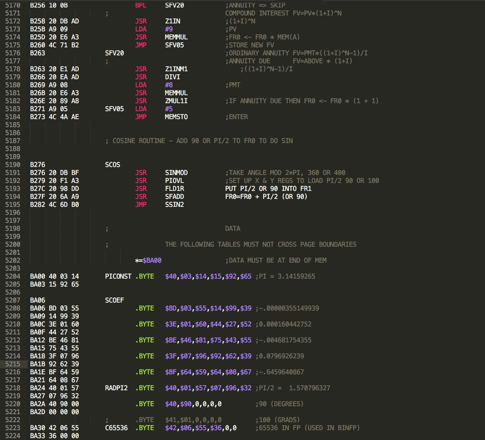
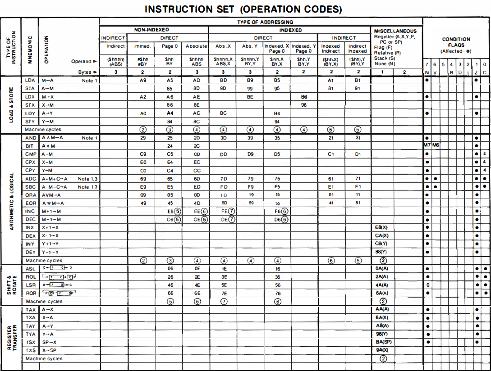
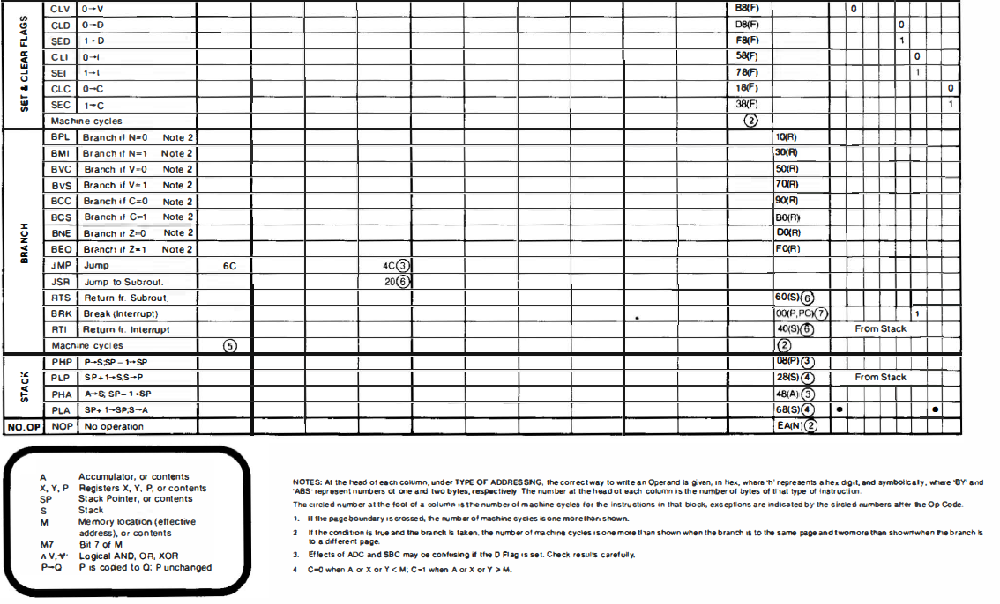

# 6502 Assembly Code

## Bitwise manipulations - Bit calculations
- [Bitwise manipulations - Bit calculations](../Bitwise_manipulations_-_Bit_calculations/README.md)

## 6502 Assembly Code
- [DEZ-HEX-BIN-OKT-PEN_ab_Excel_2016.xlsx](attachments/DEZ-HEX-BIN-OKT-PEN_ab_Excel_2016.xlsx)

## Atari Assembler
- [Assembler](../Languages/Assembler/README.md)

## Cross-Assembler
- [WUSDN IDE](http://www.wudsn.com/index.php/ide) ; smartest assembler available
- [ATASM](http://atari.miribilist.com/atasm/) ; Mac/65 compatible cross assembler

## Books
- [Programming the 6502 by Rodnay Zaks](http://www.atarimania.com/documents-atari-400-800-xl-xe-books_1_8.html) ; Mega-Thanks to Atarimania for hosting!!!
- [Programmierung des 6502 von Rodnay Zaks](http://www.atarimania.com/documents-atari-400-800-xl-xe-books_1_8.html) ; Mega-Thanks to Atarimania for hosting!!!
- [6502 Applications by Rodnay Zaks](http://www.atarimania.com/documents-atari-400-800-xl-xe-books_1_8.html) ; Mega-Thanks to Atarimania for hosting!!!
- [6502 Anwendungen von Rodnay Zaks](http://www.atarimania.com/documents-atari-400-800-xl-xe-books_1_8.html) ; Mega-Thanks to Atarimania for hosting!!!
- [Advanced 6502 Programming by Rodnay Zaks](http://www.atarimania.com/documents-atari-400-800-xl-xe-books_1_8.html) ; Mega-Thanks to Atarimania for hosting!!!
- [Fortgeschrittene 6502 Prorammierung von Rodnay Zaks](http://www.atarimania.com/documents-atari-400-800-xl-xe-books_1_8.html) ; Mega-Thanks to Atarimania for hosting!!!
- [6502 Games by Rodnay Zaks](https://archive.org/details/6502GamesRodnayZaks) ; Mega-Thanks to archive.org for hosting!!!
- [The Atari Assembler by Don Inman and Kurt Inman](http://www.atarimania.com/documents-atari-400-800-xl-xe-books_1_8.html) ; Mega-Thanks to Atarimania for hosting!!!
- [Der Atari Assembler von Don Inman und Kurt Inman](http://www.atarimania.com/documents-atari-400-800-xl-xe-books_1_8.html) ; Mega-Thanks to Atarimania for hosting!!!
- [Mapping the Atari - Compute! Books by Ian Chadwick](http://www.atarimania.com/documents-atari-400-800-xl-xe-books_1_8.html) ; Mega-Thanks to Atarimania for hosting!!!
- [Mapping the Atari - Revised Edition by Ian Chadwick](http://www.atarimania.com/documents-atari-400-800-xl-xe-books_1_8.html) ; Mega-Thanks to Atarimania for hosting!!!
- [6502 Assembly Language Programming-Lance A. Leventhal](http://www.atarimania.com/documents-atari-400-800-xl-xe-books_1_8.html) ; Mega-Thanks to Atarimania for hosting!!!
- [6502-Programmieren in ASSEMBLER-Lance A. Leventhal](https://data.atariwiki.org/DOC/6502-Programmieren_in_ASSEMBLER-Lance_A._Leventhal.pdf) ; size: 16 MB ; OCR
- [Machine Language for Beginners by Richard Mansfield](http://www.atarimania.com/documents-atari-400-800-xl-xe-books_1_8.html) ; Mega-Thanks to Atarimania for hosting!!!
- [6502 Assembly Language Subroutines-Lance A. Leventhal-Winthrop Saville](http://www.atarimania.com/documents-atari-400-800-xl-xe-books_1_8.html) ; Mega-Thanks to Atarimania for hosting!!!
- [How to Program Your Atari in 6502 Machine Language-Sam D. Roberts](http://www.atarimania.com/documents-atari-400-800-xl-xe-books_1_8.html) ; Mega-Thanks to Atarimania for hosting!!!
- [Programmieren in Maschinensprache mit dem 6502-E. Flögel](https://archive.org/details/ProgrammierenInMaschinenspracheMitDem6502)
- [6502 ASSEMBLER-Kurs für Beginner-Andreas Dripke](attachments/6502-Assembler-Kurs_fuer_Beginner-Andreas_Dripke-Print-OCR.pdf) ; Mega-Thanks to 8bitjunkie for donating and Stefan Höhl for scanning the whole book!!!
- [6502 Assembly Language Programming](ftp://ftp.apple.asimov.net/pub/apple_II/documentation/programming/6502assembly/6502%20Assembly%20Language%20Programming.pdf) (PDF)
- [6502 Assembly Language by Randy Hyde](http://homepage.mac.com/randyhyde/webster.cs.ucr.edu/A2%20Hyde%206502%20Asm%20Lang.pdf) (PDF)
- [Using 6502 Assembly Language by Randy Hyde](http://www.appleoldies.ca/anix/Using-6502-Assembly-Language-by-Randy-Hyde.pdf) (PDF)
- [WikiBook 6502 Assembly](http://en.wikibooks.org/wiki/6502_Assembly)
- [6502 Assembly Language Subroutines 1](ftp://ftp.apple.asimov.net/pub/apple_II/documentation/programming/6502assembly/6502%20Assembly%20Lanuage%20Rountines%20part%201.pdf)
- [6502 Assembly Language Subroutines 2](ftp://ftp.apple.asimov.net/pub/apple_II/documentation/programming/6502assembly/6502%20Assembly%20Lanuage%20Rountines%20part%202.pdf)

## Assembly Code

- [Decimal and Hex Codes for Instruction Set - Numerical](../Decimal_and_Hex_Codes_for_Instruction_Set_-_Numerical/README.md)
- [OSS ASCII-ATASCII Text File Converter](../OSS_ASCII-ATASCII_Text_File_Converter/README.md)
- [Super fast circle routine](../Super_fast_circle_routine/README.md) from Moj Mikro magazine (posted on AtariAge)
- [Starting to Program in 6502 Assembly Code](../Starting_to_Program_in_6502_Assembly_Code/README.md)
- [Copy OS ROM to RAM](../Atari_XL.XE_Copy_ROM_to_RAM/README.md)
- [So-Called Unused Opcodes](../Unused_Opcodes/README.md)
- [Interactive Assembler Tutorials](../Languages/Assembler/Interactive_Assembler_Tutorials/README.md)
- [A-LANG: WAYS TO IMPLEMENT COMPUTER LANGUAGES ON 6502s](../A-LANG_-_WAYS_TO_IMPLEMENT_COMPUTER_LANGUAGES_ON_6502s/README.md)
- [Tricky Code that Always Skips](../Tricky_Code_that_Always_Skips/README.md)
- [Self Modifying Code](../Self_Modifying_Code/README.md)
- [SDX Hello World](../SpartaDOS/Sparta_DOS_X_Hello_World/README.md)
- [Relocatable Jumps](../Relocatable_Jumps/README.md)
- [Print Inline Strings](../Print_Inline_Strings/README.md)
- [Mixed Mode Graphics](../Mixed_Mode_Graphics/README.md)
- [Synapse Assembler Atari 800 OS Equates](../Companies/Synapse_Software/SynAssembler/Synapse_Assembler_Atari_800_OS_Equates/README.md)
- [Advanced 6502 Assembly Code Examples](../Advanced_6502_Assembly_Code_Examples/README.md)
- [APAC Graphics Mode](../APAC_Graphics_Mode/README.md)
- [Atari 800 Assembler Equates](../OS/Atari_OS/Atari_800_Assembler_Equates/README.md)
- [Atari System Labels from OSS](../Atari_System_Labels_from_OSS/README.md)
- [6502 bugs](../6502_bugs/README.md)
- [6502 opcodes - complete list](http://www.6502.org/tutorials/6502opcodes.html)
- [6502 Coding Algorithms Macro Library](../6502_Coding_Algorithms_Macro_Library/README.md)
- [6502 Relocator](../6502_Relocator/README.md)
- [ATARI Basic Autorun Loader](../Languages/BASIC/Atari_BASIC/Examples/Atari_BASIC_Autorun_Loader/README.md)
- [Enhanced 6502 BASIC By Lee Davison.](../Languages/BASIC/Enhanced_BASIC/README.md) ; 2-line BASIC for 6502 Computers
- [Bootloader with Sectorcounter](../Languages/Assembler/Examples/Bootloader_with_Sectorcounter/README.md)
- [Atari 800 OS Source Listing](../OS/Atari_OS/Atari_800_ROM_OS_Source_Listing/README.md)
- [Copy OS ROM to RAM](../Languages/Assembler/Examples/Copy_OS_ROM_to_RAM/README.md)
- [Cycle neutral branching](../Cycle_neutral_branching/README.md)
- [Apple Assembly Line - How to Add and Subtract One](../Apple_Assembly_Line_-_How_to_Add_and_Subtract_One/README.md)
- [Sweet 16](../Sweet_16/README.md) - a virtual 16bit machine for the 6502 CPU
- [puZIP - ZIP File compression](../puZIP/README.md) - ZIP file compression
- [Small DOS 2.5 COM-File loader for Demo](../Small_DOS_2.5_COM-File_loader_for_Demo/README.md)
- [Hobbytronic Demo 2004/2005](../Hobby_Tronic_Demo_2004/README.md)
- [BASIC_on-off_from_DOS_XL_commandline](../BASIC_on-off_from_DOS_XL_commandline/README.md)
- [Page Flip Routine for BASIC](../Languages/BASIC/Atari_BASIC/Examples/Page_Flip_Routine_for_Basic/README.md)
- [RAM Move Routine for BASIC](../RAM_Move_Routine_for_Basic/README.md)
- [Atari 6502 System Equations and Macros](../Atari_System_Equates_and_Macros/README.md)
- [PSC Simple Debugger](../A_simple_6502_debugger/README.md)
- [Atari COM-File Tracer](../Atari_COM_Filetracer/README.md)
- [Typo bug virus](../Typo_bug_virus/README.md)
- [Sector Mapper](../Sector_Mapper/README.md)

## Courses

### Chris Crawford's Assembly language course
- [Chris Crawford's - Assembly Language Course](../CHRIS_CRAWFORDS_-_ASSEMBLY_LANGUAGE_COURSE/README.md)

### Assembly Course from Z*Magazine
- [Assembly Language Course (from Z*Magazine)](../Assembly_Course_from_Z-Magazine/README.md)

### Programming the Atari XL / XE - Assembly language course by Peter Dell
- [Programming the Atari XL / XE - Peter Dell](http://ftp.pigwa.net/upload2/JAC!/tutorials/Programming%20the%20Atari%20XL_XE/)
- [Introduction](http://ftp.pigwa.net/upload2/JAC!/tutorials/Programming%20the%20Atari%20XL_XE/Programming%20the%20Atari%20XL_XE%20-%20Introduction.mp4)
- [Part 01 - Executables](http://ftp.pigwa.net/upload2/JAC!/tutorials/Programming%20the%20Atari%20XL_XE/Programming%20the%20Atari%20XL_XE%20-%20Part%2001%20-%20Executables.mp4)
- [Part 02 - Text Screen](http://ftp.pigwa.net/upload2/JAC!/tutorials/Programming%20the%20Atari%20XL_XE/Programming%20the%20Atari%20XL_XE%20-%20Part%2002%20-%20Text%20Screen.mp4)
- [Part 03 - Memory Map](http://ftp.pigwa.net/upload2/JAC!/tutorials/Programming%20the%20Atari%20XL_XE/Programming%20the%20Atari%20XL_XE%20-%20Part%2003%20-%20Memory%20Map.mp4)
- [Part 04 - Chip Map](http://ftp.pigwa.net/upload2/JAC!/tutorials/Programming%20the%20Atari%20XL_XE/Programming%20the%20Atari%20XL_XE%20-%20Part%2004%20-%20Chip%20Map.mp4)
- [Part 05 - System Character Sets](http://ftp.pigwa.net/upload2/JAC!/tutorials/Programming%20the%20Atari%20XL_XE/Programming%20the%20Atari%20XL_XE%20-%20Part%2005%20-%20System%20Character%20Sets.mp4)
- [Part 06 - Modified Character Sets](http://ftp.pigwa.net/upload2/JAC!/tutorials/Programming%20the%20Atari%20XL_XE/Programming%20the%20Atari%20XL_XE%20-%20Part%2006%20-%20Modified%20Character%20Sets.mp4)
- [Part 07 - Own Character Sets](http://ftp.pigwa.net/upload2/JAC!/tutorials/Programming%20the%20Atari%20XL_XE/Programming%20the%20Atari%20XL_XE%20-%20Part%2007%20-%20Own%20Character%20Sets.mp4)
- [Part 08 - Text Output using E](http://ftp.pigwa.net/upload2/JAC!/tutorials/Programming%20the%20Atari%20XL_XE/Programming%20the%20Atari%20XL_XE%20-%20Part%2008%20-%20Text%20Output%20using%20E_.mp4)
- [Part 09 - Graphics Modes](http://ftp.pigwa.net/upload2/JAC!/tutorials/Programming%20the%20Atari%20XL_XE/Programming%20the%20Atari%20XL_XE%20-%20Part%2009%20-%20Graphics%20Modes.mp4)
- [Part 10 - Colors, Hardware Registers and Shadow Registers](http://ftp.pigwa.net/upload2/JAC!/tutorials/Programming%20the%20Atari%20XL_XE/Programming%20the%20Atari%20XL_XE%20-%20Part%2010%20-%20Colors,%20Hardware%20Registers%20and%20Shadow%20Registers.mp4)
- [Part 11 - Display List Basics](http://ftp.pigwa.net/upload2/JAC!/tutorials/Programming%20the%20Atari%20XL_XE/Programming%20the%20Atari%20XL_XE%20-%20Part%2011%20-%20Display%20List%20Basics.mp4)
- [Part 12 - Display List Memory and Scrolling](http://ftp.pigwa.net/upload2/JAC!/tutorials/Programming%20the%20Atari%20XL_XE/Programming%20the%20Atari%20XL_XE%20-%20Part%2012%20-%20Display%20List%20Memory%20and%20Scrolling.mp4)
- [Part 13 - Display List Soft Scrolling](http://ftp.pigwa.net/upload2/JAC!/tutorials/Programming%20the%20Atari%20XL_XE/Programming%20the%20Atari%20XL_XE%20-%20Part%2013%20-%20Display%20List%20Soft%20Scrolling.mp4)
- [Part 14 - POKEY Sounds](http://ftp.pigwa.net/upload2/JAC!/tutorials/Programming%20the%20Atari%20XL_XE/Programming%20the%20Atari%20XL_XE%20-%20Part%2014%20-%20POKEY%20Sounds.mp4)
- [Part 15 - Raster Music Tracker Modules](http://ftp.pigwa.net/upload2/JAC!/tutorials/Programming%20the%20Atari%20XL_XE/Programming%20the%20Atari%20XL_XE%20-%20Part%2015%20-%20Raster%20Music%20Tracker%20Modules.mp4)
- [Part 16 - RMT and SAP Modules](http://ftp.pigwa.net/upload2/JAC!/tutorials/Programming%20the%20Atari%20XL_XE/Programming%20the%20Atari%20XL_XE%20-%20Part%2016%20-%20RMT%20and%20SAP%20Modules.mp4)

### WUDSN IDE Tutorial - Assembly IDE course by Peter Dell
- [01 Introduction, Installation and Use](http://ftp.pigwa.net/upload2/JAC!/tutorials/WUDSN%20IDE/WUDSN%20IDE%20Tutorial%2001_%20Introduction,%20Installation%20and%20Use.mp4)
- [02 Setting up Perspective, Views and Editors](http://ftp.pigwa.net/upload2/JAC!/tutorials/WUDSN%20IDE/WUDSN%20IDE%20Tutorial%2002_%20Setting%20up%20Perspective,%20Views%20and%20Editors.mp4)
- [03 Setting up Editors and File Extensions correctly](http://ftp.pigwa.net/upload2/JAC!/tutorials/WUDSN%20IDE/WUDSN%20IDE%20Tutorial%2003_%20Setting%20up%20Editors%20and%20File%20Extensions%20correctly.mp4)
- [04 Syntax Highlighting and Content Assist](http://ftp.pigwa.net/upload2/JAC!/tutorials/WUDSN%20IDE/WUDSN%20IDE%20Tutorial%2004_%20Syntax%20Highlighting%20and%20Content%20Assist.mp4)
- [05 Working with Projects, Folders and Files](http://ftp.pigwa.net/upload2/JAC!/tutorials/WUDSN%20IDE/WUDSN%20IDE%20Tutorial%2005_%20Working%20with%20Projects,%20Folders%20and%20Files.mp4)
- [06 Content Outline and Navigation - the Heart of the the IDE](http://ftp.pigwa.net/upload2/JAC!/tutorials/WUDSN%20IDE/WUDSN%20IDE%20Tutorial%2006_%20Content%20Outline%20and%20Navigation%20-%20the%20Heart%20of%20the%20the%20IDE.mp4)
- [07 New Features in Version 1.6.0](http://ftp.pigwa.net/upload2/JAC!/tutorials/WUDSN%20IDE/WUDSN%20IDE%20Tutorial%2007_%20New%20Features%20in%20Version%201.6.0.mp4)
- [08 New Features in Version 1.6.2](http://ftp.pigwa.net/upload2/JAC!/tutorials/WUDSN%20IDE/WUDSN%20IDE%20Tutorial%2008_%20New%20Features%20in%20Version%201.6.2.mp4)
- [09 Source Level Debugging](http://ftp.pigwa.net/upload2/JAC!/tutorials/WUDSN%20IDE/WUDSN%20IDE%20Tutorial%2009_%20Source%20Level%20Debugging.mp4)
- [10 Adding Support for an Additional Assembler](http://ftp.pigwa.net/upload2/JAC!/tutorials/WUDSN%20IDE/WUDSN%20IDE%20Tutorial%2010_%20Adding%20Support%20for%20an%20Additional%20Assembler.mp4)
- [11 New Features in Version 1.6.3](http://ftp.pigwa.net/upload2/JAC!/tutorials/WUDSN%20IDE/WUDSN%20IDE%20Tutorial%2011_%20New%20Features%20in%20Version%201.6.3.mp4)
- [12 New Features in Version 1.6.4](http://ftp.pigwa.net/upload2/JAC!/tutorials/WUDSN%20IDE/WUDSN%20IDE%20Tutorial%2012_%20New%20Features%20in%20Version%201.6.4.mp4)
- [13 New features in Version 1.6.5](http://ftp.pigwa.net/upload2/JAC!/tutorials/WUDSN%20IDE/WUDSN%20IDE%20Tutorial%2013_%20New%20features%20in%20Version%201.6.5.mp4)
- [14 New Features in Version 1.6.6](http://ftp.pigwa.net/upload2/JAC!/tutorials/WUDSN%20IDE/WUDSN%20IDE%20Tutorial%2014_%20New%20Features%20in%20Version%201.6.6.mp4)
- [15 New Features in Version 1.7.0](http://ftp.pigwa.net/upload2/JAC!/tutorials/WUDSN%20IDE/WUDSN%20IDE%20Tutorial%2015_%20New%20Features%20in%20Version%201.7.0.mp4)

## Kurse
### CompyShop Magazin-Assembler Kurs

- [6502 Programmieren - Teil 1](../Companies/CompyShop/CSM_Assembler_Course/CSM_ASM_Teil1/README.md) - Grundlegendes
- [6502 Programmieren - Teil 2](../Companies/CompyShop/CSM_Assembler_Course/CSM_ASM_Teil2/README.md) - Befehlsübersicht
- [6502 Programmieren - Teil 3](../Companies/CompyShop/CSM_Assembler_Course/CSM_ASM_Teil3/README.md) - Adressierungsarten
- [6502 Programmieren - Teil 4](../Companies/CompyShop/CSM_Assembler_Course/CSM_ASM_Teil4/README.md) - Das erste Programm eine einfache Schleife
- [6502 Programmieren - Teil 5](../Companies/CompyShop/CSM_Assembler_Course/CSM_ASM_Teil5/README.md) - Bildschirmspeicher löschen
- [6502 Programmieren - Teil 6](../Companies/CompyShop/CSM_Assembler_Course/CSM_ASM_Teil6/README.md) - Addieren und Subtrahieren
- [6502 Programmieren - Teil 7](../Companies/CompyShop/CSM_Assembler_Course/CSM_ASM_Teil7/README.md) - Befehle zum "Bearbeiten" von Zahlen
- [6502 Programmieren - Teil 8](../Companies/CompyShop/CSM_Assembler_Course/CSM_ASM_Teil8/README.md) - Flags (Flaggen)
- [6502 Programmieren - Teil 9](../Companies/CompyShop/CSM_Assembler_Course/CSM_ASM_Teil9/README.md) - Vergleichs- und Transportbefehle
- [6502 Programmieren - Teil 10](../Companies/CompyShop/CSM_Assembler_Course/CSM_ASM_Teil10/README.md) - JSR, Zusatzbefehle des 65C02
- [6502 Programmieren - Teil 11](../Companies/CompyShop/CSM_Assembler_Course/CSM_ASM_Teil11/README.md) - Schleifen
- [6502 Programmieren - Teil 12](../Companies/CompyShop/CSM_Assembler_Course/CSM_ASM_Teil12/README.md) - Ausgabe von Zeichen und Texten auf dem Bildschirm
- [6502 Programmieren, Teil 13](../Zeile_per_CIO_einlesen_und_Programme_resetfest_machen/README.md) - Zeile per CIO einlesen und Programme RESET-fest machen
- [6502 Programmieren - Teil 14](../Companies/CompyShop/CSM_Assembler_Course/CSM_ASM_Teil14/README.md) - Programmierung von Interrupts

### CompyShop Magazin-Assembler für Fortgeschrittene

- [Assembler für Fortgeschrittene: CIO und DOS](../Companies/CompyShop/CSM_Assembler_Course/CSM-Assembler_Kurs_-_CIO_und_DOS/README.md) - CIO und DOS
- [Assembler für Fortgeschrittene: Displaylist](../Companies/CompyShop/CSM_Assembler_Course/CSM-Assembler_Kurs_-_Displaylist/README.md) - Displaylist
- [Der Display-List-Interrupt](../Companies/CompyShop/CSM_Assembler_Course/CSM-Assembler_Kurs_-_Displaylist-Interrupts/README.md) - Displaylist-Interrupts

## DEC-HEX bis 255:

DEC-HEX bis 255

## Picture

6502 assembly code in Sublime Text 2 with 6502 language plug-ins. One of today's best options to program in 6502 assembly in combination with [MADS](http://mads.atari8.info/).

## Instruction Set (Operation Codes)

Instruction Set (Operation Codes)
