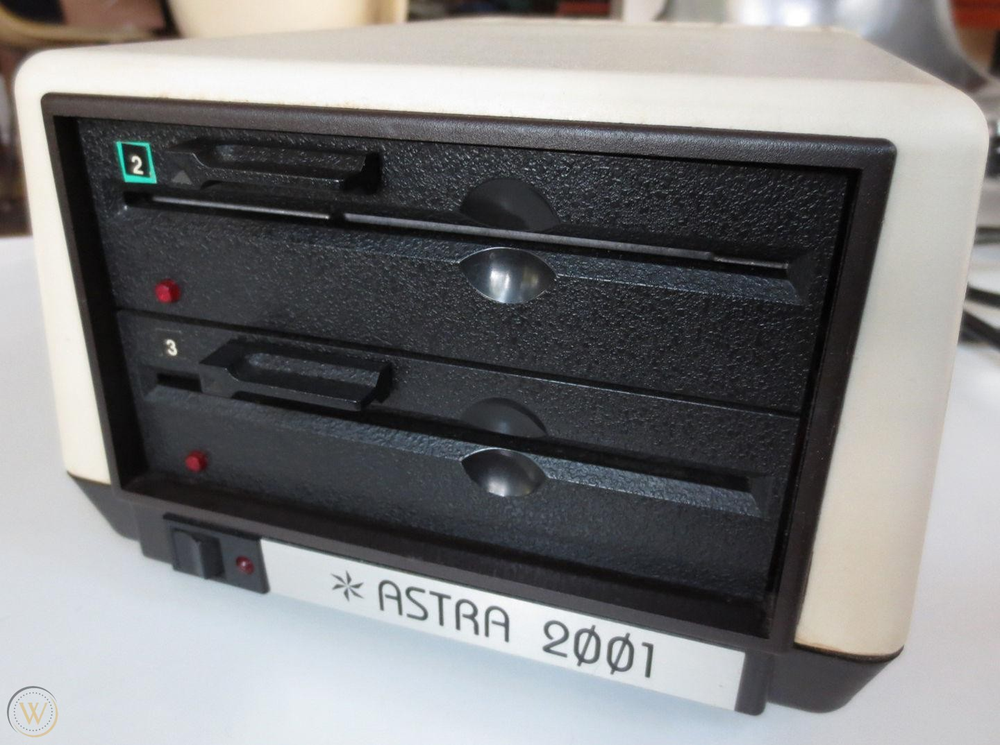
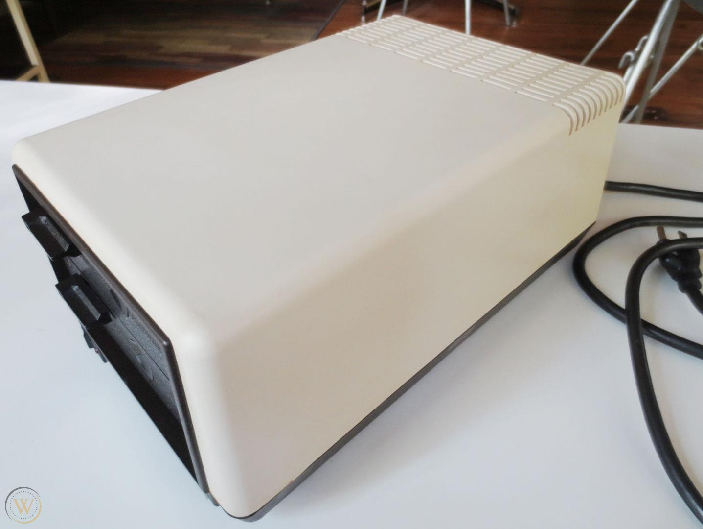
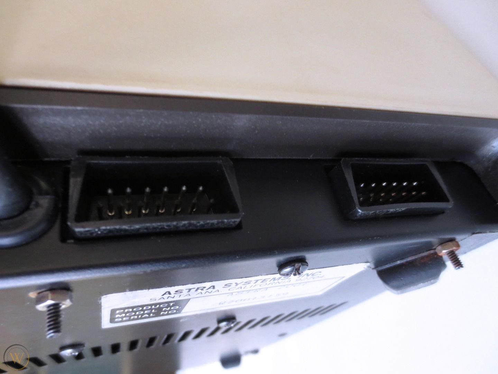

# ASTRA 2001

Astra Systems Inc., Santa Ana, California.

The 2001 was a double disk drive SS/DD. It is a pair of the same mechs found in the 1050 drive, these were setup with a Double Density controller.
Not a lot of surviving information on it. It is also a very rare drive to find outside of a collection.

