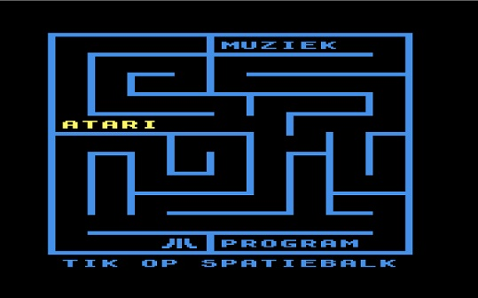
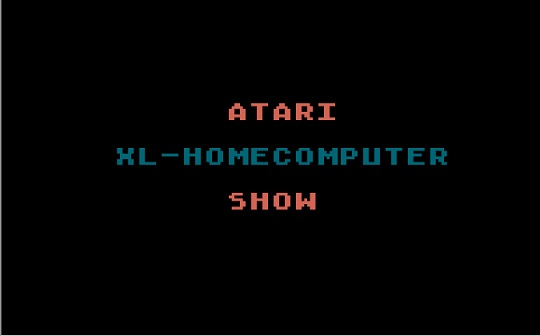
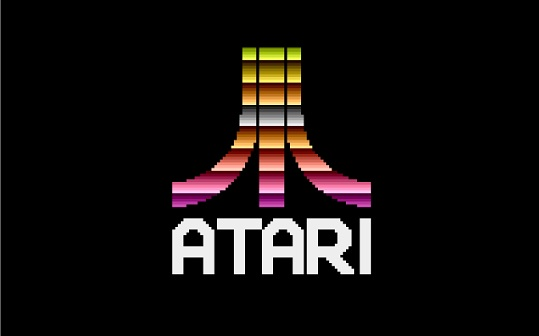
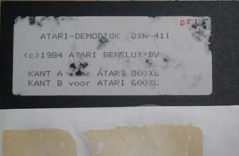
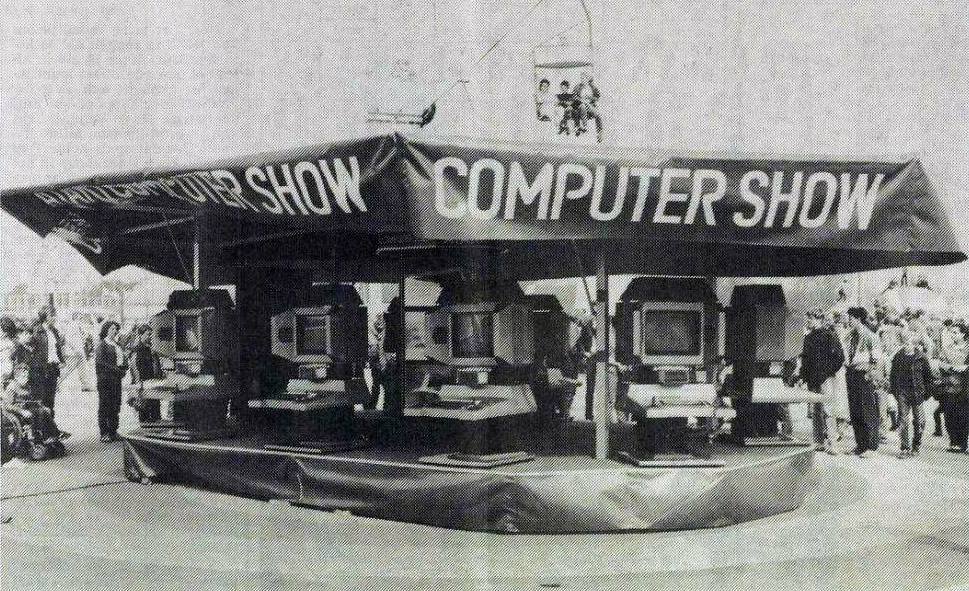

# Atari Demo disk (DXN 411)

Atari Benelux created several demos to be used in Dutch and Flemmish stores. Looking at the title of one of the demos (Side B), this demo is probably also used during the Dutch Atari Homecomputer show on tour.

## ATR-files

DXN 411 Side A: [DEMODSKA.ATR](attachments/DEMODSKA.ATR)
DXN 411 Side B: [DEMODSKB.ATR](attachments/DEMODSKB.ATR)

Besides this original Atari Benelux disk, a variation of the demo of side A was also distributed.

Alternate Side A: [DEMODSKC.ATR](attachments/DEMODSKC.ATR)

## Screen Shots

- Atari Benelux Demo Disk Side A 
- Atari Benelux Demo Disk Side B 
- Atari Benelux Demo Disk Side "C" 

## Media picture

- Atari Benelux Demo Disk label 

## Media picture

- Atari Benelux Computer Show on Tour 
