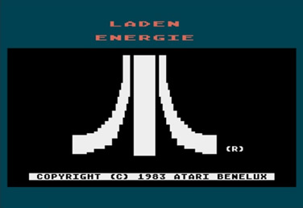
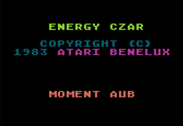
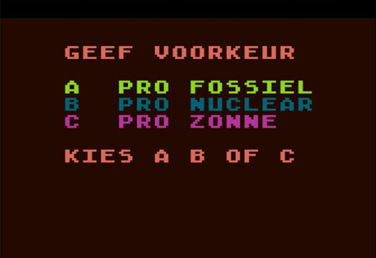
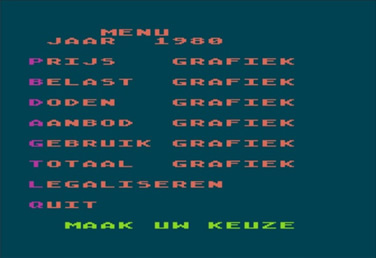
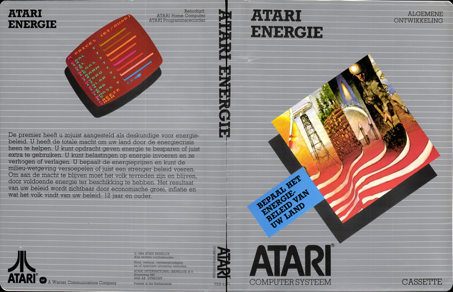
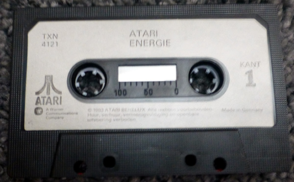

# Atari Energie (TXN4121)

Atari Energie is the Dutch translation of Energy Czar and was published by Atari International (Benelux) B.V. in 1984. This release date is printed on the cover. The software displays (c) 1983. The cassette used the dual audio format.

## CAS-Image:

[Atari\_Energie\_TXN4121.zip](attachments/Atari_Energie_TXN4121.zip)

## ATR-file:

[Atari\_Energie.ATR](attachments/Atari_Energie.ATR)

## MP3-file:

Low quality
[Atari\_Energie\_Dual\_Audio.mp3](../../../../../media/Companies/Atari/Atari_Energie/attachments/Atari_Energie_Dual_Audio.mp3)

## FLAC-file:

[http://data.atariwiki.org/FLAC/Atari\_Energie\_Dual\_Audio.flac](http://data.atariwiki.org/FLAC/Atari_Energie_Dual_Audio.flac)

## Manual:

[Atari\_Energie\_manual.pdf](../../../../../media/Companies/Atari/Atari_Energie/attachments/Atari_Energie_manual.pdf)

## Screenshots:

## Cover:

Atari Energie Cover

## Media pictures:

Atari Energie Cassette
