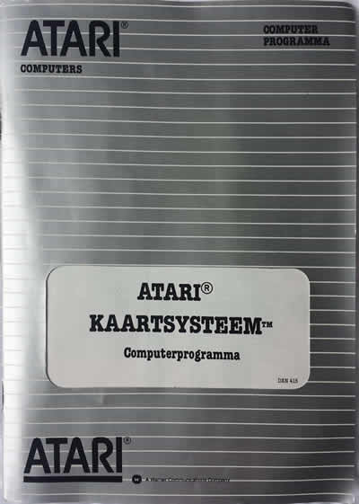
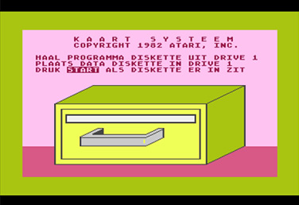
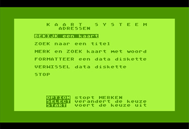
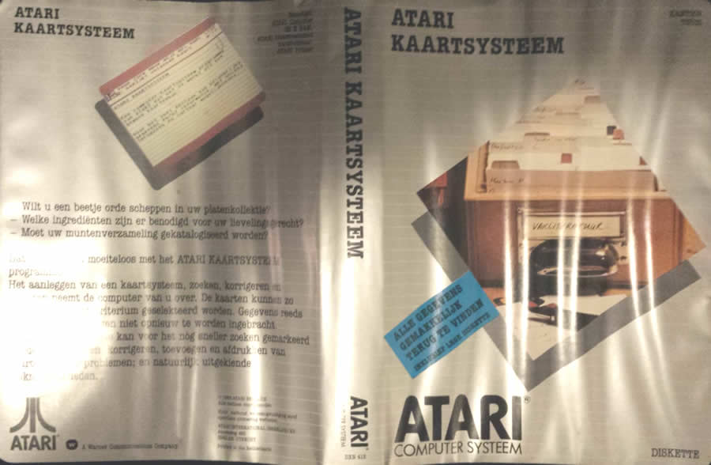
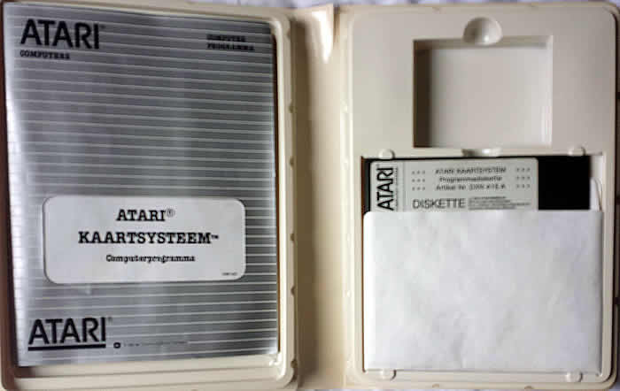
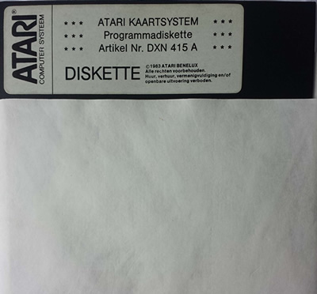
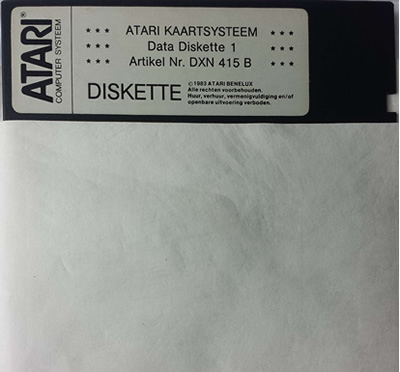

# Atari Kaartsysteem

Atari Kaartsysteem is the Dutch translation of The Home Filing Manager and was published by Atari International (Benelux) B.V. in 1982.

The package contains two disks. One program disk and one data disk.

> > > Many thanks to **Freddy Offenga** for supplying the atr-files and the pictures!

## ATR-Images

Disk 1: [Atari\_Kaartsysteem\_Programmadiskette\_DX415A.atr](attachments/Atari_Kaartsysteem_Programmadiskette_DX415A.atr)
Disk 2: [Atari\_Kaartsysteem\_Data\_Diskette\_1\_DXN415B.atr](attachments/Atari_Kaartsysteem_Data_Diskette_1_DXN415B.atr)

## Manual picture

## Manual

[Kaartsysteem\_Manual.pdf](attachments/Kaartsysteem_Manual.pdf)

## Screenshots

## Cover

- Atari Kaartsysteem Cover 

## Inside of the box

- Atari Kaartsysteem inside 

## Media pictures

- Atari Kaartsysteem Disk 1 
- Atari Kaartsysteem Disk 2 
