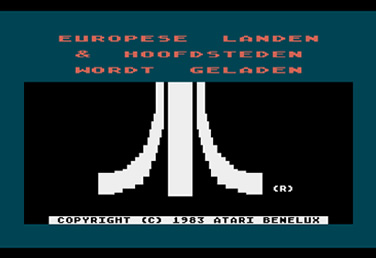
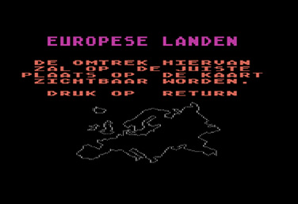
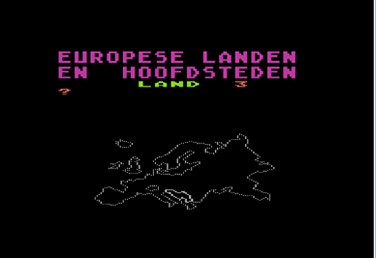

# Europese Landen en Hoofdsteden (Cassette: TXN 4114)

Europese Landen en Hoofdsteden is the Dutch translation of European Countries and Capitals and was published by Atari (Benelux) B.V. in 1983. Side 1 of the cassette includes on screen instructions. Side 2 does not contain the instructions. Both sides use the dual audio format.

## CAS-Image

Side 1: [Europese\_Landen\_en\_Hoofdsteden\_1983\_Atari\_NL.cas](attachments/Europese_Landen_en_Hoofdsteden_1983_Atari_NL.cas)

## FLAC file

Side 1: [http://data.atariwiki.org/FLAC/Europese\_Landen\_en\_Hoofdsteden\_1983\_Atari\_NL.flac](http://data.atariwiki.org/FLAC/Europese_Landen_en_Hoofdsteden_1983_Atari_NL.flac)

## ATR-Image

Side 1: [Europese\_Landen\_en\_Hoofdsteden\_1983\_Atari\_NL.ATR](attachments/Europese_Landen_en_Hoofdsteden_1983_Atari_NL.ATR)

## Manual

PDF: [Europese\_Landen\_Handleiding.pdf](attachments/Europese_Landen_Handleiding.pdf)

## Screenshots

## Cover

[Europese\_Landen\_cover.jpg](attachments/Europese_Landen_cover.jpg)

## Media pictures

[Europese\_Landen\_cassette.jpg](attachments/Europese_Landen_cassette.jpg)
