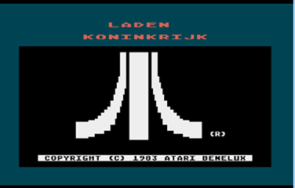
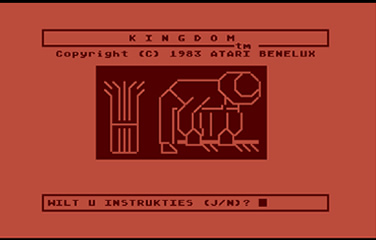
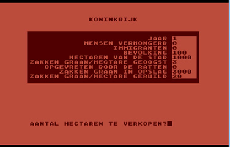
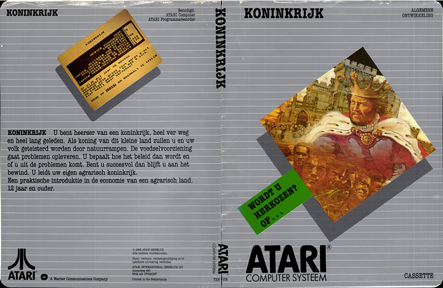
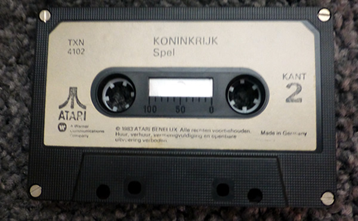

# Koninkrijk

Koninkrijk is the Dutch translation of Kingdom and was published by Atari International (Benelux) B.V. in 1983.

Side 1 of the cassette includes on screen instructions. Side 2 does not contain the instructions. Both sides use the dual audio format.

## CAS-Images:

Side 1: [koninkrijk\_side1.zip](attachments/koninkrijk_side1.zip)
Side 2: [koninkrijk\_side2.zip](attachments/koninkrijk_side2.zip)

## MP-3 files:

Side 1: [koninkrijk\_dual\_audio\_side1.mp3](../../../../../media/Companies/Atari/Atari_Benelux/Koninkrijk/attachments/koninkrijk_dual_audio_side1.mp3)
Side 2: [koninkrijk\_sdual\_audio\_side2.mp3](../../../../../media/Companies/Atari/Atari_Benelux/Koninkrijk/attachments/koninkrijk_sdual_audio_side2.mp3)

## FLAC-files:

[http://data.atariwiki.org/FLAC/koninkrijk\_side1.flac](http://data.atariwiki.org/FLAC/koninkrijk_side1.flac)
[http://data.atariwiki.org/FLAC/koninkrijk\_side2.flac](http://data.atariwiki.org/FLAC/koninkrijk_side2.flac)

## Manual:

[Koninkrijk\_manual.pdf](attachments/Koninkrijk_manual.pdf)

## Screenshots:

## Cover:

Koninkrijk Cover

## Media pictures:

Koninkrijk Cassette
