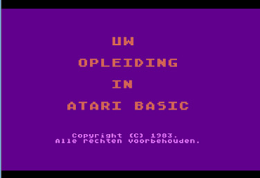
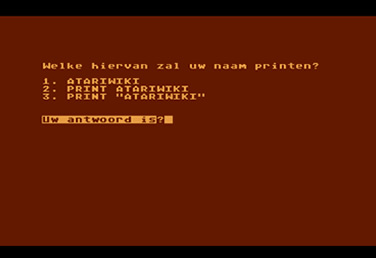
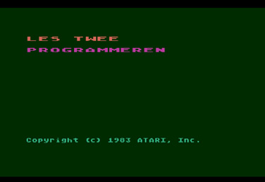
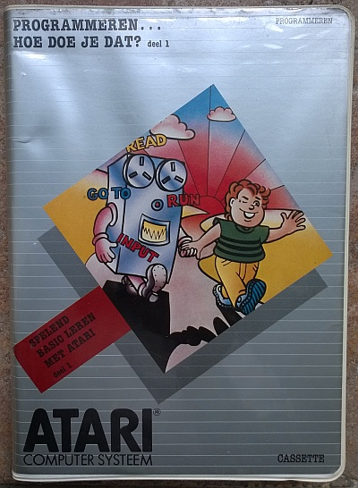
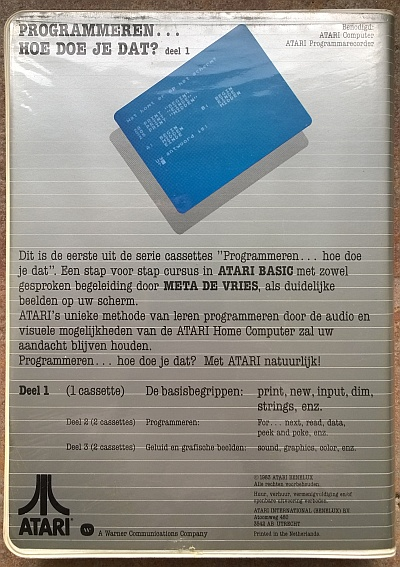
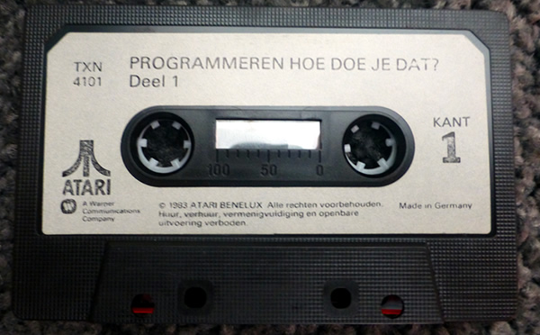

# Programmeren... Hoe Doe Je Dat? (Deel 1) - (Cassette: TXN 4101)

Programmeren... Hoe Doe Je Dat (Deel 1) is the Dutch translation of An Invitation To Programming (Part 1) and was published by Atari International (Benelux) B.V. in 1983. The cassette uses the dual audio format.

## CAS-Images

[Programmeren\_hoe\_doe\_je\_dat\_deel1\_cass1a.cas](attachments/Programmeren_hoe_doe_je_dat_deel1_cass1a.cas)
[Programmeren...\_Hoe\_Doe\_Je\_Dat\_Deel\_1TXN\_4101-Cas1-side2.cas](attachments/Programmeren..._Hoe_Doe_Je_Dat_Deel_1TXN_4101-Cas1-side2.cas)

## ATR-Images

[Programmeren\_hoe\_doe\_je\_dat\_deel1\_cass1a.atr](attachments/Programmeren_hoe_doe_je_dat_deel1_cass1a.atr)
[Programmeren...\_Hoe\_Doe\_Je\_Dat\_Deel\_1TXN\_4101-Cas1-side2.atr](attachments/Programmeren..._Hoe_Doe_Je_Dat_Deel_1TXN_4101-Cas1-side2.atr)

## Flac-files

[http://data.atariwiki.org/FLAC/Programmeren\_hoe\_doe\_je\_dat\_deel1\_cass1a.flac](http://data.atariwiki.org/FLAC/Programmeren_hoe_doe_je_dat_deel1_cass1a.flac)
[http://data.atariwiki.org/FLAC/Programmeren\_hoe\_doe\_je\_dat\_deel1\_cass1b.flac](http://data.atariwiki.org/FLAC/Programmeren_hoe_doe_je_dat_deel1_cass1b.flac)

## Manual

[Programmeren\_Hoe\_Doe\_Je\_Dat\_1\_manual.pdf](attachments/Programmeren_Hoe_Doe_Je_Dat_1_manual.pdf)

## Screenshots

## Cover

## Mediapictures

- Programmeren... Hoe doe je dat (Deel 1) Cassette 1 
