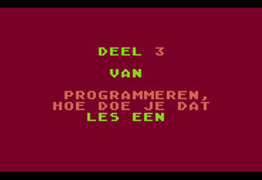
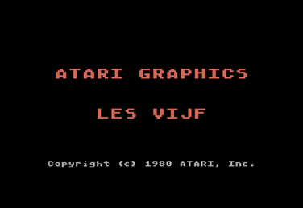
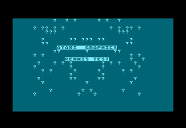
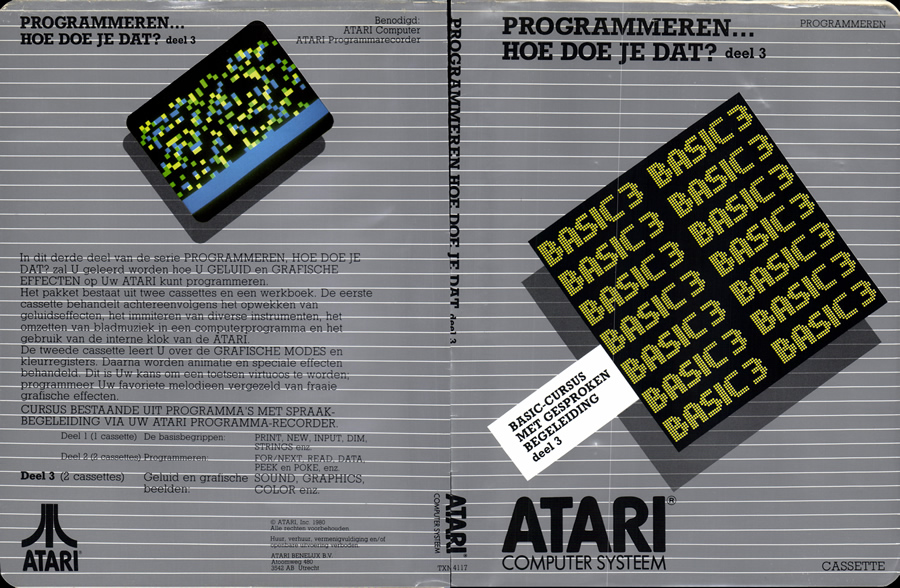
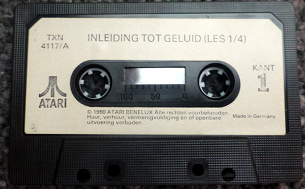
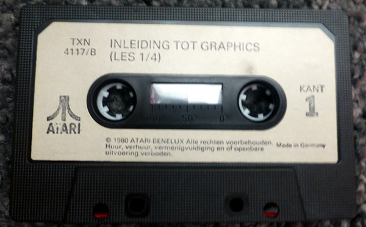

# Programmeren... Hoe Doe Je Dat (Deel 3)

Programmeren... Hoe Doe Je Dat (Deel 3) is the Dutch translation of An Invitation To Programming (Part 3) and was published by Atari International (Benelux) B.V. in 1980. The cassette uses the dual audio format.

## CAS-Images

[Programmeren\_Hoe\_Doe\_Je\_Dat\_deel3\_cass1a.zip](attachments/Programmeren_Hoe_Doe_Je_Dat_deel3_cass1a.zip)
[Programmeren\_Hoe\_Doe\_Je\_Dat\_deel3\_cass1b.zip](attachments/Programmeren_Hoe_Doe_Je_Dat_deel3_cass1b.zip)
[Programmeren\_Hoe\_Doe\_Je\_Dat\_deel3\_cass2a.zip](attachments/Programmeren_Hoe_Doe_Je_Dat_deel3_cass2a.zip)
[Programmeren\_Hoe\_Doe\_Je\_Dat\_deel3\_cass2b.zip](attachments/Programmeren_Hoe_Doe_Je_Dat_deel3_cass2b.zip)

## ATR-Images

[Programmeren\_Hoe\_Doe\_Je\_Dat\_deel3\_cass1a.ATR](attachments/Programmeren_Hoe_Doe_Je_Dat_deel3_cass1a.atr)
[Programmeren\_Hoe\_Doe\_Je\_Dat\_deel3\_cass1b.ATR](attachments/Programmeren_Hoe_Doe_Je_Dat_deel3_cass1b.atr)
[Programmeren\_Hoe\_Doe\_Je\_Dat\_deel3\_cass2a.ATR](attachments/Programmeren_Hoe_Doe_Je_Dat_deel3_cass2a.atr)
[Programmeren\_Hoe\_Doe\_Je\_Dat\_deel3\_cass2b.ATR](attachments/Programmeren_Hoe_Doe_Je_Dat_deel3_cass2b.atr)

## MP3-files

Low quality.
[Programmeren\_Hoe\_Doe\_Je\_Dat\_deel3\_cass1a.mp3](../../../../../../media/Companies/Atari/Atari_Benelux/Programmeren..._Hoe_Doe_Je_Dat/Programmeren..._Hoe_Doe_Je_Dat_Deel_3-TXN_4117/attachments/Programmeren_Hoe_Doe_Je_Dat_deel3_cass1a.mp3)
[Programmeren\_Hoe\_Doe\_Je\_Dat\_deel3\_cass1b.mp3](../../../../../../media/Companies/Atari/Atari_Benelux/Programmeren..._Hoe_Doe_Je_Dat/Programmeren..._Hoe_Doe_Je_Dat_Deel_3-TXN_4117/attachments/Programmeren_Hoe_Doe_Je_Dat_deel3_cass1b.mp3)
[Programmeren\_Hoe\_Doe\_Je\_Dat\_deel3\_cass2a.mp3](../../../../../../media/Companies/Atari/Atari_Benelux/Programmeren..._Hoe_Doe_Je_Dat/Programmeren..._Hoe_Doe_Je_Dat_Deel_3-TXN_4117/attachments/Programmeren_Hoe_Doe_Je_Dat_deel3_cass2a.mp3)
[Programmeren\_Hoe\_Doe\_Je\_Dat\_deel3\_cass2b.mp3](../../../../../../media/Companies/Atari/Atari_Benelux/Programmeren..._Hoe_Doe_Je_Dat/Programmeren..._Hoe_Doe_Je_Dat_Deel_3-TXN_4117/attachments/Programmeren_Hoe_Doe_Je_Dat_deel3_cass2b.mp3)

## FLAC-files

[http://data.atariwiki.org/FLAC/Programmeren\_Hoe\_Doe\_Je\_Dat\_deel3\_cass1a.flac](http://data.atariwiki.org/FLAC/Programmeren_Hoe_Doe_Je_Dat_deel3_cass1a.flac)
[http://data.atariwiki.org/FLAC/Programmeren\_Hoe\_Doe\_Je\_Dat\_deel3\_cass1b.flac](http://data.atariwiki.org/FLAC/Programmeren_Hoe_Doe_Je_Dat_deel3_cass1b.flac)
[http://data.atariwiki.org/FLAC/Programmeren\_Hoe\_Doe\_Je\_Dat\_deel3\_cass2a.flac](http://data.atariwiki.org/FLAC/Programmeren_Hoe_Doe_Je_Dat_deel3_cass2a.flac)
[http://data.atariwiki.org/FLAC/Programmeren\_Hoe\_Doe\_Je\_Dat\_deel3\_cass2b.flac](http://data.atariwiki.org/FLAC/Programmeren_Hoe_Doe_Je_Dat_deel3_cass2b.flac)

## Manual

[Programmeren\_Hoe\_Doe\_Je\_Dat\_3\_manual.pdf](../../../../../../media/Companies/Atari/Atari_Benelux/Programmeren..._Hoe_Doe_Je_Dat/Programmeren..._Hoe_Doe_Je_Dat_Deel_3-TXN_4117/attachments/Programmeren_Hoe_Doe_Je_Dat_3_manual.pdf)

## Screenshots

## Cover

Programmeren... Hoe doe je dat (Deel 3) Cover

## Mediapictures

Programmeren... Hoe doe je dat (Deel 3) Cassette 1

Programmeren... Hoe doe je dat (Deel 3) Cassette 2
