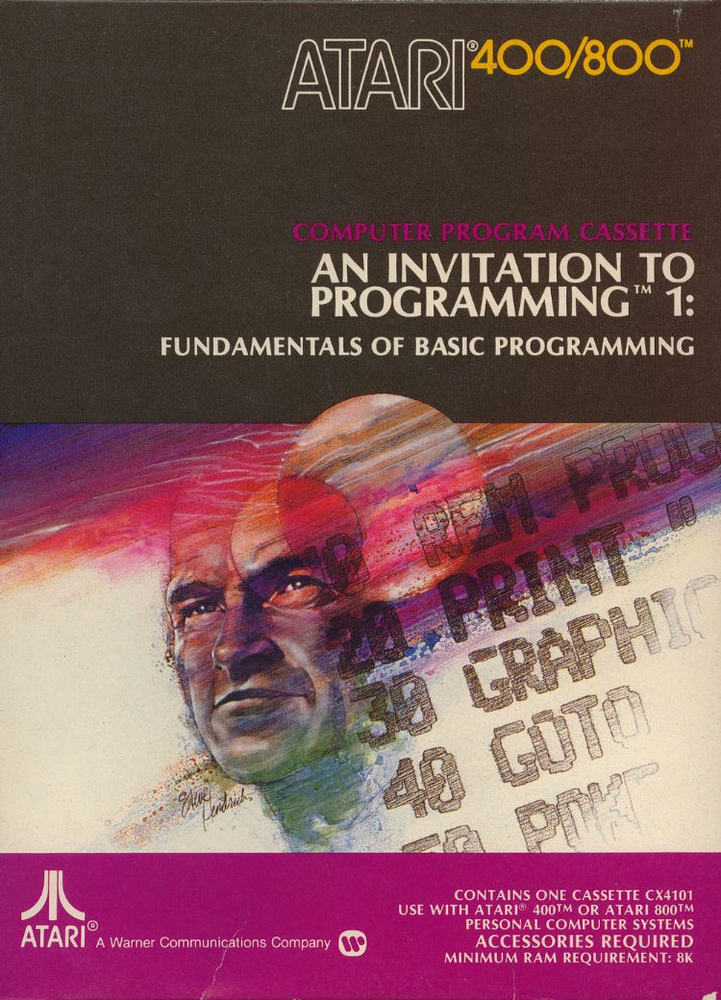
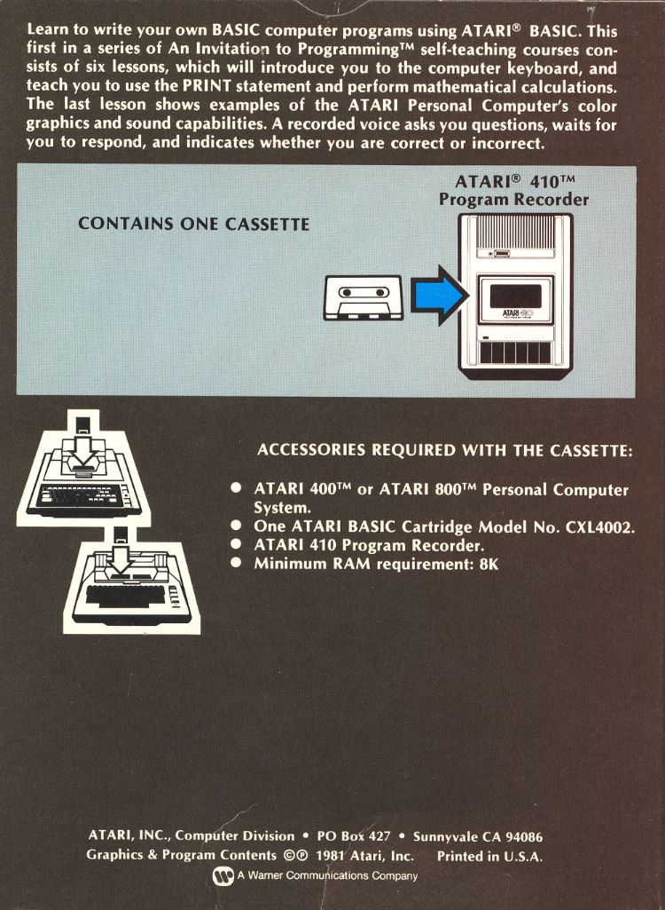

# An Invitation to Programming 1 (CX4101)

## ATR-Images:

[An\_Invitation\_to\_Programming\_Side\_1\_Lessons\_1-3.atr](attachments/An_Invitation_to_Programming_Side_1_Lessons_1-3.atr) Lessons 1-3 disk

[An\_Invitation\_to\_Programming\_Side\_2\_Lessons\_4-6.atr](attachments/An_Invitation_to_Programming_Side_2_Lessons_4-6.atr) Lessons 4-6 disk

## Manuals:

[An\_Invitation\_to\_Programming\_1-Screen\_Version.pdf](attachments/An_Invitation_to_Programming_1-Screen_Version.pdf) (897 KB) (C) 1979 Atari

[An\_Invitation\_to\_Programming\_CX4101.pdf](attachments/An_Invitation_to_Programming_CX4101.pdf) (573 KB) (C) 1985 Atari

## Audio Files:

[CX4101\_A\_Side\_1.flac](../../../../../../media/Companies/Atari/An_Invitation_to_Programming_CX-4101/attachments/CX4101_A_Side_1.flac) (179 MB - FLAC)
[CX4101\_A\_Side\_2.flac](../../../../../../media/Companies/Atari/An_Invitation_to_Programming_CX-4101/attachments/CX4101_A_Side_2.flac) (137 MB - FLAC)

## Box-Pictures:

 (C) 1981 Atari

 (C) 1981 Atari

## Autor:

Derzeit leider noch unbekannt. :-(

## Danksagung:

Ohne die folgenden Personen wäre dieses Projekt nicht möglich gewesen, ihnen gilt daher der Dank:

- Bradley Koda
- Benjamin Daniel Smith
- Stefan Meyer
- Carsten Strotmann

## Wartung:

Diese Seite wird von Roland B. Wassenberg verwaltet. Motto: "See you all out there in the galaxy" :-)
