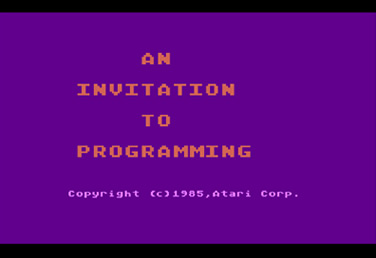
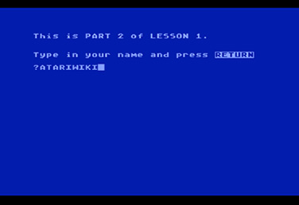
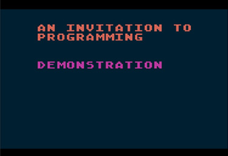
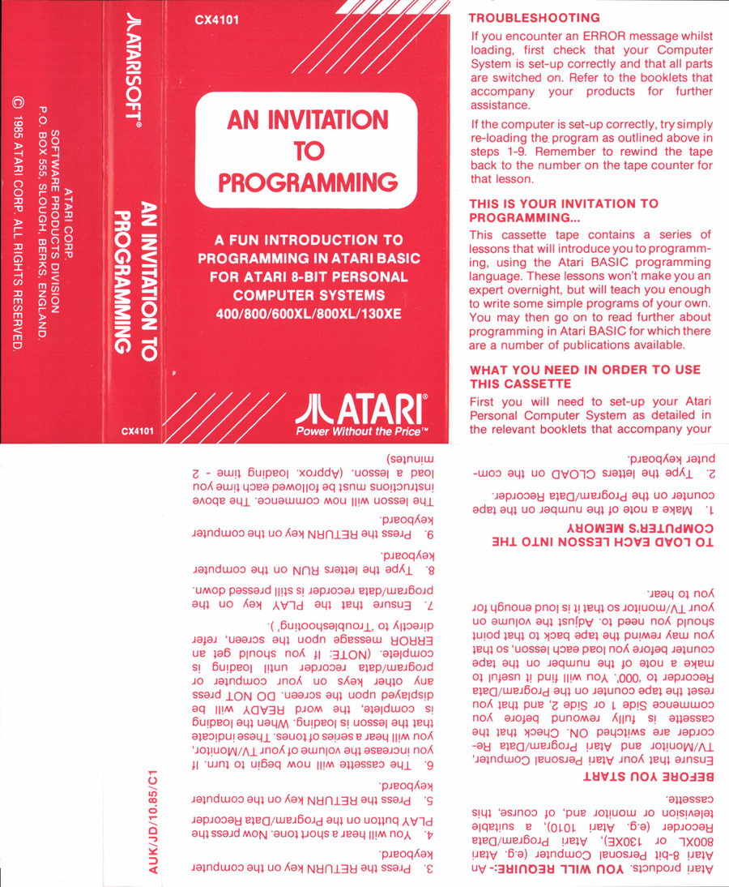
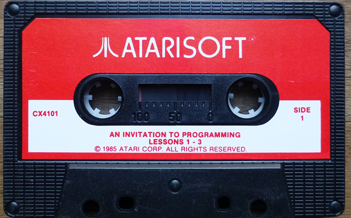

# An Invitation To Programming (cassette CX 4101)

Atari Corp UK re-released part one of this series under the label "Atarisoft" as a budget cassette in 1985. Atari UK changed the copyright date for lesson one to 1985 (see screenshot one), but lessons 2 to 5 still have the old copyright date of 1979.

Both sides use the dual audio format.

## CAS-Images

Side 1: [An\_Invitation\_To\_Programming\_UK85\_SideA.cas](attachments/An_Invitation_To_Programming_UK85_SideA.cas)
Side 2: [An\_Invitation\_To\_Programming\_UK85\_SideB.cas](attachments/An_Invitation_To_Programming_UK85_SideB.cas)

## ATR files

Side 1: [An\_Invitation\_To\_Programming\_UK85\_SideA.ATR](attachments/An_Invitation_To_Programming_UK85_SideA.ATR)
Side 2: [An\_Invitation\_To\_Programming\_UK85\_SideB.ATR](attachments/An_Invitation_To_Programming_UK85_SideB.ATR)

## FLAC file

Side 1: [http://data.atariwiki.org/FLAC/An\_Invitation\_To\_Programming\_UK85\_SideA.flac](http://data.atariwiki.org/FLAC/An_Invitation_To_Programming_UK85_SideA.flac)
Side 2: [http://data.atariwiki.org/FLAC/An\_Invitation\_To\_Programming\_UK85\_SideB.flac](http://data.atariwiki.org/FLAC/An_Invitation_To_Programming_UK85_SideB.flac)

## Manual

See cover picture

## Screenshots

## Cover

- An Invitation to Programming Cover UK 1985 rerelease 

## Media pictures

- An Invitation to Programming Cassette UK 1985 re-release 
