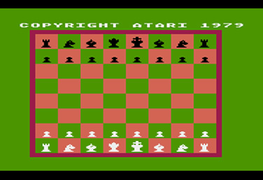
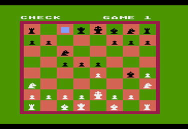
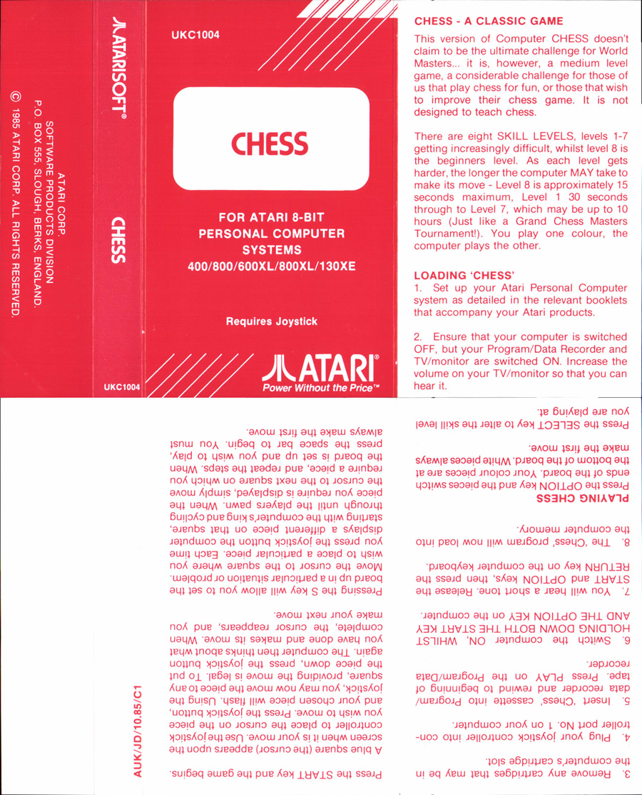
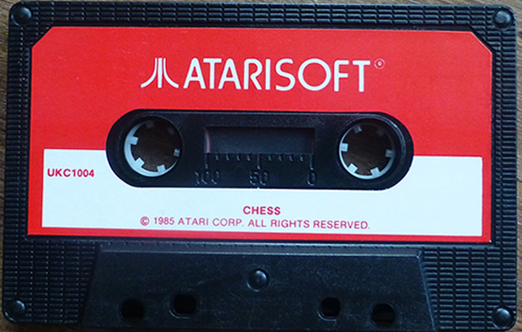

# Chess (cassette UKC1004)

Chess is the UK rerelease of Computer Chess by Atari Corp. UK.This cassette was released under the label "Atarisoft" as a budget cassette in 1985.

## CAS-Image

Side 1: [Chess\_UKC1004.cas](attachments/Chess_UKC1004.cas)

## Manual

See cover picture

## Screenshots

## Cover

- Chess Cover 1985 rerelease 

## Media pictures

- Cassette of the 1985 rerelease 
