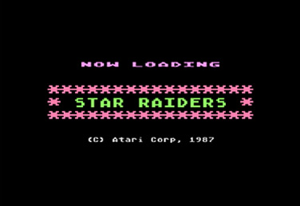
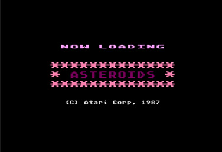
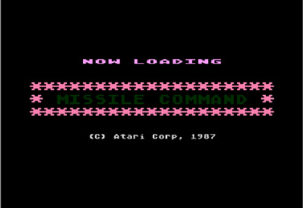
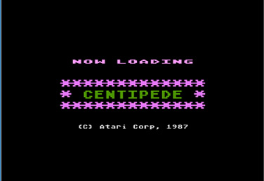
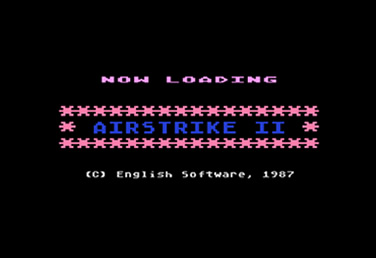
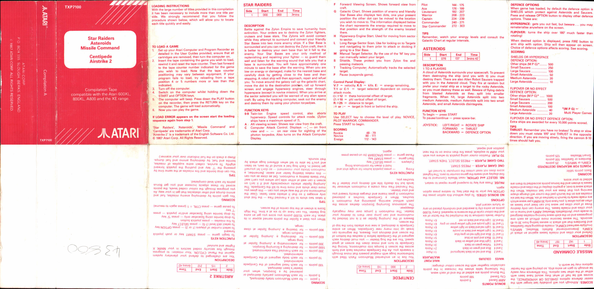
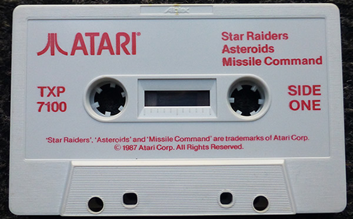

# Compilation A (TXP7100)

Atari Corp UK released this compilation cassette in 1987. This cassette contains rereleases of the games Star Raiders, Asteroids, Missile Command, Centipede and Airstrike 2. Each game features a loading screen by Atari Corp UK, which states the copyright date of 1987. The version on this tape of Centipede is not the regular 400/800 version but the version which was made for the 5200.

## CAS-Image

Side: 1 Star Raiders, Asteroids, Missile Command: [Compilation\_A\_TXP7100\_SideA.cas](attachments/Compilation_A_TXP7100_SideA.cas)
Side: 2 Centipede, Airstrike 2: [Compilation\_A\_TXP7100\_SideB.cas](attachments/Compilation_A_TXP7100_SideB.cas)

## Individual CAS-files

Star Raiders: [Compilation\_A\_TXP7100\_SideA\_Star\_Raiders.cas](attachments/Compilation_A_TXP7100_SideA_Star_Raiders.cas)
Asteroids: [Compilation\_A\_TXP7100\_SideA\_Asteroids.cas](attachments/Compilation_A_TXP7100_SideA_Asteroids.cas)
Missile Command: [Compilation\_A\_TXP7100\_SideA\_Missile\_Command.cas](attachments/Compilation_A_TXP7100_SideA_Missile_Command.cas)
Centipede: [Compilation\_A\_TXP7100\_SideB\_Centipede.cas](attachments/Compilation_A_TXP7100_SideB_Centipede.cas)
Airstrike 2: [Compilation\_A\_TXP7100\_SideB\_Airstrike2.cas](attachments/Compilation_A_TXP7100_SideB_Airstrike2.cas)

## Manual

See cover picture

## Screenshots

## Cover

- Compilation A TXP7100 cover 

## Media pictures

- Compilation A TXP7100 cassette 
