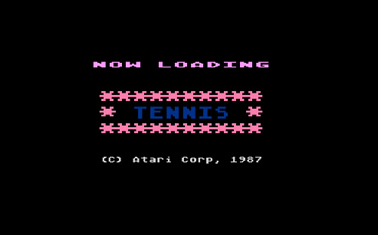
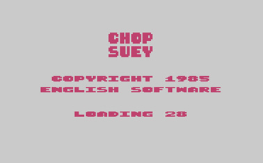
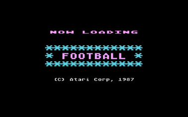
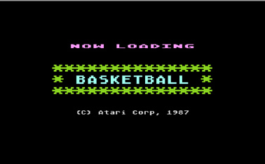
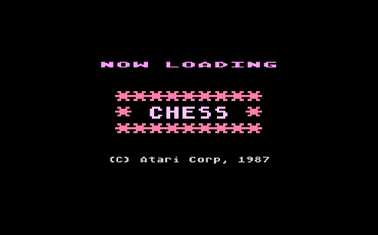
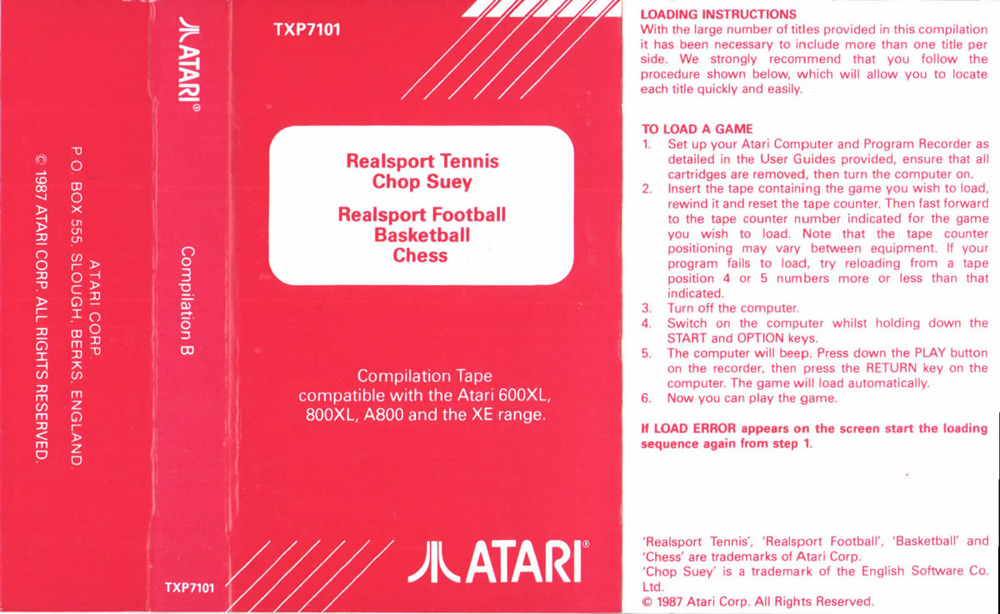
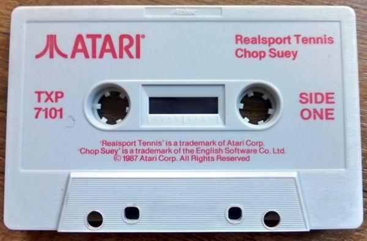

# Compilation B (TXP7101)

Atari Corp UK released this compilation cassette in 1987. This cassette contains rereleases of the games Tennis, Chop Suey, Football, Basketball and Chess. Each game features a loading screen by Atari Corp UK which states the copyright date of 1987, except Chop Suey which was a game made by English Software.

## CAS-Image

Side: 1 Realsport Tennis, Chop Suey: [Atari\_Compilation\_TXP7101\_SideA.cas](attachments/Atari_Compilation_TXP7101_SideA.cas)
Side: 2 Realsport Football, Basketball, Chess: [Atari\_Compilation\_TXP7101\_SideB.cas](attachments/Atari_Compilation_TXP7101_SideB.cas)

## Individual CAS-files

Realsport Tennis: [Atari\_Compilation\_TXP7101\_SideA\_Tennis.cas](attachments/Atari_Compilation_TXP7101_SideA_Tennis.cas)
Chop Suey: [Atari\_Compilation\_TXP7101\_SideA\_ChopSuey.cas](attachments/Atari_Compilation_TXP7101_SideA_ChopSuey.cas)
Realsport Football: [Atari\_Compilation\_TXP7101\_SideB\_Football.cas](attachments/Atari_Compilation_TXP7101_SideB_Football.cas)
Basketball: [Atari\_Compilation\_TXP7101\_SideB\_Basketball.cas](attachments/Atari_Compilation_TXP7101_SideB_Basketball.cas)
Chess: [Atari\_Compilation\_TXP7101\_SideB\_Chess.cas](attachments/Atari_Compilation_TXP7101_SideB_Chess.cas)

## Manual

See cover picture

## Screenshots

## Cover

Compilation A TXP7100 cover

## Media pictures

Compilation A TXP7100 cassette
