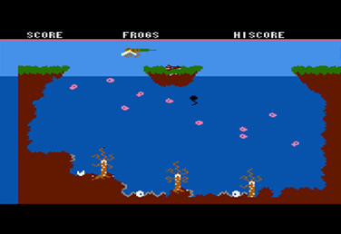
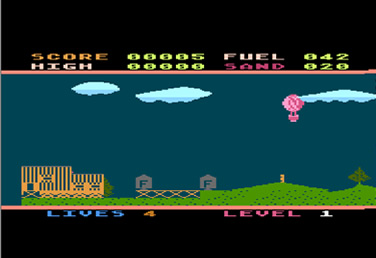
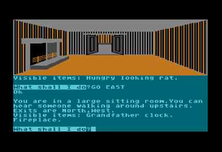
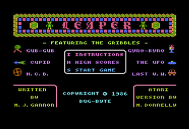
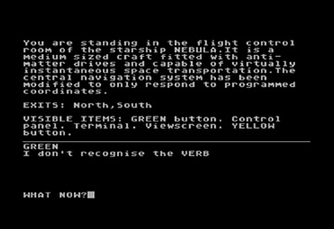
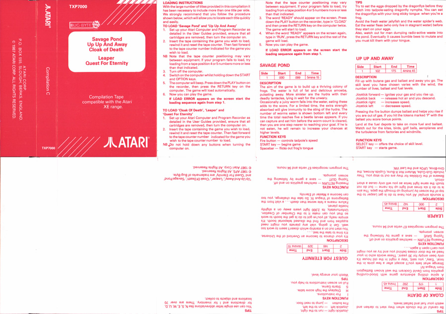
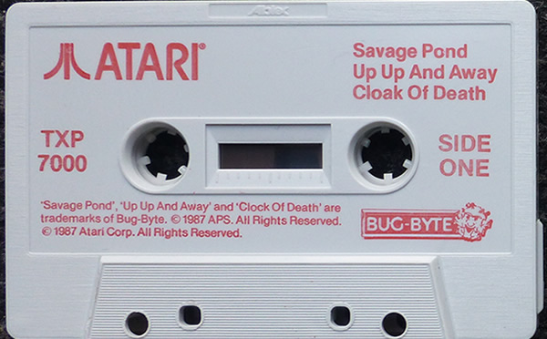

# Compilation C (TXP7000)

Atari Corp UK released this compilation cassette in 1987. This cassette contains rereleases of the games Savage Pond, Up Up And Away, Cloak Of Death, Leaper and Quest for Eternity. In contrast to the other Atari UK compilation tapes, this tape contains only games which were originally published by Bug Byte.

## CAS-Image:

Side: 1 Savage Pond, Up Up And Away, Cloak Of Death: [Compilation\_C\_TXP7000\_SideA.cas](attachments/Compilation_C_TXP7000_SideA.cas)
Side: 2 Leaper, Quest For Eternity: [Compilation\_C\_TXP7000\_SideB.cas](attachments/Compilation_C_TXP7000_SideB.cas)

## Individual CAS-files:

Savage Pond: [Compilation\_C\_TXP7000\_SideA\_Savage\_Pond.cas](attachments/Compilation_C_TXP7000_SideA_Savage_Pond.cas) (machine code)
Up Up And Away: [Compilation\_C\_TXP7000\_SideA\_Up\_Up\_And\_Away.cas](attachments/Compilation_C_TXP7000_SideA_Up_Up_And_Away.cas) (machine code)
Cloak Of Death: [Compilation\_C\_TXP7000\_SideA\_Cloak\_Of\_Death.cas](attachments/Compilation_C_TXP7000_SideA_Cloak_Of_Death.cas) (basic)
Leaper: [Compilation\_C\_TXP7000\_SideB\_Leaper.cas](attachments/Compilation_C_TXP7000_SideB_Leaper.cas) (basic)
Quest For Eternity: [Compilation\_C\_TXP7000\_SideB\_Quest\_For\_Eternity.cas](attachments/Compilation_C_TXP7000_SideB_Quest_For_Eternity.cas) (basic)

## Manual:

See cover picture

## Screenshots:

## Cover:

Compilation C TXP7000 cover

## Media pictures:

Compilation C TXP7000 cassette
