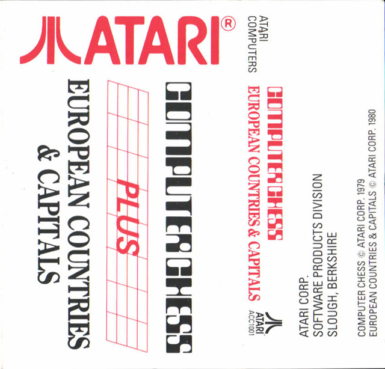
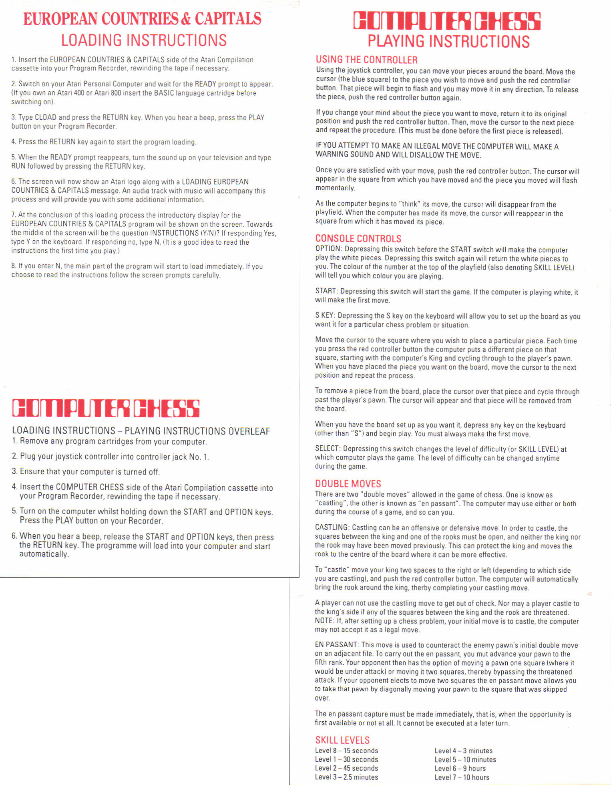
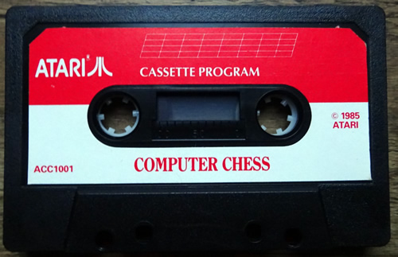
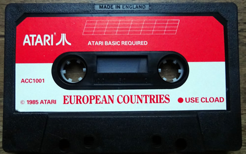
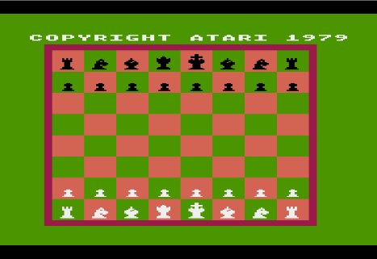
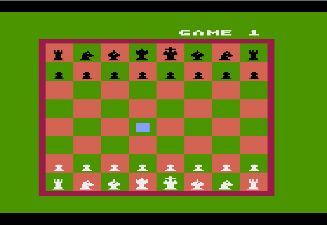
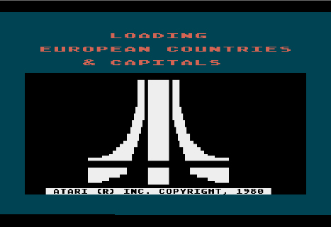
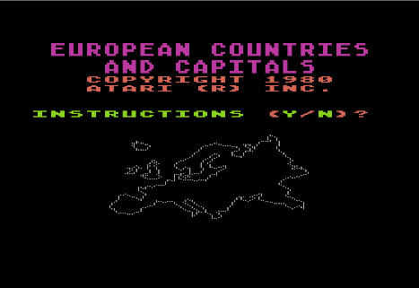
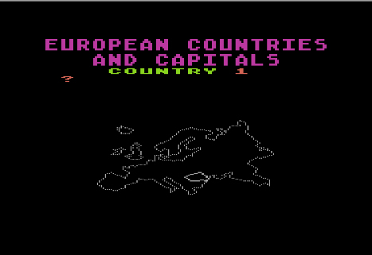

# Computer Chess \& European Countries and Capitals

Copyright (C) 1985 by Atari Corp. UK

This tape is a compilation of Computer Chess and European Countries and Capitals on one tape by Atari Corp. UK. In contrast to the original US version of European Countries and Capitals of 1980, this cassette contains only the version with the game and instructions. European Countries and Capitals uses the dual audio format.

## Cover

- Black Lamp cover 

## CAS Images

Side 1: Computer Chess [Computer\_Chess\_ACC1001.CAS](attachments/Computer_Chess_ACC1001.CAS)
Side 2: European Countries and Capitals [European\_Countries\_and\_Capitals\_ACC1001.CAS](attachments/European_Countries_and_Capitals_ACC1001.CAS)

## Manual

- Computer Chess - European Countries and Capitals manual 

## Media pictures

- Side A Chess 
- Side B European Countries and Capitals 

## Screenshots

- Computer Chess - screenshot 1 

- Computer Chess - screenshot 2 

- European Countries and Capitals - screenshot 1 

- European Countries and Capitals - screenshot 2 

- European Countries and Capitals - screenshot 3 
