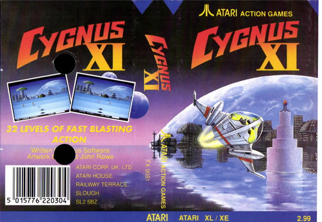
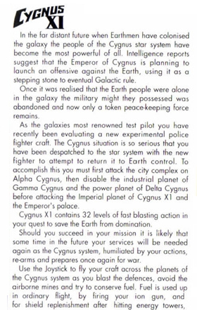
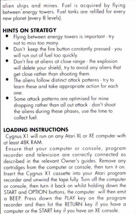
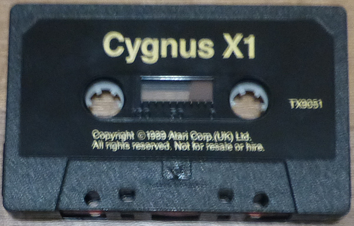
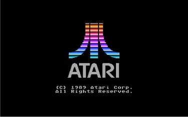
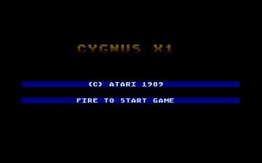
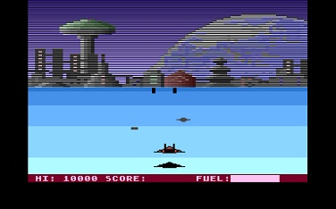

# Cygnus X1 - (TX 9051)

Copyright (C) 1989 by Atari Corp. UK

Cygnus X1 is an shoot 'm up game released by Atari Corp. UK in 1989. This game looks extremely similar to the Ski Slalom game of Winter Events by Anco.

## Cover

- Cygnus X1 cover 

## CAS Image

Side 1: [Cygnus\_TX9051.cas](attachments/Cygnus_TX9051.cas)

## Manual

- Cygnus X1 - manual - side 1 

- Cygnus X1 - manual - side 2 

## Media pictures

- Cygnus X1 - cassette 

## Screenshots

- Cygnus X1 - screenshot 1 

- Cygnus X1 - screenshot 2 

- Cygnus X1 - screenshot 3 
