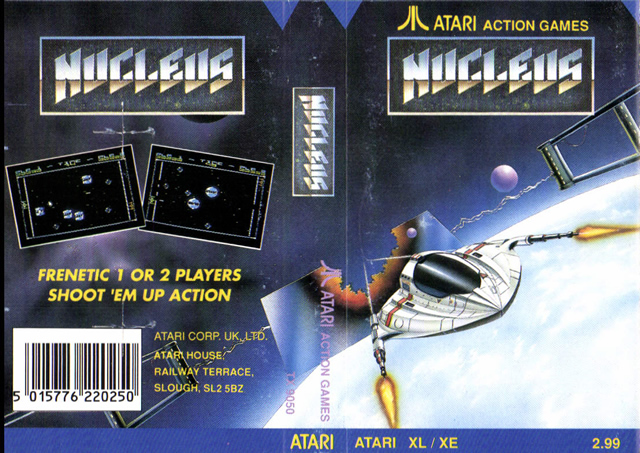
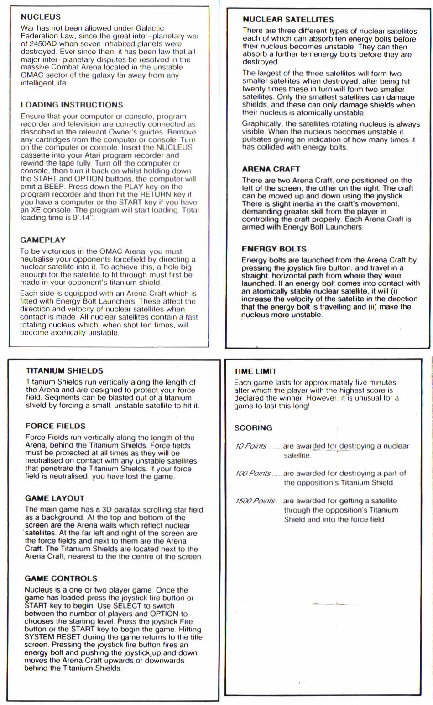
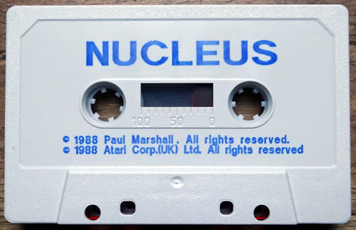
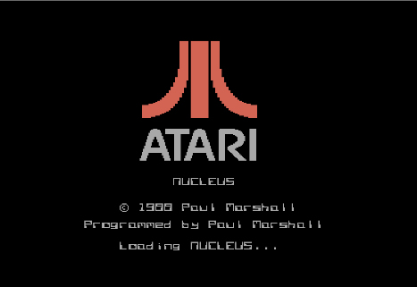
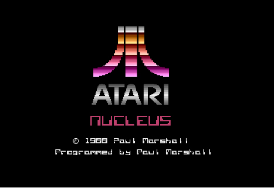
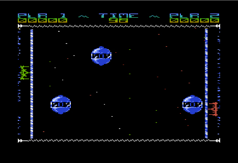

# Nucleus (TX9050)

Copyright (C) 1988 by Atari Corp. UK

Nucleus is a shoot 'm up game released by Atari Corp. UK in 1988. The game is programmed by Paul D. Marshall.

## Cover

- Nucleus cover 

## CAS Image

Side 1: [Nucleus\_TX9050.cas](attachments/Nucleus_TX9050.cas)

## Manual

- Nucleus manual 

## Media Picture

- Nucleus tape 

## Screenshots

- Nucleus - screenshot 1 

- Nucleus - screenshot 2 

- Nucleus - screenshot 3 
