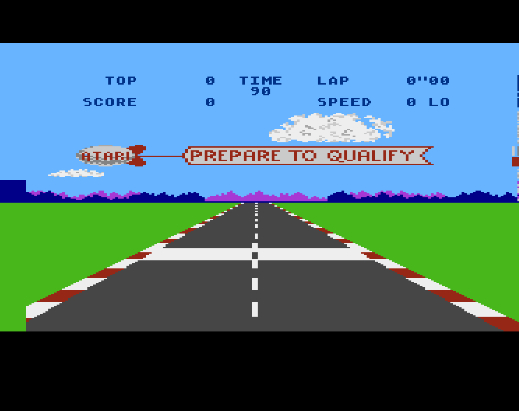
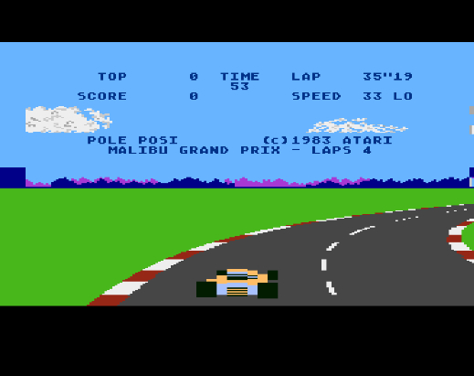
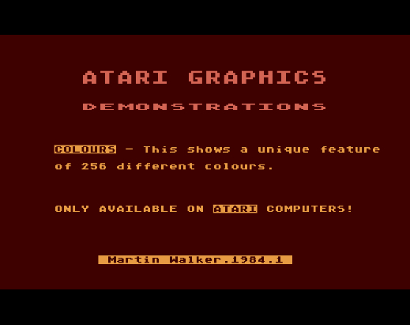
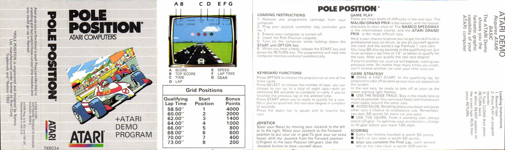
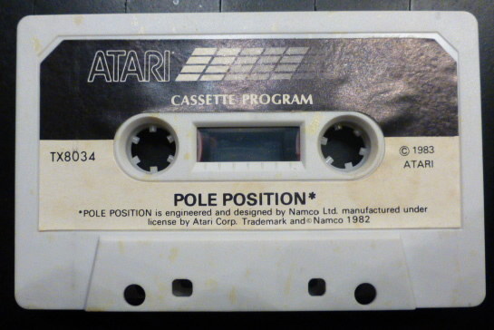

# Pole Position (TX8034)

Atari Corp UK released Pole Position on cassette in the eighties. This cassette contains besides the game an Atari Demo program on side B.

## CAS-Image

Side: 1 Pole Position: [pole\_position\_uk1984.cas](attachments/pole_position_uk1984.cas)
Side: 2 Atari Demo Program: [Atari\_demo\_program\_uk1984.cas](attachments/Atari_demo_program_uk1984.cas)

## Manual

See cover picture

## Screenshots

## Cover

- Pole Position TX8034 cover 

## Media pictures

- Pole Position TX8034 cassette 
