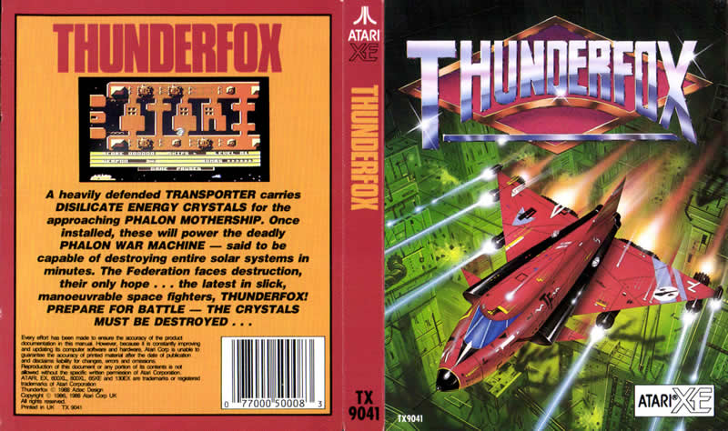
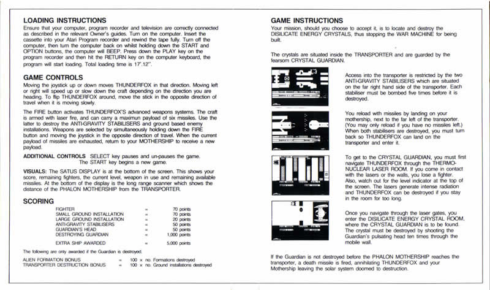
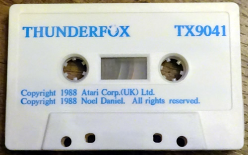
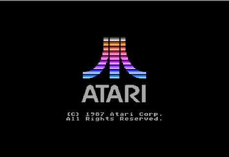
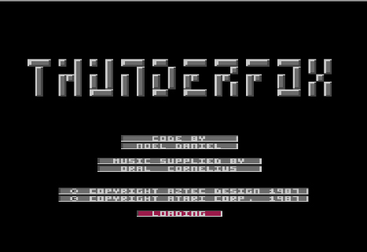
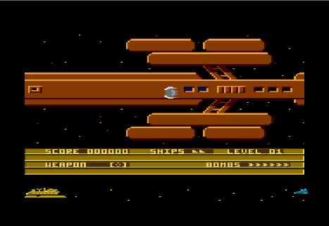

# Thunderox

Copyright (C) 1987 by Atari Corp. UK

Thunderfox is a shoot'em up game released by Atari Corp. UK on cassette tape in 1987. The game was developed by Aztec Design and programmed by Noel Daniel. The music was written by Orall Cornellius. In 1988 Atari Corp. (US) released this game on cartridge.

## Cover

- Thunderfox cover 

## CAS Image

Side 1: [Thunderfox\_TX9041.cas](attachments/Thunderfox_TX9041.cas)

## Manual

- Thunderfox manual 

## Media picture

- Thunderfox tape 

## Screenshots

- Thunderfox - screenshot 1 

- Thunderfoxf - screenshot 2 

- Thunderfox - screenshot 3 
