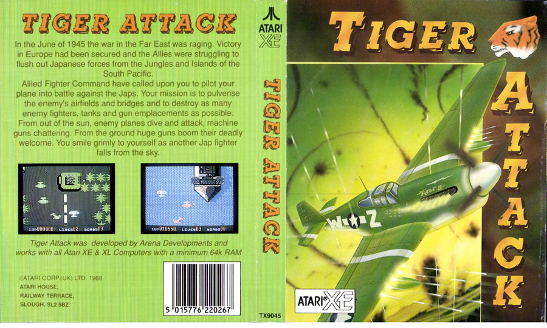
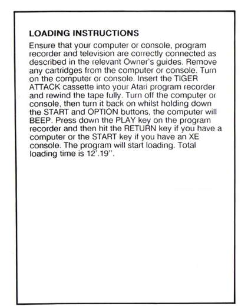
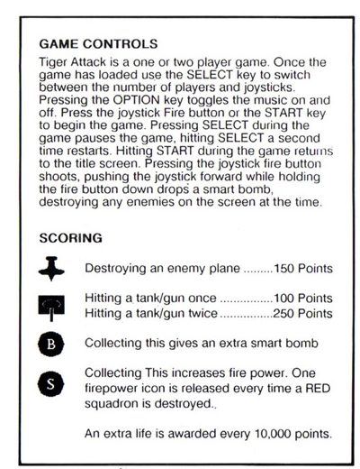
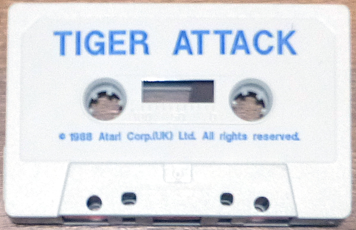
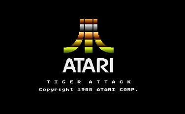
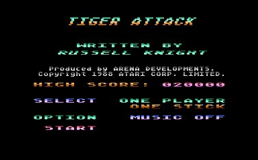
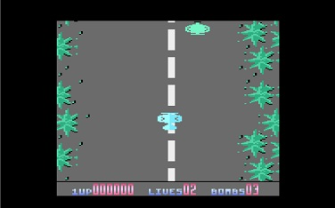

# Tiger Attack (TX 9045)

Copyright (C) 1988 by Atari Corp. UK

Tiger Attack is an shoot 'm up game developed by Arena Developments and released by Atari Corp. UK in 1988. This game is based on the arcade game Flying Shark.

## Cover

- Tiger Attack - cover 

## CAS-Image

Side 1: [Tiger\_Attack\_TX9045.cas](attachments/Tiger_Attack_TX9045.cas)

## Manual

- Tiger Attack - manual side 1 

- Tiger Attack - manual side 2 

## Media pictures

- Tiger Attack - cassette 

## Screenshots

- Tiger Attack - screenshot 1 

- Tiger Attack - screenshot 2 

- Tiger Attack - screenshot 3 
