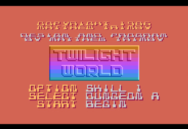
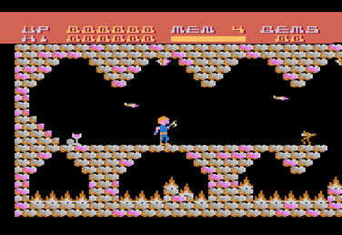
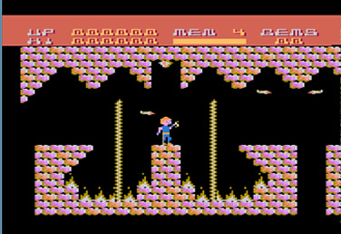
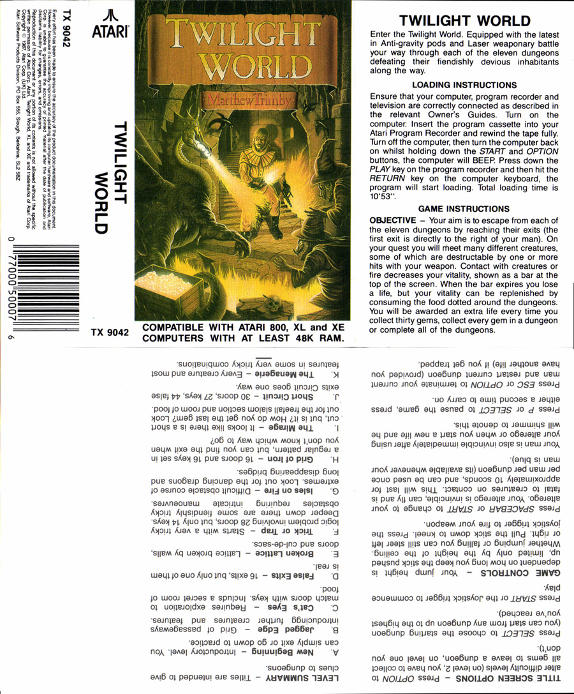
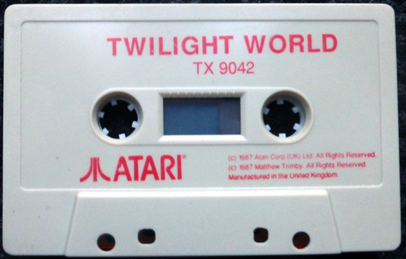

# Twilight World (cassette TX 9042)

Twilight World is a platform game made by  Matthew Trimby and released by Atari Corp. UK in 1987.

## CAS-Image

Side 1: [Twilight\_World.cas](attachments/Twilight_World.cas)

## Manual

See cover picture

## Screenshots

## Cover

- Twilight World cover 

## Media pictures

- Twilight World cassette 
