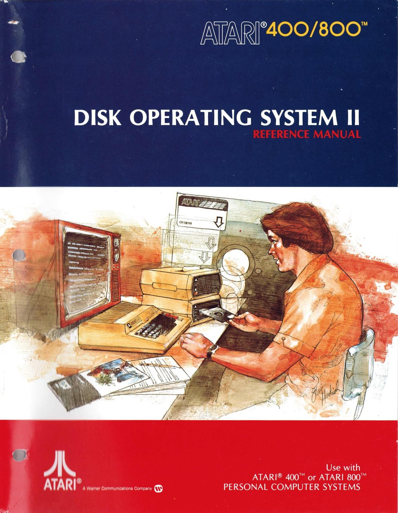

# Atari DOS 2 or DOS II Version 2.x

There were many variations with DOS 2. Here are just the most used ones.

## ATR-Images

- [Atari\_DOS\_II\_Vers.\_2.0S.atr](attachments/Atari_DOS_II_Vers._2.0S.atr) ; original single density Atari DOS II
- [Atari DOS II Vers. 2.0S enhanced](attachments/DOS_2.0S_enhanced.atr) ; Atari DOS II colored and with new functions
- [Atari\_DOS\_II\_Vers.\_2.0D.atr](attachments/Atari_DOS_II_Vers._2.0D.atr) ; original double density Atari DOS II for the Atari 815 dual disk drive
- [Atari\_DOS\_II\_D2.0S-offizielles\_deutsches\_Atari\_DOS.atr](attachments/Atari_DOS_II_D2.0S-offizielles_deutsches_Atari_DOS.atr) ; original Atari DOS II version D2.0S (german)
- [Atari\_DOS\_II\_Vers.\_2.5.atr](attachments/Atari_DOS_II_Vers._2.5.atr) ; original Atari DOS II version 2.5
- [Atari\_DOS\_II\_Vers.\_2.5\_deutsch.atr](attachments/Atari_DOS_II_Vers._2.5_deutsch.atr) ; original Atari DOS II version 2.5 (german)
- [Atari DOS II Vers. 2.75 SD](attachments/DOS_2.75_SD.atr) ; Atari DOS II version 2.75 on a SD diskette
- [Atari DOS II Vers. 2.75 MD](attachments/DOS_2.75_MD.atr) ; Atari DOS II version 2.75 on a MD diskette
- [90KB.atr](attachments/90KB.atr) ; blank formatted disk with single density and single sided: 90 KB
- [130KB.atr](attachments/130KB.atr) ; blank formatted disk with enhanced density and single sided: 130 KB
- [180KB.atr](attachments/180KB.atr) ; blank formatted disk with double density and single sided: 180 KB
- [360KB.atr](attachments/360KB.atr) ; blank formatted disk with double density and double sided: 360 KB (Atari XF 551 only)
- [SSDD128\_DOS\_XE.atr](attachments/SSDD128_DOS_XE.atr) ; blank formatted disk with double density and single sided: 180 KB, with 128 byte header for Atari DOS XE
- [SSDD256\_DOS\_XE.atr](attachments/SSDD256_DOS_XE.atr) ; blank formatted disk with double density and single sided: 180 KB, with 256 byte header for Atari DOS XE

## Manuals

- [The\_Atari\_810\_Disk\_Drive-An\_Introduction\_To\_The\_Disk\_Operating\_System.pdf](attachments/The_Atari_810_Disk_Drive-An_Introduction_To_The_Disk_Operating_System.pdf) Version 2.0S (english)
- [Atari\_DISK\_OPERATING\_SYSTEM\_2.5\_Manual.txt](attachments/Atari_DISK_OPERATING_SYSTEM_2.5_Manual.txt) Version 2.5 Atari DOS II manual, text only (english)
- [Atari\_DOS\_2.5-XF551.pdf](../../../../../media/Companies/Atari/Atari_DOS_2/attachments/Atari_DOS_2.5-XF551.pdf) Version 2.5 (english)
- [Das\_Atari\_810\_Plattenlaufwerk.pdf](../../../../../media/Companies/Atari/Atari_Hardware/Atari_810/attachments/Das_Atari_810_Plattenlaufwerk.pdf) Version 2.0S (german)
- [Atari\_Diskettenlaufwerk-DOS\_2.5-XF551.pdf](attachments/Atari_Diskettenlaufwerk-DOS_2.5-XF551.pdf) Version 2.5 (german)
- [XF551\_Formate.pdf](attachments/XF551_Formate.pdf) Version 2.5 (german) from Erwin Reuss

## Reference

- [Wikipedia: Atari DOS](http://en.wikipedia.org/wiki/Atari_DOS)

## Image

Disk Operating System II (DOS II) - Reference Manual - Cover
