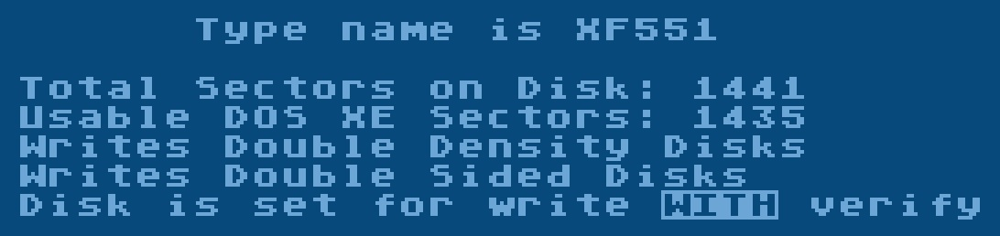

# Atari DOS XE

Copyright (C) Atari 1988.

## Manual

- [Atari DOS XE Owner's manual](attachments/Atari_DOS_XE_Owners_manual.txt) TXT file
- [Atari DOS XE Owner's manual](attachments/Atari_DOS_XE_Owners_manual.pdf) PDF file

## ATR-Images

- [Atari\_DOS\_XE\_Version\_1.00\_90K.atr](attachments/Atari_DOS_XE_Version_1.00_90K.atr) Atari DOS XE Masterdisk on a 90K image file
- [Atari\_DOS\_XE\_Version\_1.00\_360K.atr](attachments/Atari_DOS_XE_Version_1.00_360K.atr) Atari DOS XE Masterdisk on a 360K image file
- [DOS\_XE-blank\_180K\_128\_Byte\_Header.atr](attachments/DOS_XE-blank_180K_128_Byte_Header.atr) Blank formatted DOS XE disk SSDD on a 180K image file with a 128 byte header
- [DOS\_XE-blank\_180K\_256\_Byte\_Header.atr](attachments/DOS_XE-blank_180K_256_Byte_Header.atr) Blank formatted DOS XE disk SSDD on a 180K image file with a 256 byte header
- [DOS\_XE-blank\_360K\_DSDD.atr](attachments/DOS_XE-blank_360K_DSDD.atr) Blank formatted DOS XE disk DSDD on a 360K image file with a 256 byte header (quad format - XF551 only)
- [DOS\_XE\_Docs\_A.atr](attachments/DOS_XE_Docs_A.atr) Documentation of DOS XE - Part A - TXT file
- [DOS\_XE\_Docs\_B.atr](attachments/DOS_XE_Docs_B.atr) Documentation of DOS XE - Part B - TXT file
- [DOS\_XE\_Docs\_C.atr](attachments/DOS_XE_Docs_C.atr) Documentation of DOS XE - Part C - TXT file
- [DOS\_XE\_Docs\_D.atr](attachments/DOS_XE_Docs_D.atr) Documentation of DOS XE - Part D - TXT file

## Pictures

- Atari XF551 under DOS XE 
