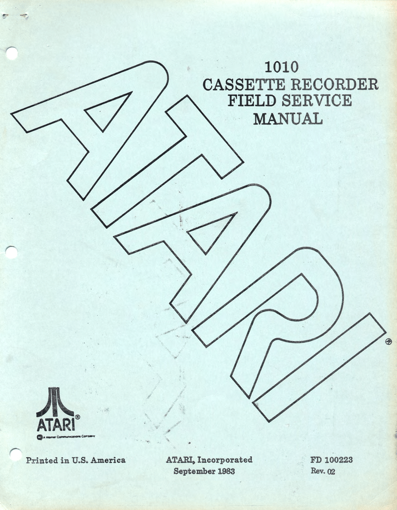
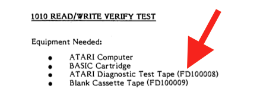
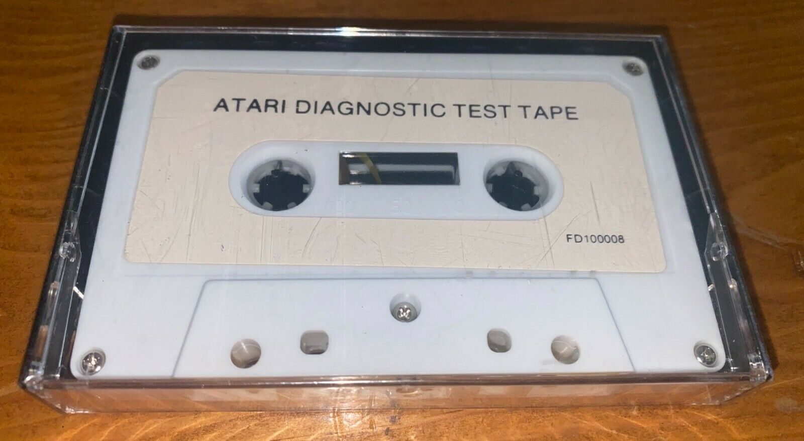
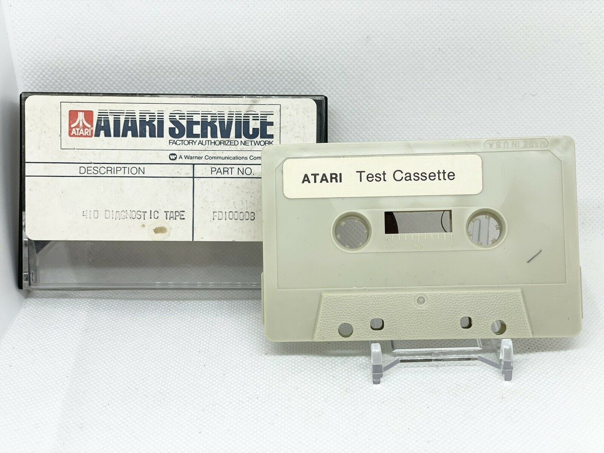
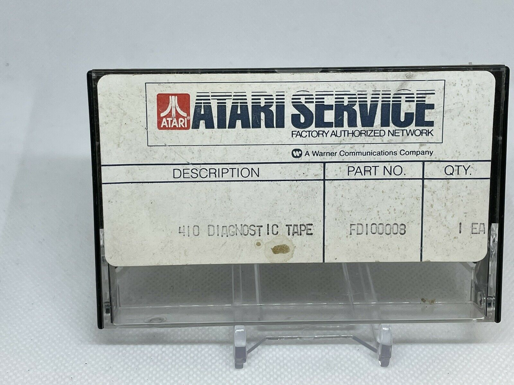
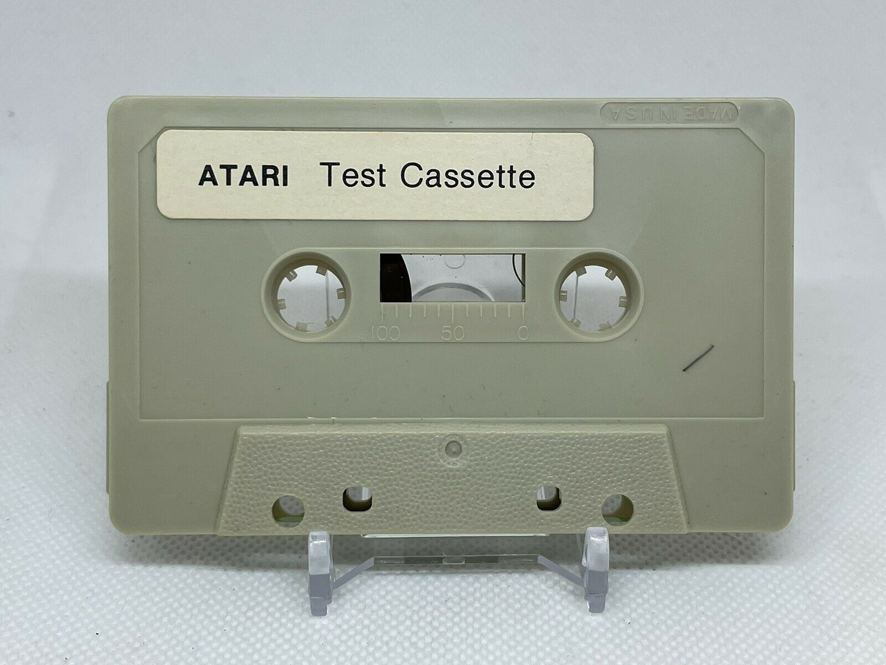
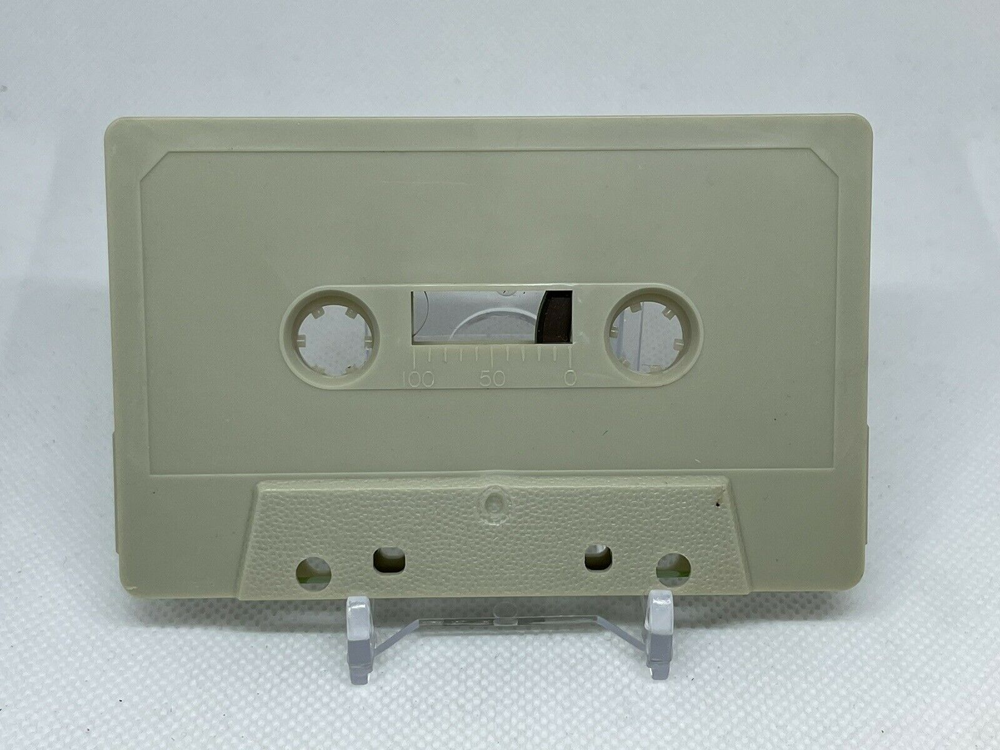
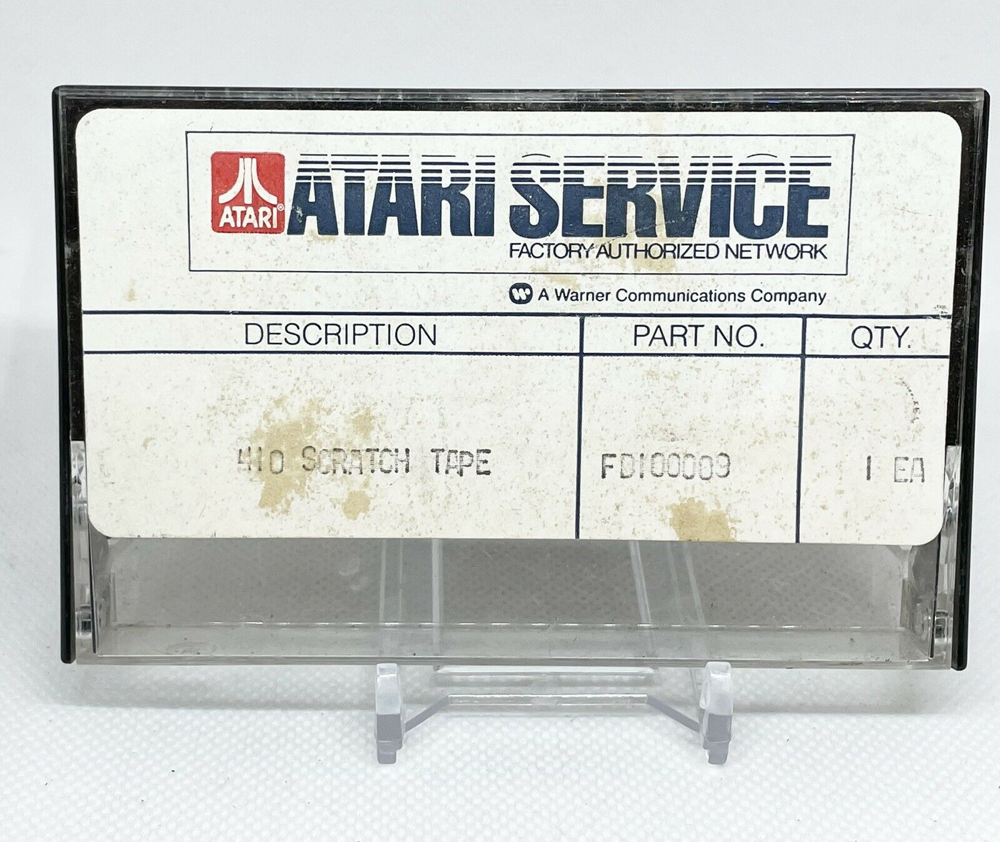
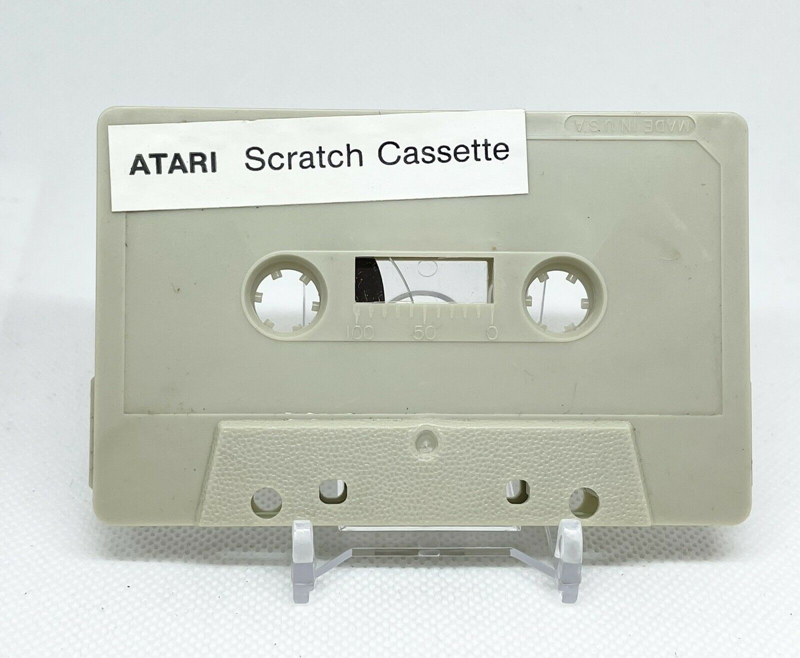
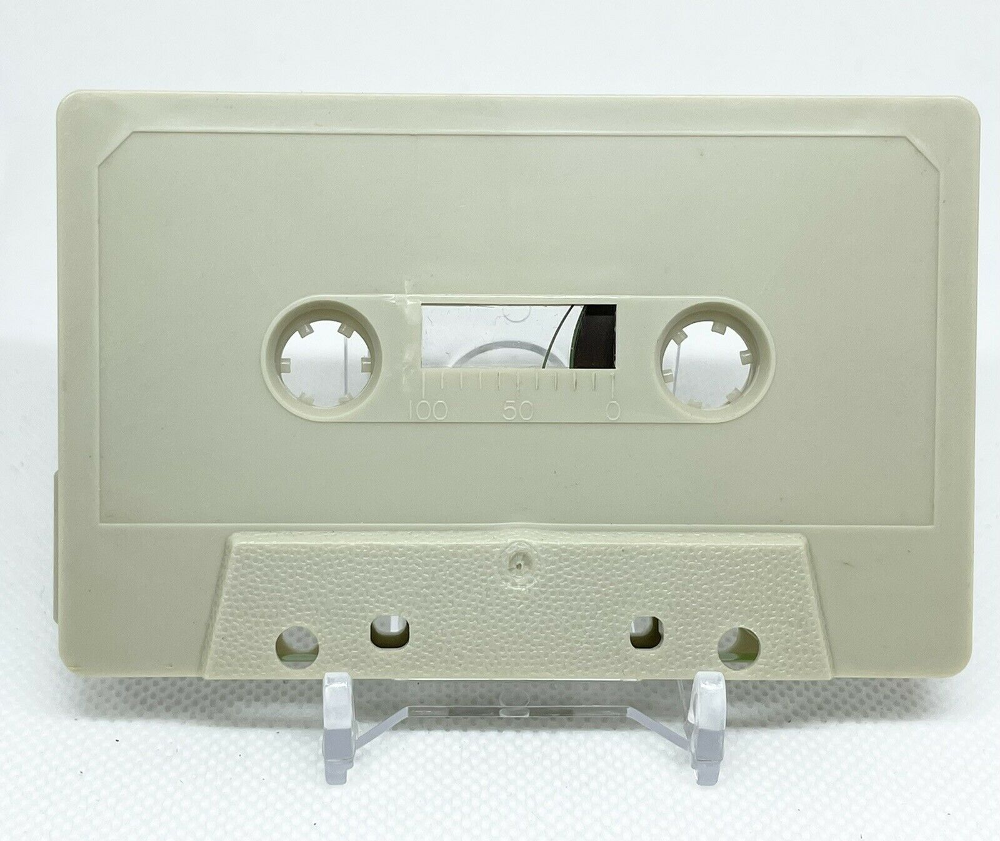

# ATARI Diagnostic Test Tape (FD100008)

From the ATARI 1010 Cassette Recorder Field Service Manual we find on page 3-1 the existence of ATARI Diagnostic Test Tape (FD100008). On page 3-5 we find the instructions on how to do the READ/WRITE verify test on the ATARI 1010 Cassette Recorder.

- ATARI 1010 Cassette Recorder Field Service Manual 

- ATARI 1010 Cassette Recorder Field Service Manual page 3-5 ; instructions on how to do the READ/WRITE verify test on the ATARI 1010 Cassette Recorder 

Besides an ATARI computer and a BASIC cartridge, we need the above mentioned test tape and an blank cassette tape. Here, we can use a 'normal' one, else the official ATARI Blank Cassette Tape (FD100009). Please see the pictures below.

- ATARI Diagnostic Test Tape (FD100008) sealed 

## CAS-File

- [BASIC program of the test in form of a CAS file](attachments/CASTEST.CAS) ; size: 2 KB

## WAV-File

coming soon

## FLAC-File

coming soon

## ATR-Image

- [ATARI\_Diagnostic\_Test\_Tape\_FD100008.atr](attachments/ATARI_Diagnostic_Test_Tape_FD100008.atr) ; ATARI Diagnostic Test program on an atr image with DOS 2.0S

## Manuals

- [Atari\_1010\_Cassette\_Recorder\_Field\_Service\_Manual-FD\_100223\_Rev.\_02.pdf](attachments/Atari_1010_Cassette_Recorder_Field_Service_Manual-FD_100223_Rev._02.pdf) ; size: 3.9 MB
- [Atari\_1010\_Cassette\_Recorder\_Field\_Service\_Manual-FD\_100223\_Rev.\_02-OCR.pdf](attachments/Atari_1010_Cassette_Recorder_Field_Service_Manual-FD_100223_Rev._02-OCR.pdf) ; size: 2.2 MB ; same as above, but with OCR

## Pictures

- ATARI 410 Diagnostic Tape (FD100008) ; box and tape ; thanks to [Fred Meijer](https://www.atarimuseum.nl) 

- ATARI 410 Diagnostic Tape (FD100008) ; box ; thanks to [Fred Meijer](https://www.atarimuseum.nl) 

- ATARI 410 Diagnostic Tape (FD100008) ; tape front ; thanks to [Fred Meijer](https://www.atarimuseum.nl) 

- ATARI 410 Diagnostic Tape (FD100008) ; tape back ; thanks to [Fred Meijer](https://www.atarimuseum.nl) 

- ATARI 410 Scratch Tape (FD100009) ; box ; thanks to [Fred Meijer](https://www.atarimuseum.nl) 

- ATARI 410 Scratch Tape (FD100009) ; tape front ; thanks to [Fred Meijer](https://www.atarimuseum.nl) 

- ATARI 410 Scratch Tape (FD100009) ; tape back ; thanks to [Fred Meijer](https://www.atarimuseum.nl) 
