# Atari Program Text Editor (DXG20075)

Copyright (C) 1981 Atari, Inc. and Mike Lorenzen

Mega-Danke an Marc Brings (Sleeπ) für den Erhalt der Software. :-) Wir sind tief in Deiner Schuld! :-)))

Der Atari Program-Text Editor 1.0 von Mike Lorenzen ist ein universeller Text-Editor, der für alle Programmiersprachen verwendet werden kann. Mit Hilfe des Programms: "MEDITCM.BAS" auf dem ATR-Image unten, ist es möglich den Editor auf seine persönlichen Bedürfnisse zuzuschneiden. Man kann auch eine andere Farbe wählen sowie spezifische Tabulator-Stopps setzen, siehe Anleitung.

Der Atari Program-Text Editor wurde auch als APX-Programm [Atari Program-Text Editor (APX-20075, CX20075, CX8105?)](../../Atari_Program-Text_Editor/README.md) verkauft. Atari übernahm diesen anscheinend und änderte lediglich die Bezeichnung in CX20075. Die hier vorliegende deutsche Version hat in der Datei: "DISKNAME.DAT" noch die Bezeichnung: "APX-20075".

Der exakt gleiche Editor wurde auch mit dem [Atari Macro Assembler (AMAC) and Program-Text Editor (CX8121)](../../Atari_Macro_Assembler_and_Program-Text_Editor/README.md) verkauft.

## ATR-Image

- [Atari\_Programm-Text\_Editor.atr](attachments/Atari_Programm-Text_Editor.atr)

## Startbild

- Atari Program-Text Editor 1.0 - Startbildschirm 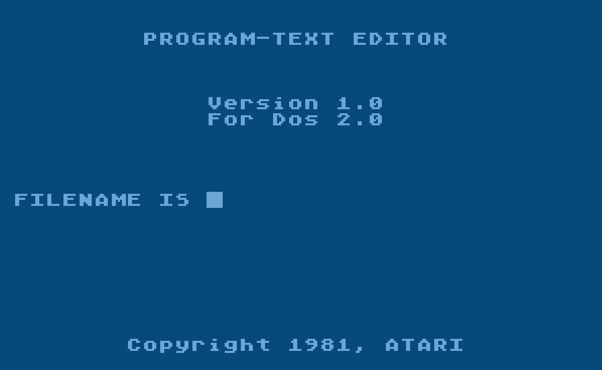

- Atari Program-Text Editor 1.0 - Disketten-Info 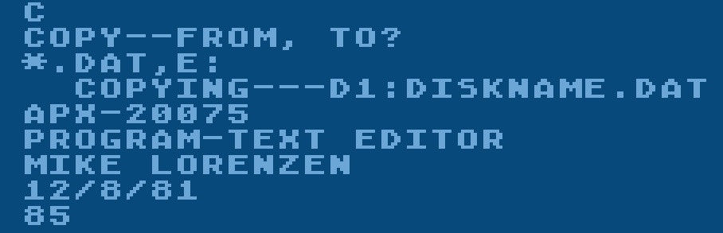

## Editor Customizing Manager

Atari BASIC Source Code als txt-Datei mit der Anleitung in Deutsch, was angepasst werden kann

- [EDITOR\_CUSTOMIZING\_MANAGER.txt](attachments/EDITOR_CUSTOMIZING_MANAGER.txt)

## Reference Card

- Atari Program-Text Editor - Reference Card 

## Bilder des EDITOR CUSTOMIZING MANAGER

- Atari Program-Text Editor 1.0 - EDITOR CUSTOMIZING MANAGER - Anleitung - Bild 1 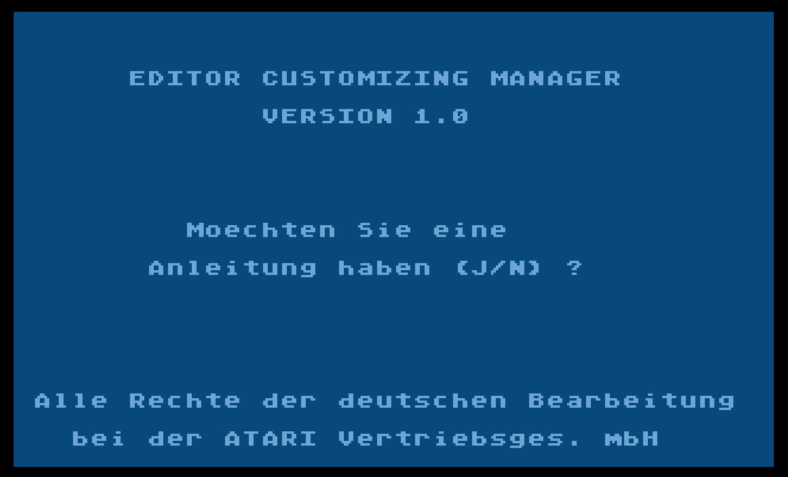

- Atari Program-Text Editor 1.0 - EDITOR CUSTOMIZING MANAGER - Anleitung - Bild 2 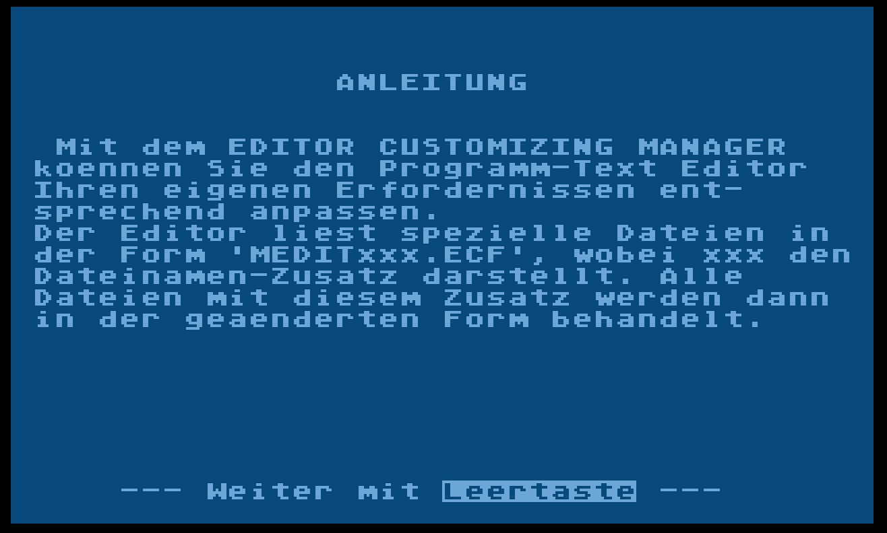

- Atari Program-Text Editor 1.0 - EDITOR CUSTOMIZING MANAGER - Anleitung - Bild 3 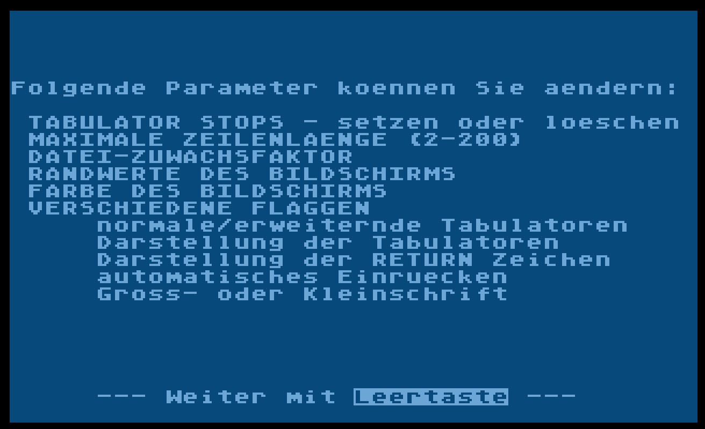

- Atari Program-Text Editor 1.0 - EDITOR CUSTOMIZING MANAGER - Anleitung - Bild 4 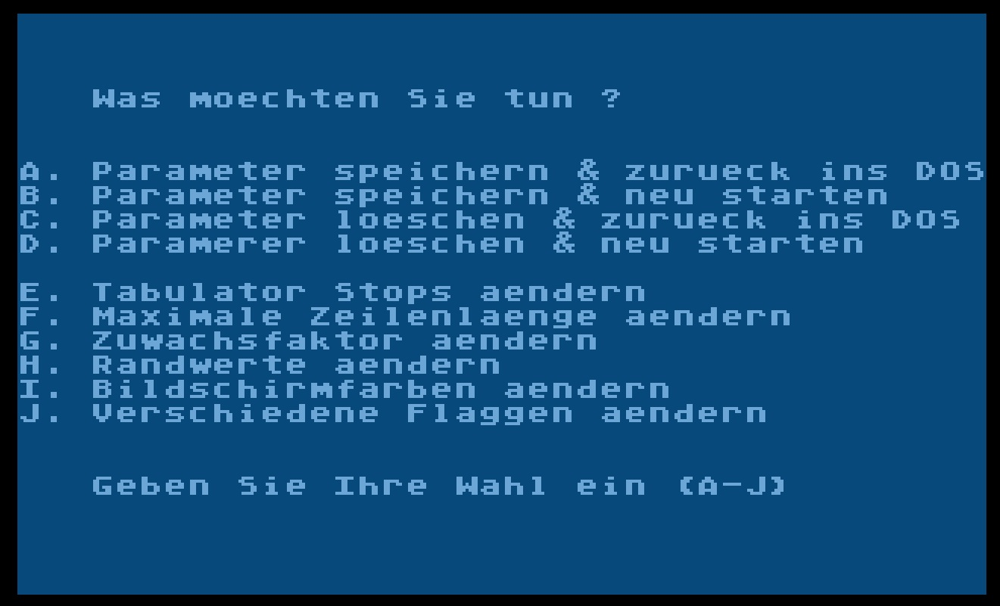

- Atari Program-Text Editor 1.0 - EDITOR CUSTOMIZING MANAGER - Anleitung - Bild 5 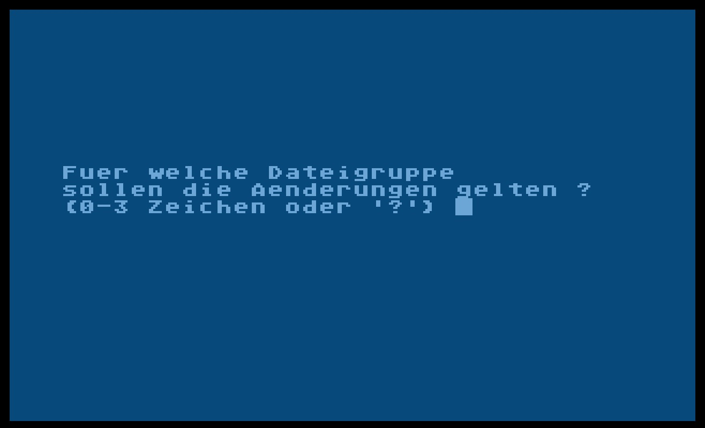

- Atari Program-Text Editor 1.0 - EDITOR CUSTOMIZING MANAGER - Info 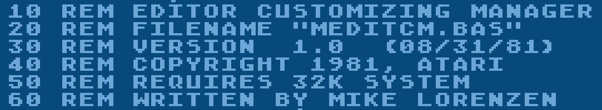

## Bilder

- Atari Program-Text Editor 1.0 - Box-Cover 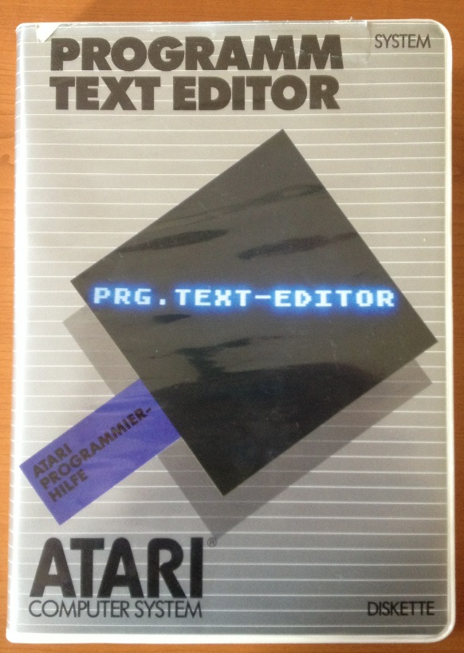

- Atari Program-Text Editor 1.0 - Box-Rückansicht 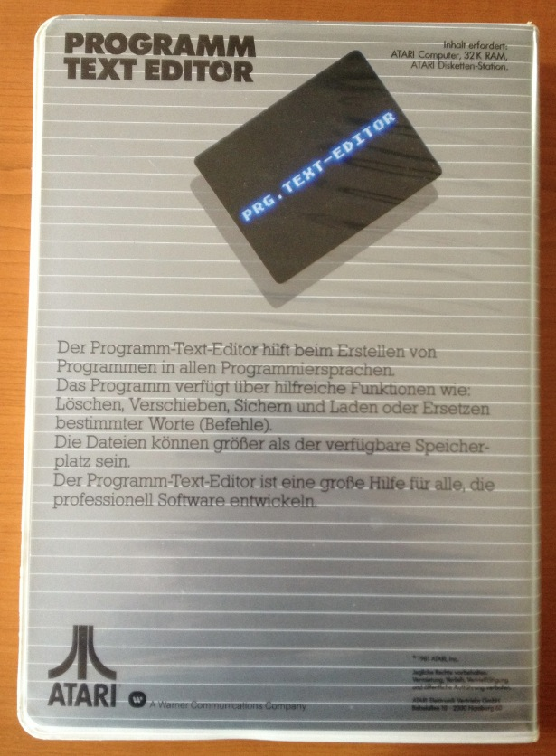

- Atari Program-Text Editor 1.0 - Box geöffnet 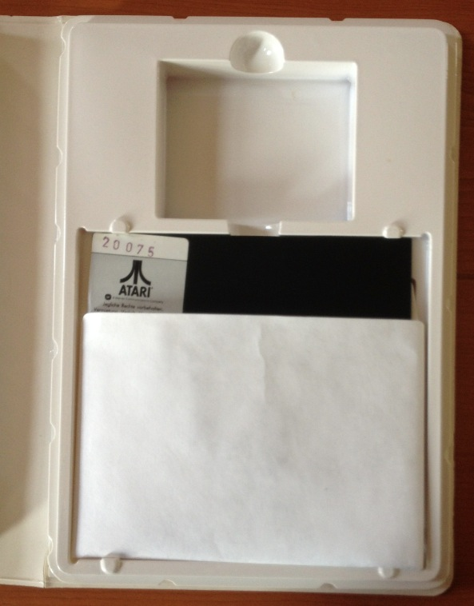

- Atari Program-Text Editor 1.0 - Diskette - Bild 1 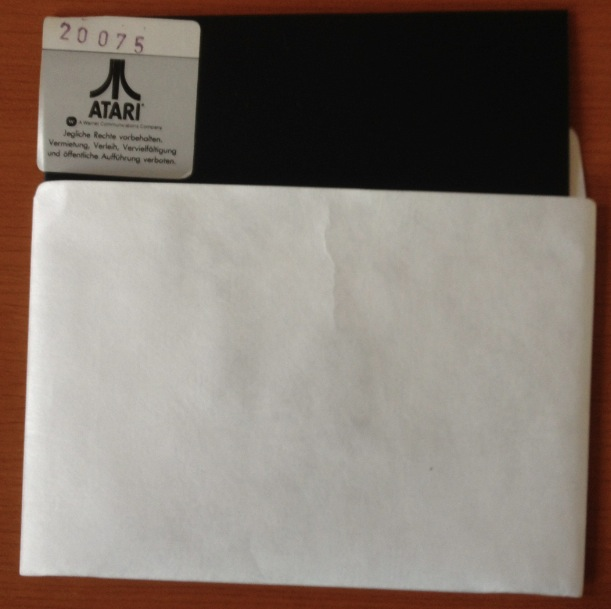

- Atari Program-Text Editor 1.0 - Diskette - Bild 2 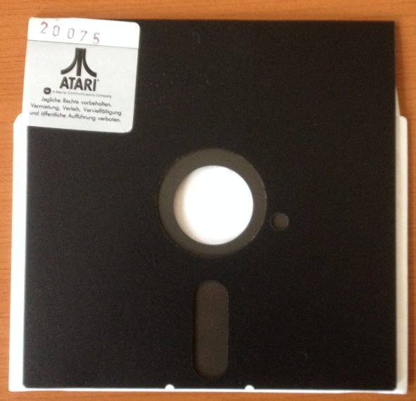

- Atari Program-Text Editor 1.0 - Diskettenaufkleber 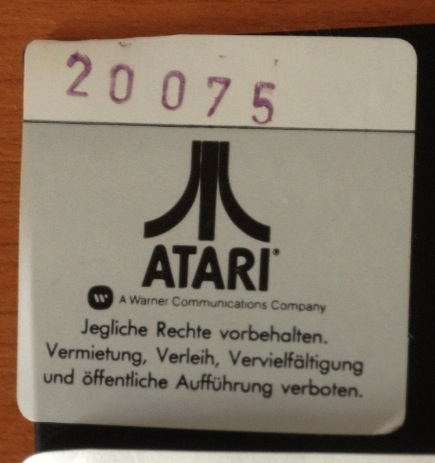
