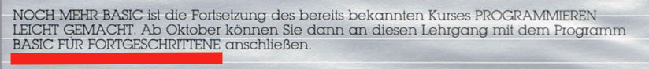

# BASIC für Fortgeschrittene

Copyright (C) 1984 Atari Elektronik Vertriebsgesellschaft mbH

Im 2. Kurs: [Noch mehr BASIC (TXG55007)](../Noch_mehr_BASIC_TXG55007/README.md) findet man einen Hinweis, dass es noch einen 3. Kurs geben soll mit dem Namen: __BASIC für Fortgeschrittene__. Der Kurs war für Oktober 1984 angegekündigt, aber erst im Jahre 2019 konnte durch Rücksprache mit den Verantwortlichen von Atari in Hamburg abschließend geklärt werden, dass lediglich der 1. und 2. Kurs produziert worden sind. Zu einem 3. Kurs kam es leider nicht mehr, was sehr traurig ist. Es besteht jedoch die Möglichkeit den 3. Kurs durch Crowd­fun­ding dennoch fertig zu stellen. Das liegt nunmehr in der Hand der User.

Die deutsche Atari-Gemeinschaft bedankt sich hiermit auf das Herzlichste bei Atari Deutschland mbH für die große Hilfe zur Klärung dieses Mysteriums und der letzten noch verbliebenen deutschen Atari-X-Akte. Allen voran __[Dagmar Berghoff](https://de.wikipedia.org/wiki/Dagmar_Berghoff)__, __Renate Knüfer__, __Dieter Hegemann__, __Dipl.-Ing. Matthias Panczyk__ und ganz besonders __Marion Duus__. Wer so ein Gedächtnis hat, der braucht keinen Computer mehr, außer vielleicht einen Atari. ;-)

## Bild

Einzige vorhandene Spur von: __BASIC für Fortgeschrittene__, vorgesehen für den Oktober 1984. Der Hinweis hierzu befindet sich auf der Rückseite der Box des 2. Kurses: [Noch mehr BASIC (TXG55007)](../Noch_mehr_BASIC_TXG55007/README.md) 

## Nachweise
Den 3. Kurs gab es für Atari US/UK, BeNeLux und Frankreich. Wahrscheinlich auch für Italien sowie Spanien.
- [An Invitation to Programming 3-Introduction to Sound and Graphics (CX4117)](../../Atari_Corporation_UK/An_Invitation_To_Programming/An_Invitation_to_Programming_3_CX4117/README.md)
- [Programmeren... Hoe Doe Je Dat (Deel 3)](../Programmeren..._Hoe_Doe_Je_Dat_(Deel_3)/README.md) ; thanks to Fred_M from AtariAge
- [ATARI CX-4117 C Initiation à la Programmation en Basic (Cours n°3)](http://www.rhod.fr/pages/basic3.html) ; thanks to rhod
- [Invito a programmare 1](https://www.atarinside.com/blog/index.php/atarinside-items/invito-a-programmare-1/) ; thanks to [ATARInside](https://www.atarinside.com/blog/index.php/atarinside-items/invito-a-programmare-1/) at least course 1 surfaced :-)
