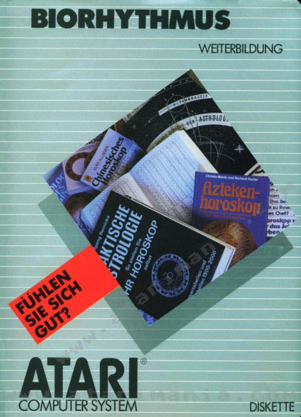
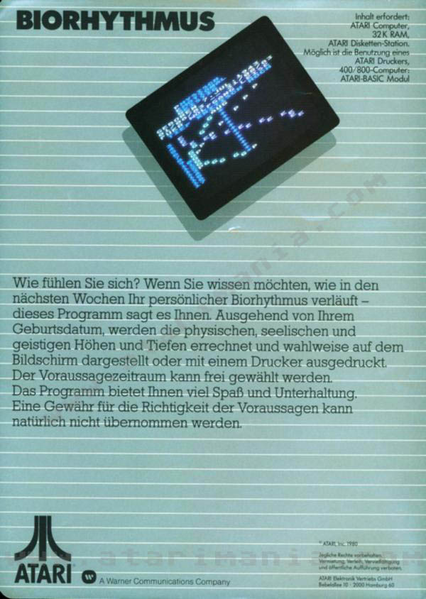
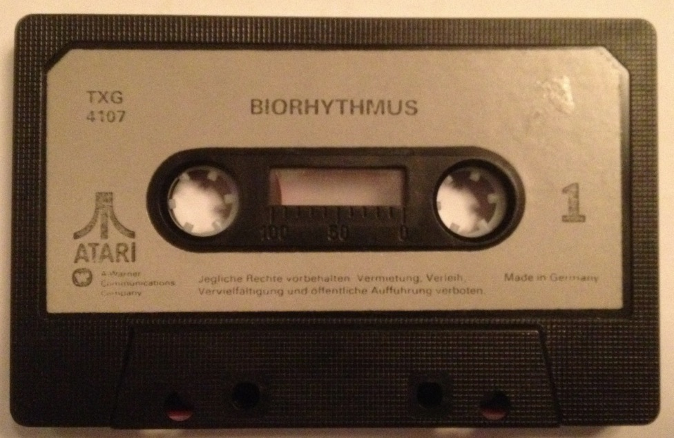
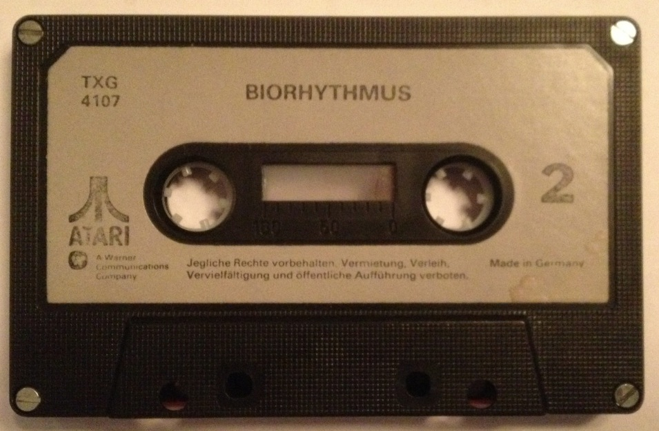
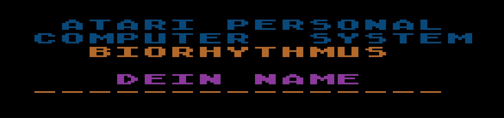
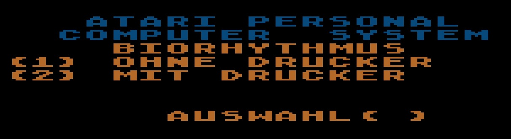
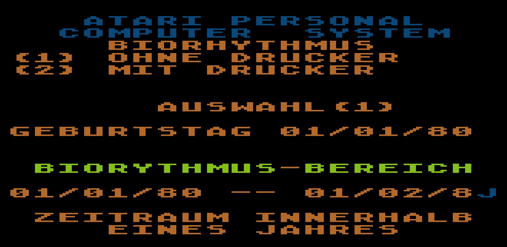
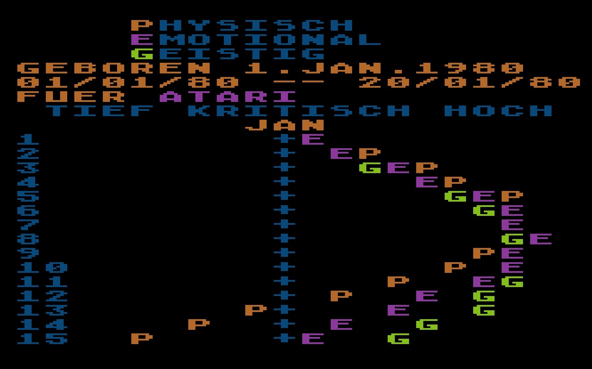

# Biorhythmus DXG 5727 bzw. TXG 4107

Copyright (C) 1980 Atari Elektronik Vertriebs GmbH

Atari Biorhythmus DXG 5727 bzw. TXG 4107 ist die deutsche Version von: [Atari Biorhythm (CX4107)](../../Atari_Biorhythm/README.md)

Normalerweise hat ein solches Programm in der Atariwiki nichts zu suchen, da es eher dem Bereich "Spiele" zugeordnet werden kann. Schaut man jedoch in den Quelltext, so wird klar, dass hier transzendente Funktionen zur Berechnung zum Einsatz kommen. Dies ist mathematisch schon etwas anspruchsvoller und daher soll das Programm zu diesem Zwecke hier mitaufgeführt werden.

Derzeit existiert nur die 16K-Version in deutsch. Die 8K-Version wird noch gesucht und ist bislang nicht funktionsfähig gefunden wurden. Jede Hilfe in dieser Richtung ist stets willkommen! :-)))

Bitte beachten Sie, dass die deutsche Version noch den Y2K-Bug enthält und daher nur bis zum Jahr 2000 funktioniert. Es gibt eine englischen Version [Atari Biorhythm (CX4107)](../../Atari_Biorhythm/README.md), die den Bug bereits bereinigt hat. Diese Version müsste lediglich entsprechend in die deutsche Version übertragen werden.

## ATR-Images

- [Atari\_Biorhythmus\_CX4107\_und\_DXG\_5727\_deutsch-englisch\_Basic\_komplett.atr](attachments/Atari_Biorhythmus_CX4107_und_DXG_5727_deutsch-englisch_Basic_komplett.atr) ;
- [Atari\_Biorhythmus\_DXG\_5727\_deutsch\_Basic\_16K\_mit\_Y2K-Bug--HH-READY-Version.atr](attachments/Atari_Biorhythmus_DXG_5727_deutsch_Basic_16K_mit_Y2K-Bug--HH-READY-Version.atr) ; deutsche, geänderte Version von HH-READY mit dem Y2K-Bug

## Bilder

- Atari Biorhythmus DXG 5727 - Box - Vorderseite - Dank an Atarimania für den Scan 

- Atari Biorhythmus DXG 5727 - Box - Rückseite - Dank an Atarimania für den Scan 

- Atari Biorhythmus TXG 4107 - Kassette - Seite 1 

- Atari Biorhythmus TXG 4107 - Kassette - Seite 2 

- Atari Biorhythmus - Bild 1 

- Atari Biorhythmus - Bild 2 

- Atari Biorhythmus - Bild 3 

- Atari Biorhythmus - Bild 4 
