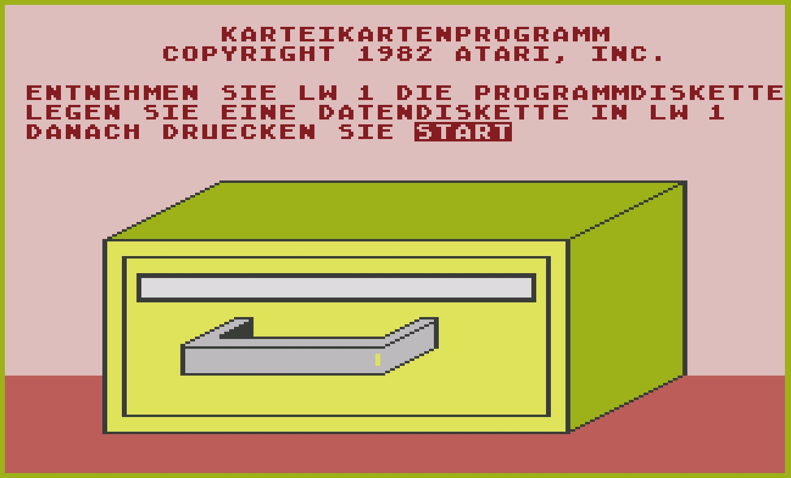
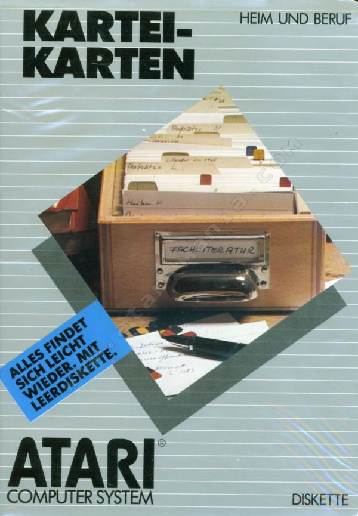
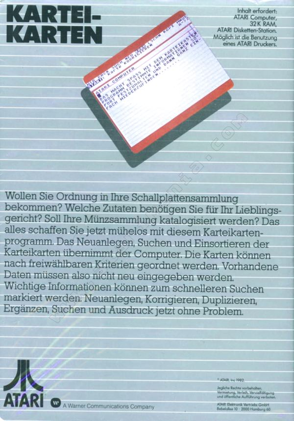

# Karteikartenprogramm (DXG 415)

Copyright (C) 1982 Atari, Inc.

## ATR-Image
- [Karteikartenprogramm.atr](attachments/Karteikartenprogramm.atr)

## Handbuch
- [ATARI_Karteikarten_DXG_415.pdf](../../../../../media/Companies/Atari/Karteikartenprogramm/attachments/ATARI_Karteikarten_DXG_415.pdf) ; Größe: 9,3 MB ; deutsches Handbuch mit roten Seiten

## Bilder
 
Karteikartenprogramm - Startbildschirm

 
Karteikartenprogramm - Box Cover - Danke an Atarimania

 
Karteikartenprogramm - Box Back - Danke an Atarimania
