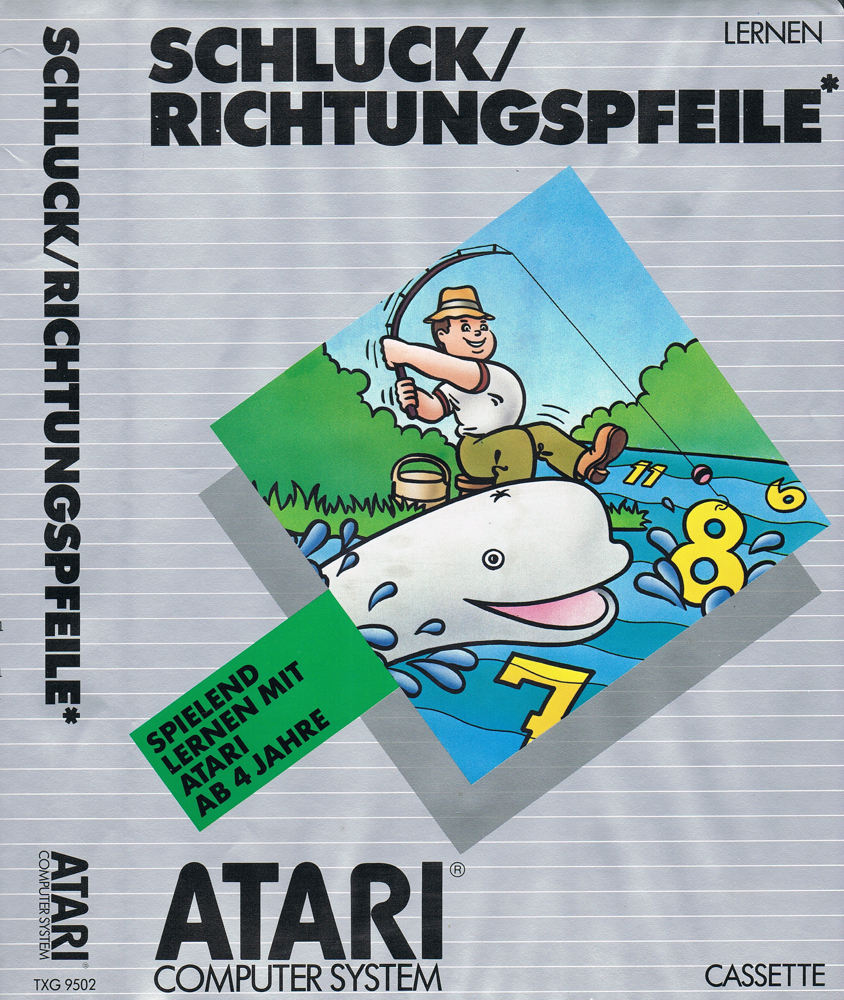
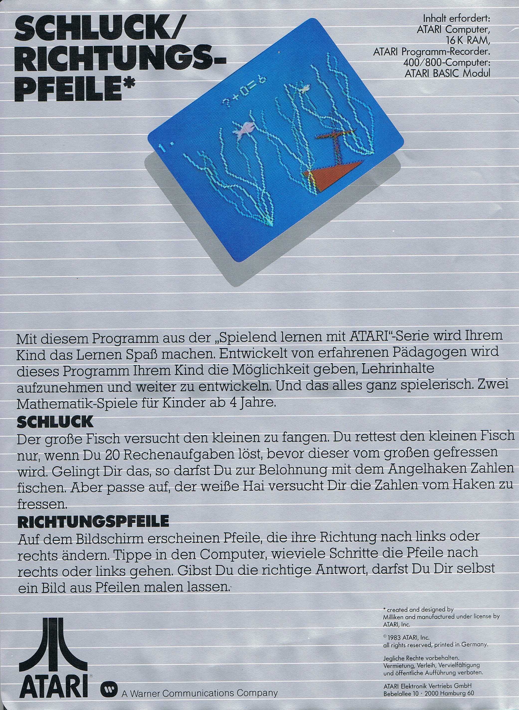

# Schluck / Richtungspfeile TXG 9502

(C) 1983 Atari Elektronik-Vertriebsgesellschaft mbH

## Handbuch

- [Schluck-Richtungspfeile\_TXG\_9502.pdf](../../../../../media/Companies/Atari/Atari_Germany/Schluck-Richtungspfeile/attachments/Schluck-Richtungspfeile_TXG_9502.pdf) : Größe: 10,9 MB

## Bilder

- Schluck-Richtungspfeile TXG 9502 - Box Vorderansicht 

- Schluck-Richtungspfeile TXG 9502 - Box Rückansicht 
