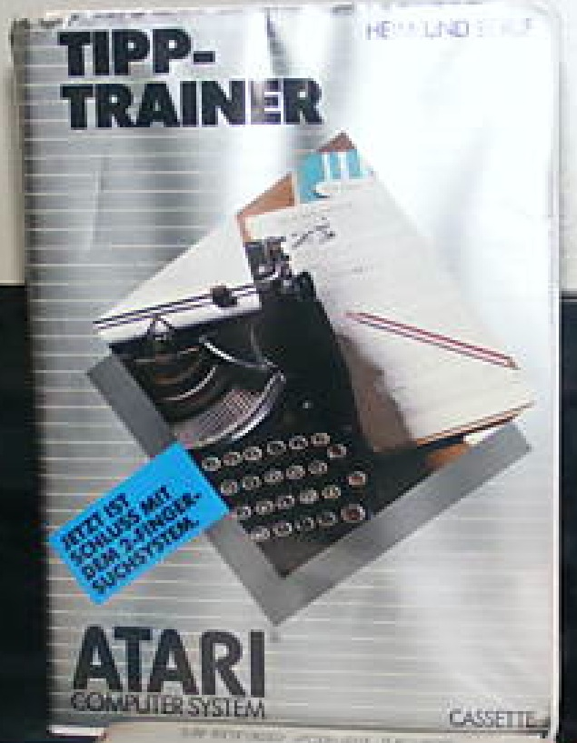
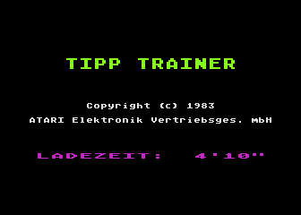
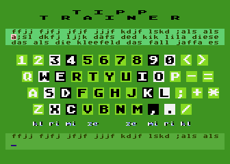
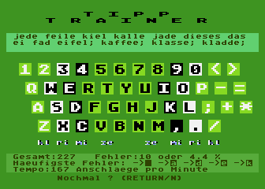

# Tipp Trainer (TXG 9512)

Copyright (C) 1983 Atari Elektronik Vertriebsgesellschaft mbH

## CAS-Image (TXG 9512)

- [Tipp-Trainer.cas](attachments/Tipp-Trainer.cas)

## DISK-Image (DXG 5712)

- [Tipp-Trainer\_DXG-5712.atr](attachments/Tipp-Trainer_DXG-5712.atr)

## Bilder

- Atari Tipp Trainer TXG 9512 - Box: Vorderansicht 

- Atari Tipp Trainer TXG 9512 - Startbildschirm 

- Atari Tipp Trainer TXG 9512 - Programmbeispiel 1 

- Atari Tipp Trainer TXG 9512 - Programmbeispiel 2 
