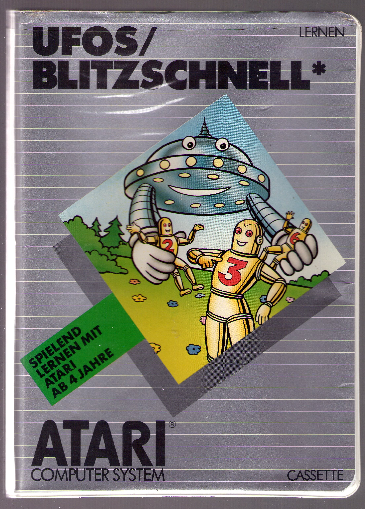
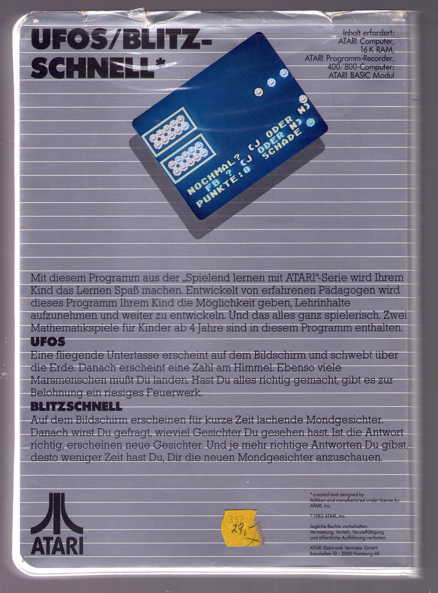
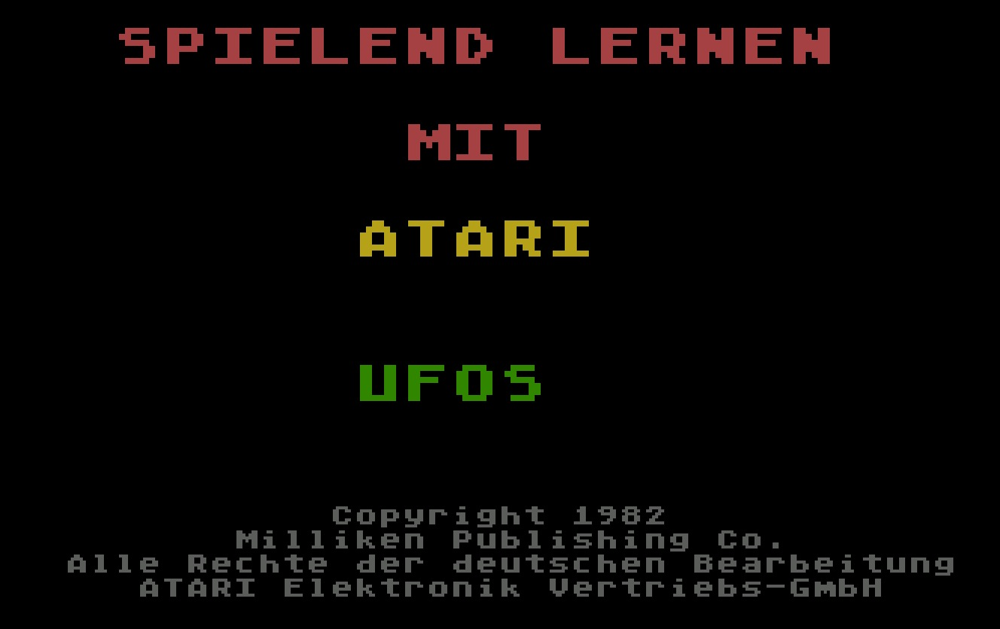
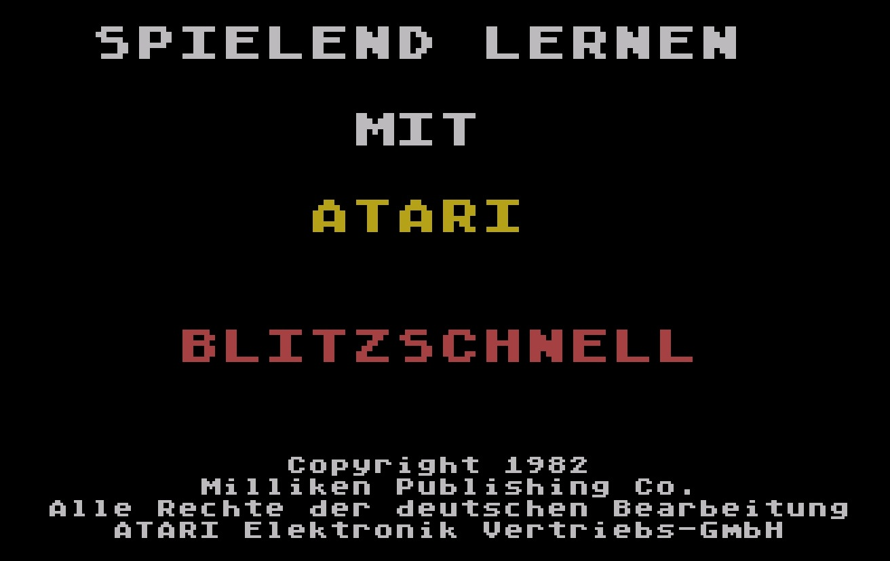
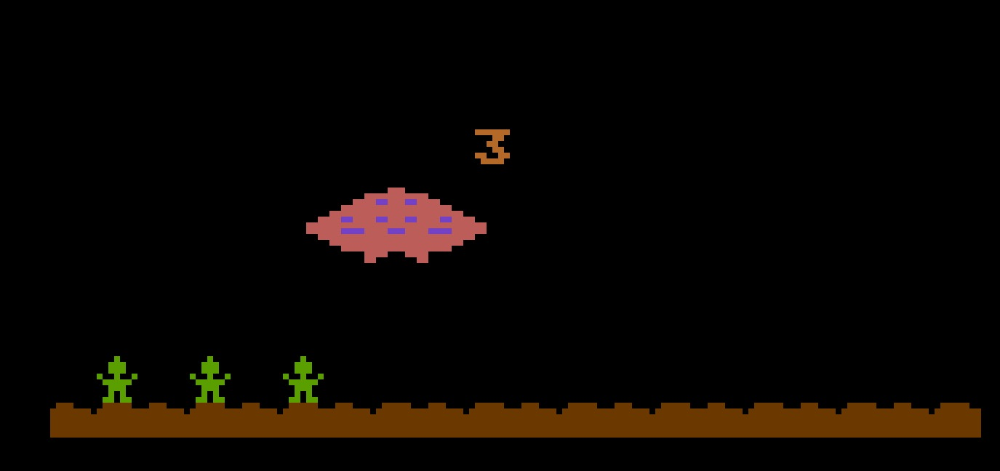
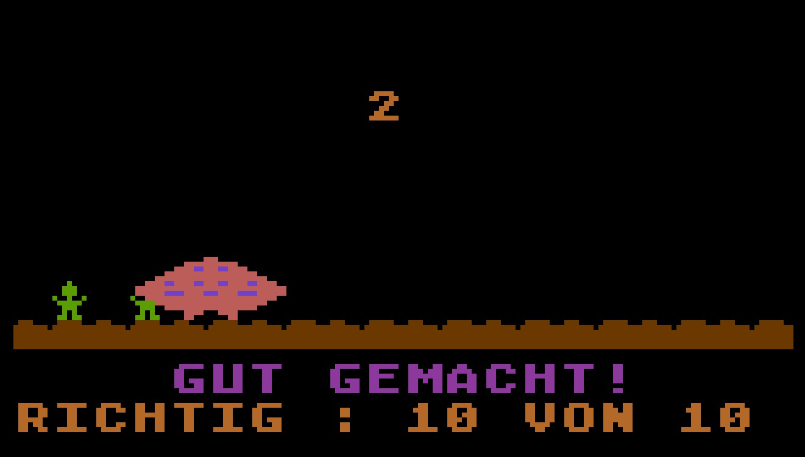

# Ufos / Blitzschnell (DXG 5711 bzw. TXG 9511)

Copyright (C) 1983 Atari Elektronik Vertriebsgesellschaft mbH

Vielen lieben Dank an Helmut Weidner, ohne ihn wäre diese seltene Software wahrscheinlich verloren gegangen.

## CAS-Images

- [Ufos-Blitzschnell\_TXG-9511\_side\_a\_Ufos.cas](attachments/Ufos-Blitzschnell_TXG-9511_Side_A_Ufos.cas) ; Danke an Mr. Bacardi fürs konvertieren :-)
- [Ufos-Blitzschnell\_TXG-9511\_side\_b\_Blitzschnell.cas](attachments/Ufos-Blitzschnell_TXG-9511_Side_B_Blitzschnell.cas) ; Danke an Mr. Bacardi fürs konvertieren :-)

## ATR-Image

- [Ufos-Blitzschnell\_DXG\_5711.atr](attachments/Ufos-Blitzschnell_DXG_5711.atr)

## Handbuch

- [Ufos-Blitzschnell\_TXG\_9511.pdf](../../../../../media/Companies/Atari/Atari_Germany/Ufos-Blitzschnell/attachments/Ufos-Blitzschnell_TXG_9511.pdf) : Größe: 6,8 MB

## Bilder

- Ufos-Blitzschnell DXG 5711 bzw. TXG 9511 - Box Vorderansicht 

- Ufos-Blitzschnell DXG 5711 bzw. TXG 9511 - Box Rückansicht 

- Ufos-Startbildschirm 

- Blitzschnell-Startbildschirm 

- Ufos-Blitzschnell DXG 5711 bzw. TXG 9511 - Bildschirmfoto 1 

- Ufos-Blitzschnell DXG 5711 bzw. TXG 9511 - Bildschirmfoto 2 

- Ufos-Blitzschnell DXG 5711 bzw. TXG 9511 - Bildschirmfoto 3 

- Ufos-Blitzschnell DXG 5711 bzw. TXG 9511 - Bildschirmfoto 4 
