# Zinsen und Tilgung (TXG5114)

(C) 1981 Atari Elektronik Vertriebsgesellschaft GmbH, (C) 1980 Control Data Corporation und Atari, Inc.

Atari Zinsen und Tilgung ist die deutsche Version von [Mortgage \& Loan Analysis (CX4115)](../../Mortgage_and_Loan_Analysis/README.md) von 1980. Das deutsche Handbuch ist leider verschollen, jeder Hinweis darauf ist stets sehr willkommen. :-) Daher kann hier nur die englische Originalanleitung angeboten werden.

## Handbuch

- [Handbuch für Zinsen und Tilgung (deutsch)](https://data.atariwiki.org/DOC/Zinsen_und_Tilgung_DXG_4116.pdf) ; 12,9 MB ; deutsches Handbuch ; Mega-Danke an Dirk Tröger (Yellow Man) für das Scannen des sehr seltenen Handbuchs! :-)))

## ATR-Image ; bitte mit dem BASIC-Cartridge verwenden

- [Zinsen und Tilgung TXG5114 (Autorun)](attachments/Zinsen_und_Tilgung_TXG5114_Autorun_Control_Data_Corp._1981_Basic.atr) ; Version startet automatisch, ist aber geschützt. Wir danken Mr. Barcardi für die Bereitstellung der Diskette. Bitte weiter so! :-)))
- [Zinsen und Tilgung TXG5114](attachments/Zinsen_und_Tilgung_TXG5114_Control_Data_Corp._1981_Basic.atr) ; Version startet nicht automatisch und muss vom BASIC-Cartridge aus geladen und gestartet werden. Dafür ist jedoch der Quelltext ungeschützt einsehbar.

## Box-Bilder

- Zinsen und Tilgung TXG5114 - Vorderseite der Box 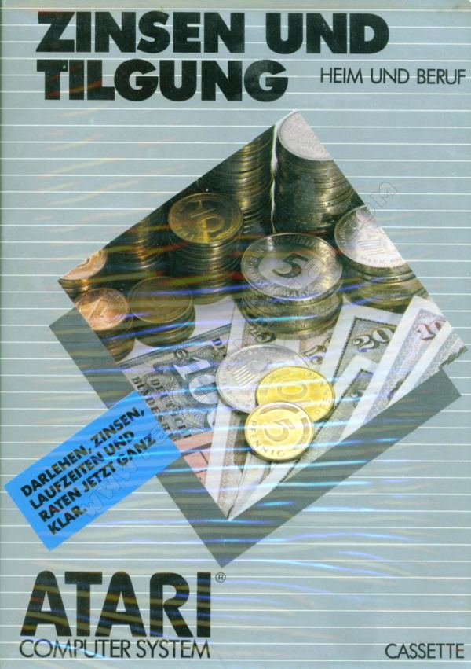

- Zinsen und Tilgung TXG5114 - Rückseite der Box 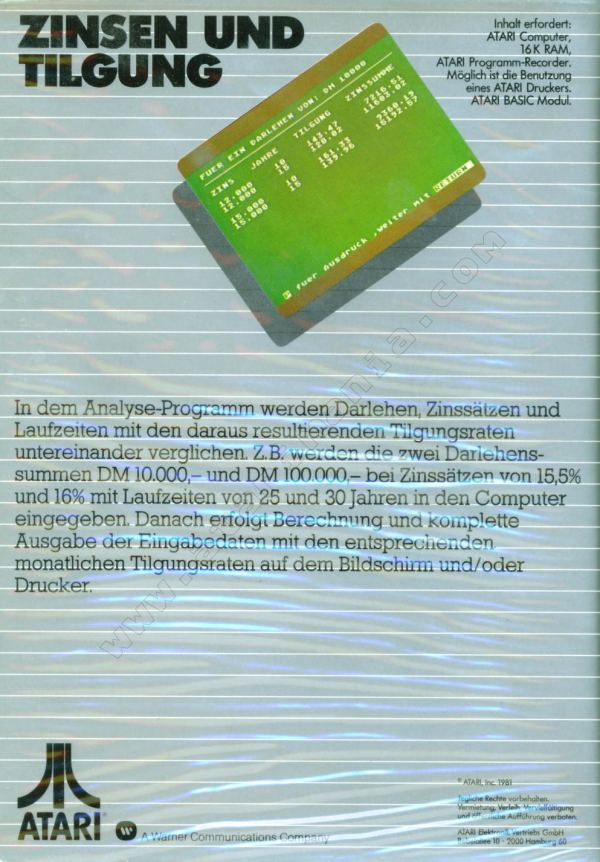

## Bilder

- Zinsen und Tilgung TXG5114 - erstes Bild beim Starten 

- Zinsen und Tilgung TXG5114 - zweites Bild beim Starten: Hinweis auf die Control Data Corporation (Entwickler des Programms) 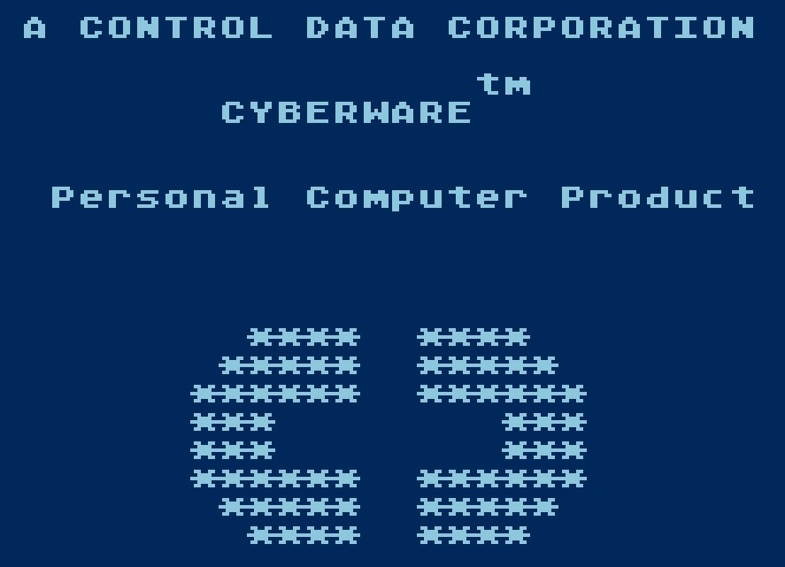

- Zinsen und Tilgung TXG5114 - drittes Bild beim Starten 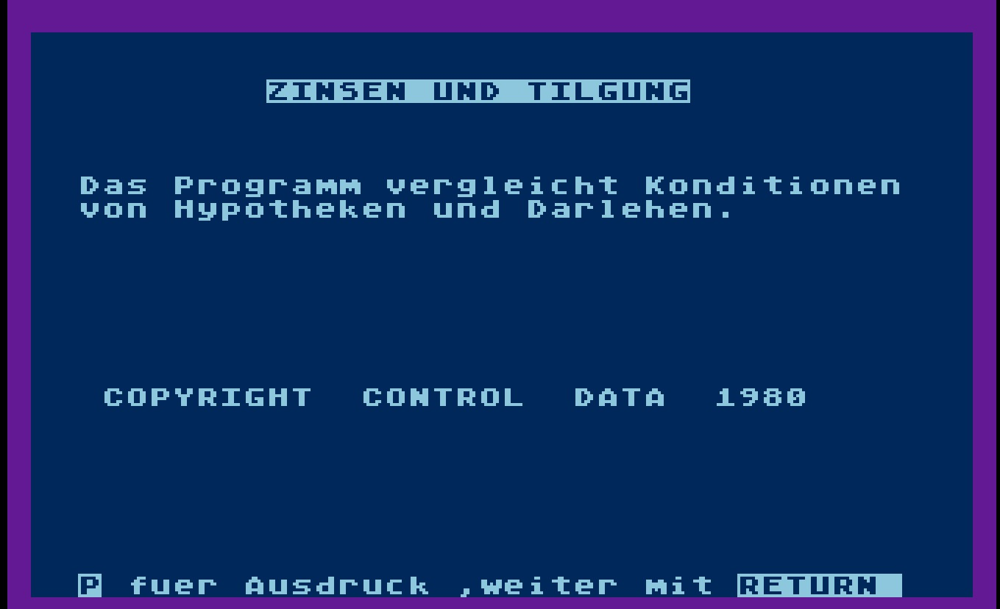

## Bildschirmfotos

- Zinsen und Tilgung TXG5114 - Bildschirmfoto 01 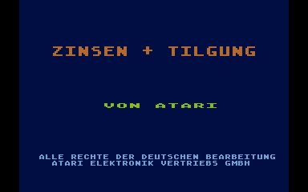

- Zinsen und Tilgung TXG5114 - Bildschirmfoto 02 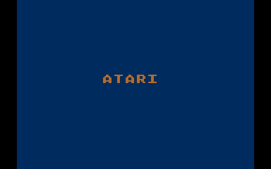

- Zinsen und Tilgung TXG5114 - Bildschirmfoto 03 

- Zinsen und Tilgung TXG5114 - Bildschirmfoto 04 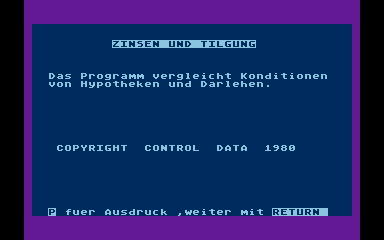

- Zinsen und Tilgung TXG5114 - Bildschirmfoto 05 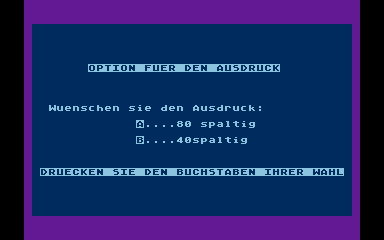

- Zinsen und Tilgung TXG5114 - Bildschirmfoto 06 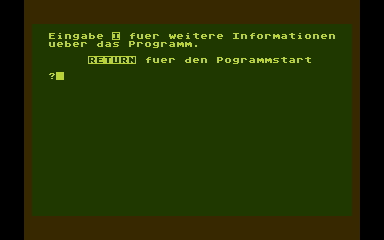

- Zinsen und Tilgung TXG5114 - Bildschirmfoto 07 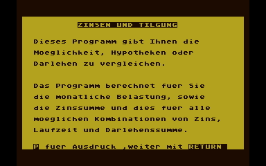

- Zinsen und Tilgung TXG5114 - Bildschirmfoto 08 

- Zinsen und Tilgung TXG5114 - Bildschirmfoto 09 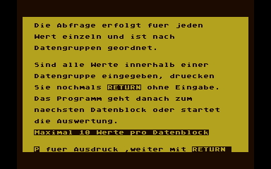

- Zinsen und Tilgung TXG5114 - Bildschirmfoto 10 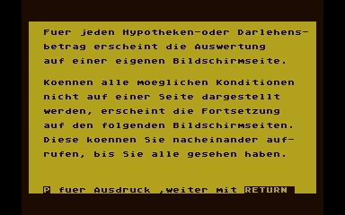

- Zinsen und Tilgung TXG5114 - Bildschirmfoto 11 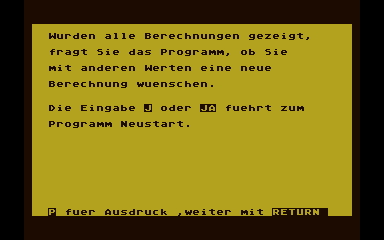

- Zinsen und Tilgung TXG5114 - Bildschirmfoto 12 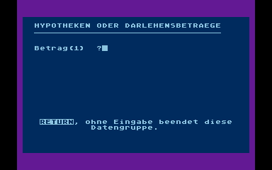

- Zinsen und Tilgung TXG5114 - Bildschirmfoto 13 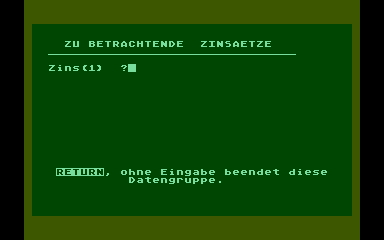

- Zinsen und Tilgung TXG5114 - Bildschirmfoto 14 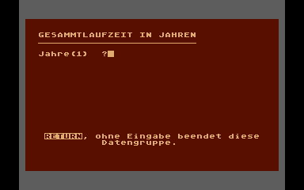

- Zinsen und Tilgung TXG5114 - Bildschirmfoto 15 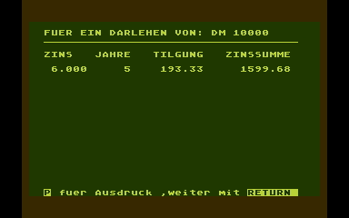

## CDC-Logo

- Control Data Corporation - Logo ; Copyright (C) 1980 
