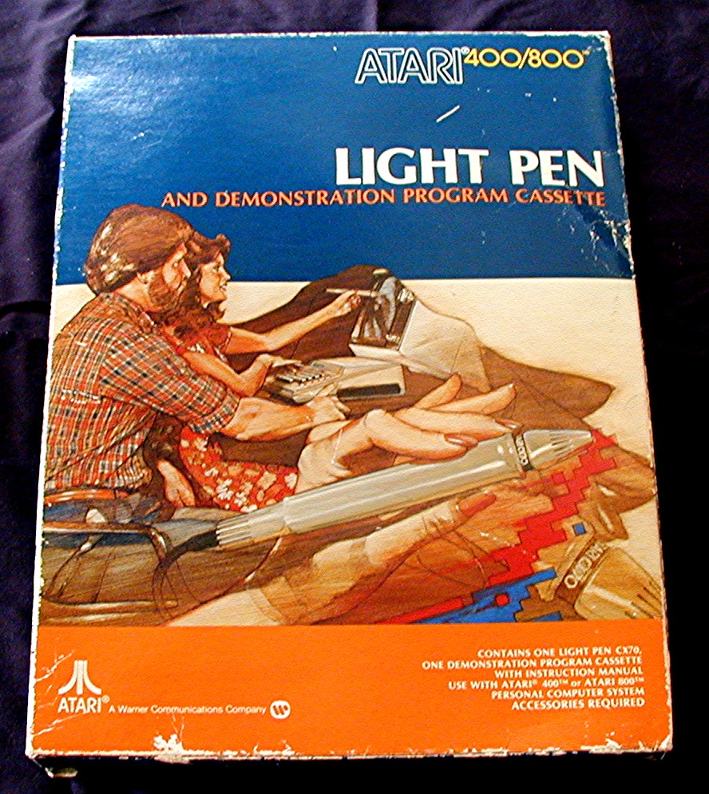
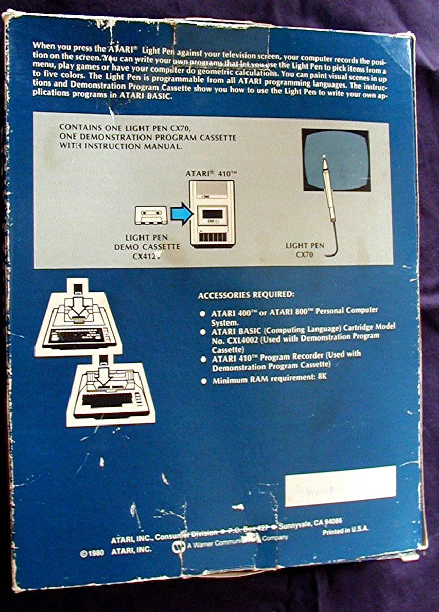
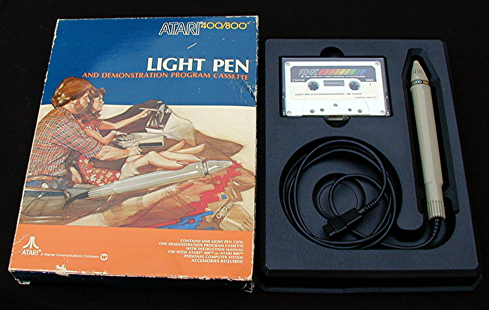
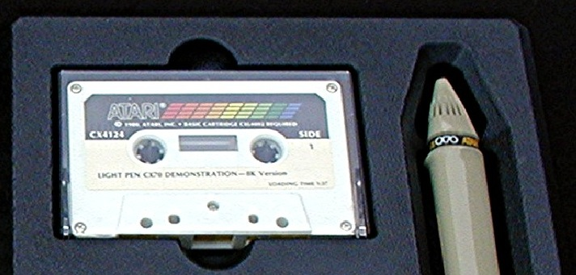
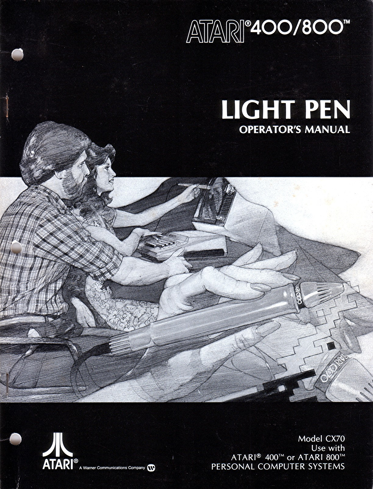
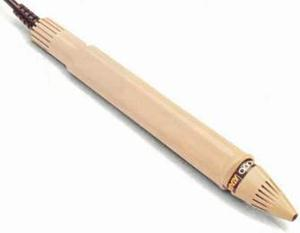
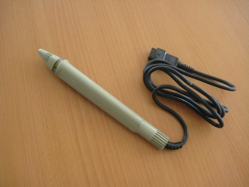
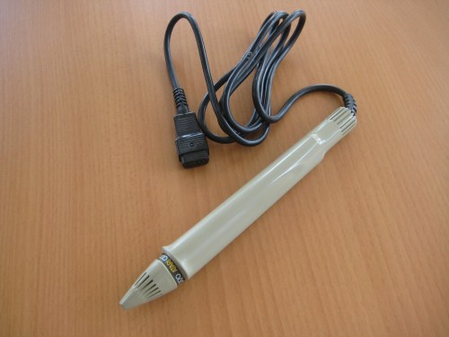

# Atari Light Pen CX70

- Introduced June 1980
- RARE - Only offered by Atari for a few months in 1981 (InfoWorld 12/26/83-1/2/84)
- Shipped with CX4124 demonstration program cassette
- Manual: Atari Light Pen Operator's Manual Model CX70 C016367 (CO16367)

Please take into account that the light pen doesn't work with modern LCD-, LED- or Plasma-screens.

**A wav-file of the Light Pen CX70 Demonstration Cassette CX4124 is still missing, please help us. Thank you very much in advance. :-)**

## Box

- Atari Light Pen CX70 - box front 

- Atari Light Pen CX70 - box back 

- Atari Light Pen CX70 - box content 

## Light Pen CX70 Demonstration Cassette CX4124

- Atari Light Pen CX70 - Demonstration - 8K Version CX4124 Cassette 

## Manual

- Atari Light Pen CX70 - manual 

## Images

- Atari Light Pen CX70 - image 1 

- Atari Light Pen CX70 - image 2 

- Atari Light Pen CX70 - image 3 
