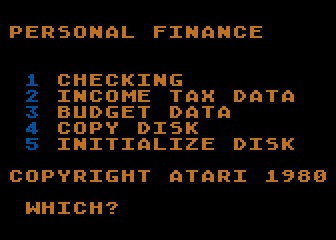
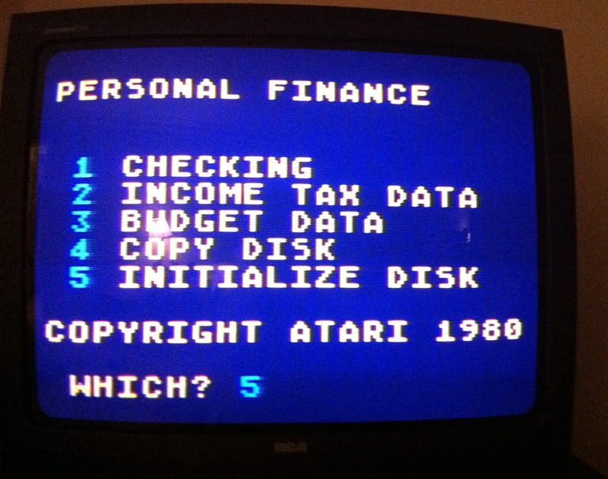
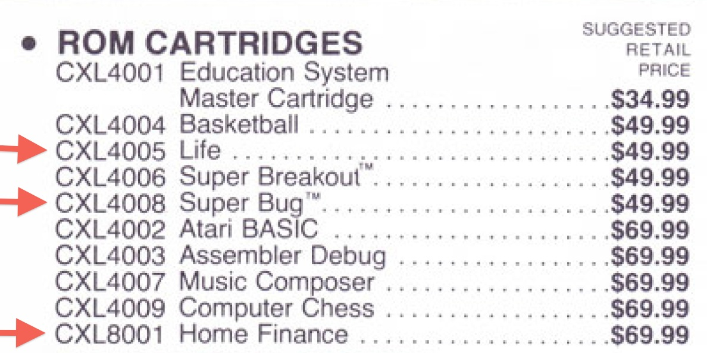
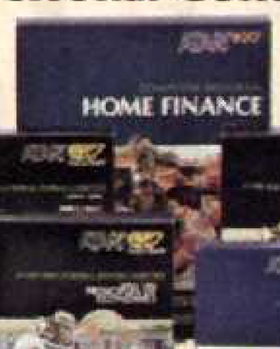
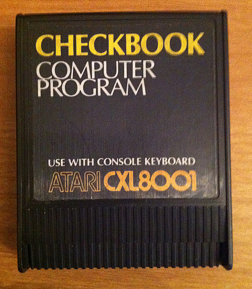
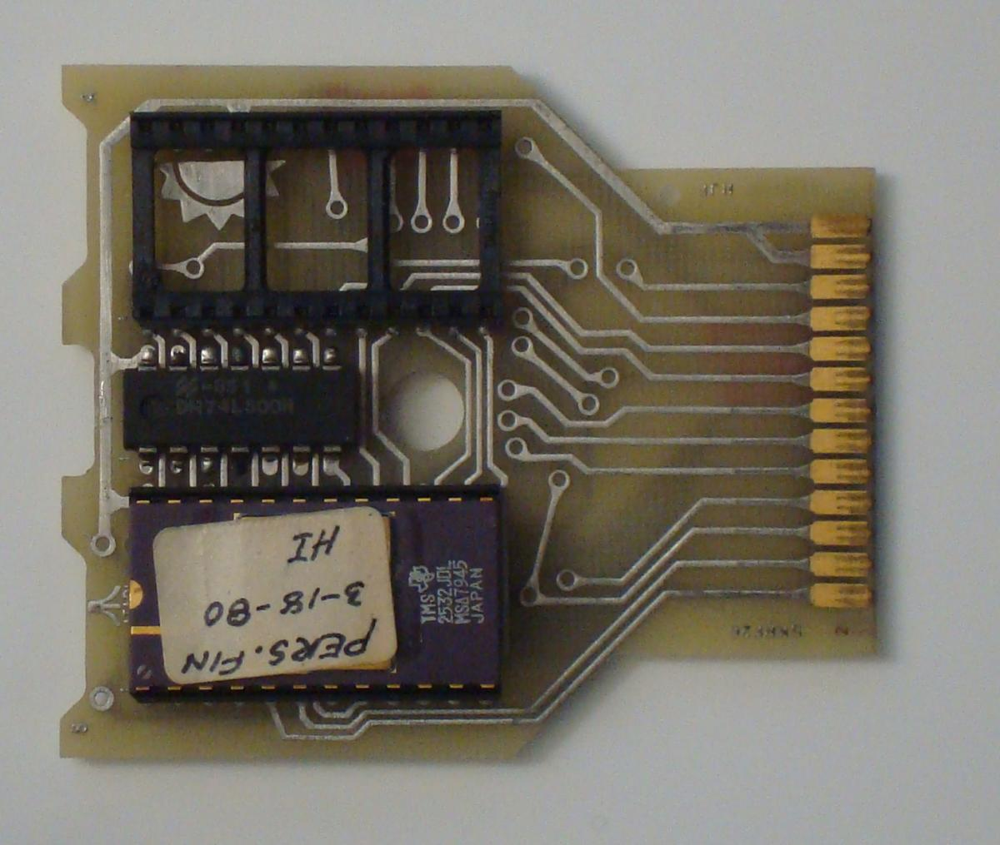
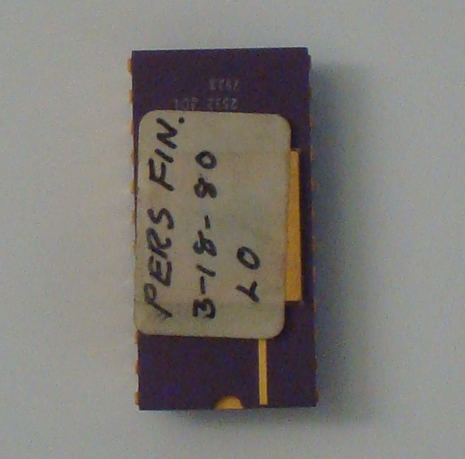
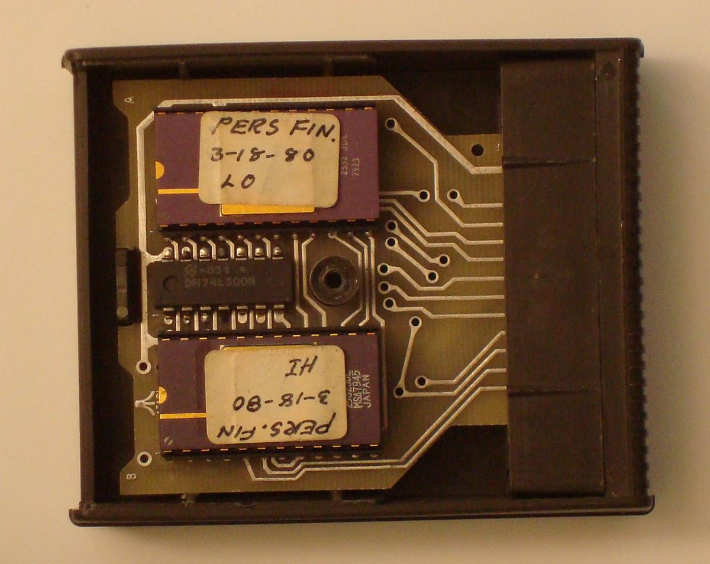

# Atari Home Finance (CXL8001)

with Checkbook Cartridge CXL8001 showing Personal Finance after starting: status: unclear

The status of this cartridge is not known for sure. According to Michael Current (Atari faq): Home Finance (later: Personal Finance; never shipped). On the other hand, we could see here:

## BIN-Images

\*[checkbook8KB.bin](attachments/checkbook8KB.bin) ; a big, big thank you to the owner of the cartridge for sharing with the community! We really appreciate your help very much! :-)
\*[checkbook16KB.bin](attachments/checkbook16KB.bin) ; a big, big thank you to the owner of the cartridge for sharing with the community! We really appreciate your help very much! :-)

## Screenshots

- Atari Home Finance CXL8001 startscreen 1 

- Atari Home Finance CXL8001 startscreen 2 

## ADs

- ROM Cartridges 1979 - Life -\> Video Easel, Super Bug -\> Space Invaders, Home Finance ? 

- Atari Home Finance box from Playboy Guide-Electronic Entertainment-Fall 1980 

## Images

- Atari Home Finance CXL8001 Cartridge 1 

- Atari Home Finance CXL8001 Cartridge 2 

- Atari Home Finance CXL8001 Cartridge 3 

- Atari Home Finance CXL8001 Cartridge 4 
