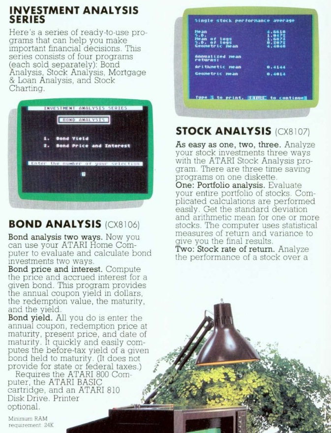
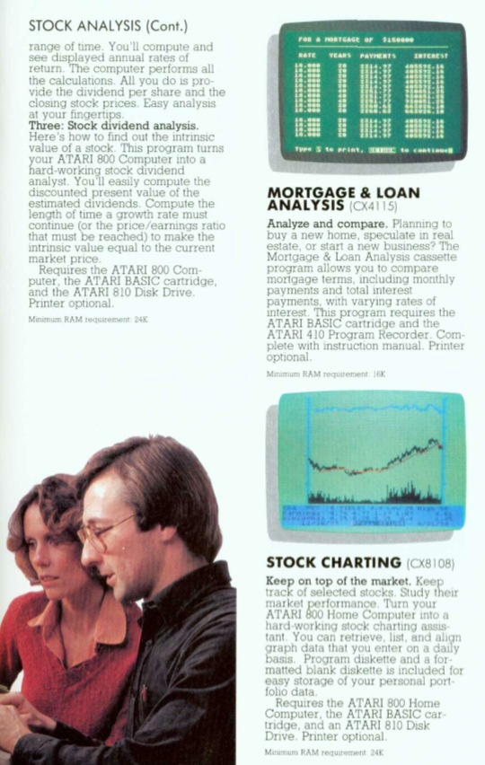
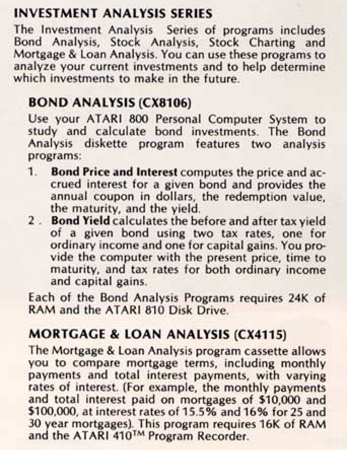
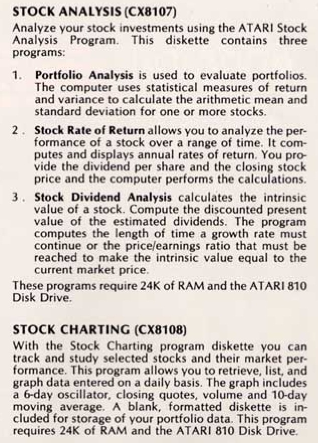

# Atari Investment Analysis Series

Copyright (C) 1980 Atari, Inc. under license from Control Data Corporation

- [Bond Analysis CX8106](../Bond_Analysis/README.md)

- [Stock Analysis (CX8107)](../Stock_Analysis/README.md)

- [Stock Charting (CX8108)](../Stock_Charting/README.md)

- [Mortgage & Loan Analysis (CX4115)](../Mortgage_and_Loan_Analysis/README.md)

## Reference
- [Control Data Corporation in wikipedia](https://en.wikipedia.org/wiki/Control_Data_Corporation)

## Advertisements

Bond Analysis CX8106 and Stock Analysis CX8107

Mortgage & Loan Analysis CX4115 and Stock Charting CX8108

Bond Analysis CX8106 and Mortgage & Loan Analysis CX4115

Stock Analysis CX8107 and Stock Charting CX8108

Control Data Corporation-Logo
