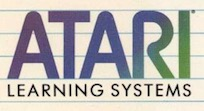
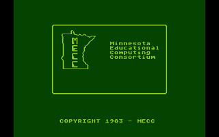
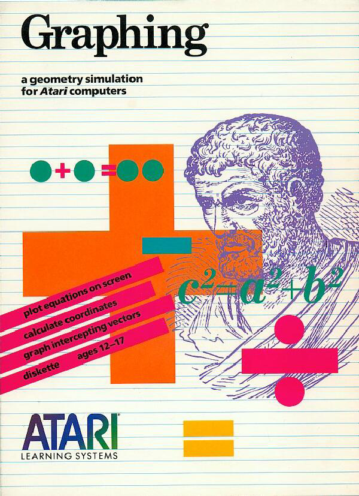

# Atari Learning System Software

Copyright (C) Atari and Minnesota Educational Computing Consortium (MECC)  

AtariWiki would like to thank all the users who upload these program packages and [Atarimania](http://www.atarimania.com) for hosting the files. Thank you all so much, we really appreciate your help, as always. :-)  
  
  
The logo of the Atari Learning System Software  
  
  
The logo of the Minnesota Educational Computing Consortium (MECC)  
  
## Content of the Educational Program

Status 2017: 11/85 packages: 12.94 % finished over all; 11/68 packages: 16.12 % of all packages minus not applicable packages and minus packages to investigate):  
  
| # | AEDSerial-Number | Name| Manual | Image | Digitized? | Info |
|---|-------------------|-----|--------|-------|------------|------|   
| 1| AED80001| Spelling in Context| X| X| yes| [Spelling in Context](http://www.atarimania.com/game-atari-400-800-xl-xe-spelling-in-context-level-1_12466.html)  
| 2| AED80002| Spelling in Context 2| | | |   
| 3| AED80003| Spelling in Context 3| | | |   
| 4| AED80004| Spelling in Context 4| | | |   
| 5| AED80005| Spelling in Context 5| | | |   
| 6| AED80006| Spelling in Context 6| | | |   
| 7| AED80007| Spelling in Context 7| | | |   
| 8| AED80008| Spelling in context 8| X| X| | [Spelling in context 8](http://www.atarimania.com/game-atari-400-800-xl-xe-spelling-in-context-8_12473.html)  
| 9| AED80009| Math Facts & Games| | | |   
| 10| AED80010| Concentration| | | |   
| 11| AED80011| Division Drill| X| X| | [Division Drill](http://www.atarimania.com/game-atari-400-800-xl-xe-division-drill_6696.html)  
| 12| AED80012| Atari Sentences| | | |   
| 13| AED80013| Atari Lab Starter Set| X| X| | [Atari Lab Starter Set](http://www.atarimania.com/game-atari-400-800-xl-xe-atarilab-starter-set_15989.html)  
| 14| AED80014| Atari Light Module| X| X| | [Atari Light Module](http://www.atarimania.com/game-atari-400-800-xl-xe-atarilab-light-module_15990.html)  
| 15| AED80015| The Learning Phone| | | | ??? [The Learning Phone](http://www.atarimania.com/game-atari-400-800-xl-xe-learning-phone-_6486.html)  
| 16| AED80016| U.S Geography I| | | |   
| 17| AED80017| U.S Geography II| | | |   
| 18| AED80018| Pascal 2.0| | | |   
| 19| AED80020| Secret Formula, Elementary| X| -| | [Secret Formula, Elementary](http://www.atarimania.com/game-atari-400-800-xl-xe-secret-formula-elementary_12474.html)  
| 20| AED80021| Secret Formula, Intermediate| -| X| | [Secret Formula, Intermediate](http://www.atarimania.com/game-atari-400-800-xl-xe-secret-formula-intermediate_12475.html)  
| 21| AED80022| Secret Formula, Advanced| X| X| | [Secret Formula, Advanced](http://www.atarimania.com/game-atari-400-800-xl-xe-secret-formula-advanced_12476.html)  
| 22| AED80030| Introducing ..., Introducing Peter & The Wolf| | | |   
| 23| AED80033| Screen Maker| | | |   
| 24| AED80034| Player Maker| | | |   
| 25| AED80035| Book - Atari Logo, in the Classroom - a teacher's guide| | | |   
| 26| AED80037| Alien addition| | | |   
| 27| AED80038| Meteor Multiplication| | | |   
| 28| AED80039| Demolition Division| | | |   
| 29| AED80040| Aligotr Mix| | | |   
| 30| AED80041| Minus Mission| | | |   
| 31| AED80042| Dragon Mix| | | |   
| 32| AED80043| Super Pilot| | | |   
| 33| AED80044| Phone Home| | | |   
| 34| AED80045| Name Rondo| | | |   
| 35| AED80046| Create a Rondo| | | |   
| 36| AED80047| Instructional Computing Demo| X| X| | [Instructional Computing Demo](http://www.atarimania.com/game-atari-400-800-xl-xe-instructional-computing-demonstration_2589.html)  
| 37| AED80048| Music I - Terms and Notations| | | |   
| 38| AED80049| Music II - Rhythm and Pitch| -| X| | [Music II - Rhythm and Pitch](http://www.atarimania.com/game-atari-400-800-xl-xe-music-ii-rhythm-and-pitch_19519.html)  
| 39| AED80050| Music III - Scales and Chords| -| X| | [Music III - Scales and Chords](http://www.atarimania.com/game-atari-400-800-xl-xe-music-iii-scales-and-chords_19521.html)  
| 40| AED80051| Elementary Biology| | | |   
| 41| AED80052| Earth Sciences| X| X| | [Earth Sciences](http://www.atarimania.com/game-atari-400-800-xl-xe-earth-science_25608.html)  
| 42| AED80053| Geography| X| -| | [Geography](http://www.atarimania.com/game-atari-400-800-xl-xe-geography_12217.html)  
| 43| AED80054| Prefixes| X| -| | [Prefixes](http://www.atarimania.com/game-atari-400-800-xl-xe-prefixes_8619.html)  
| 44| AED80055| Metric & Problem ...., Metric & Problem Solving| | | |   
| 45| AED80056| The Market Place| X| -| | [The Market Place](http://www.atarimania.com/game-atari-400-800-xl-xe-market-place-_25612.html)  
| 46| AED80057| Basic Arithmetic| X| X| | [Basic Arithmetic](http://www.atarimania.com/game-atari-400-800-xl-xe-basic-arithmetic_25603.html)  
| 47| AED80058| Graphing| -| X| | [Graphing](http://www.atarimania.com/game-atari-400-800-xl-xe-graphing_2289.html)  
| 48| AED80059| Pre-Reading| X| -| | [Pre-Reading](http://www.atarimania.com/game-atari-400-800-xl-xe-pre-reading_8622.html)  
| 49| AED80060| Counting| X| X| | [Counting](http://www.atarimania.com/game-atari-400-800-xl-xe-counting_25606.html)  
| 50| AED80061| Book - Free Software for Your Atari| X| /| | [Free Software for Your Atari](http://www.atarimania.com/documents-atari-400-800-xl-xe-books_1_8.html)  
| 51| AED80062| Book - Atari Games and Recreations| X| /| | [Atari Games and Recreations](http://www.atarimania.com/documents-atari-400-800-xl-xe-books_1_8.html)  
| 52| AED80063| Book - A Guide to Computers in the Classroom| | | |   
| 53| AED80065| Book - Atari Computer .., Educational Software Directory| | | |   
| 54| AED80066| Expeditions| -| X| | [Expeditions](http://www.atarimania.com/game-atari-400-800-xl-xe-expeditions_22498.html)  
| 55| AED80067| Spelling Bee| X| X| | [Spelling Bee](http://www.atarimania.com/game-atari-400-800-xl-xe-spelling-bee_25615.html)  
| 56| AED80069| Word Games| X| -| | [Word Games](http://www.atarimania.com/game-atari-400-800-xl-xe-word-games_29139.html)  
| 57| AED80072| Atari Logo| ?| ?| | ?  
| 58| AED80077| Atari Pilot, Individual's Kit| ?| ?| | ?  
| 59| AED80078| Atari Pilot, Educator's Kit| ?| ?| | ?  
| 60| AED80083| Atari Microsoft BASIC II| ?| ?| | ?  
| 61| AED80084| LabMate - Home Edition - Ages 9-13| | | |   
| 62| AED80085| LabMate - Home Edition - Ages 14-15| | | |   
| 63| AED80087| LabMate - School Edition - Elementary| | | |   
| 64| AED80088| LabMate - School Edition - Jr. High| | | |   
| 65| AED80089| LabMate - School Edition - High School| | | |   
| 66| AED80090| AtariLab - Starter Set / Apple II| /| /| /| /|  
| 67| AED80091| AtariLab - Starter Set / Commodore 64| /| /| / |  
| 68| AED80093| Find It! / Atari| | | |   
| 69| AED80094| Find It! / Apple II| /| /| | /  
| 70| AED80095| Find It! / IBM PC| /| /| | /  
| 71| AED80096| Find It! / Commodore 64| /| /| | /  
| 72| AED80097| Green Globs / Atari| | | |   
| 73| AED80098| Green Globs / Apple II| /| /| | /  
| 74| AED80100| Yaacov Agam's Interactive Painting| -| X| | [Yaacov Agam's Interactive Painting](http://www.atarimania.com/game-atari-400-800-xl-xe-yaacov-agam-s-interactive-painting_21714.html)  
| 75| AED80101| The ABC of CPR| -| X| | [The ABC of CPR](http://www.atarimania.com/game-atari-400-800-xl-xe-abc-of-cpr-_12807.html)  
| 76| AED80150| Simulated Computer II / Atari| | | |   
| 77| AED80151| Simulated Computer II / Commodore 64| /| /| | /  
| 78| AED80152| Telly Turtle / Atari| | | |   
| 79| AED80153| Telly Turtle / Commodore 64| /| /| | /  
| 80| AED80154| Telly Turtle / IBM PC| /| /| | /  
| 81| AED80155| Telly Turtle / Apple II| /| /| | /  
| 82| AED80158| Wheeler Dealer / Atari| | | |   
| 83| AED80159| Wheeler Dealer / Commodore 64| /| /| | /  
| 84| AED80160| Wheeler Dealer / Apple II| /| /| | /  
| 85| AED80161| Wheeler Dealer / IBM PC| /| /| | /  

__Legend:__ 
- X already in the can  
- \- not available, still searching for  
- / not applicable for Atari computers  
- ? investigation required
  
## Undetermined
| # | AEDSerial-Number | Name | Manual | Image | Digitized? | Info |   
|---|-------------------|------|--------|-------|------------|------|   
| ?| ?| Animal World| | | |   
| ?| ?| AtariLab Curriculum Module - Light| | | |   
| ?| ?| AtariLab Curriculum Module - Temperature| | | |   
| ?| ?| AtariWriter Curriculum Guide| | | |   
| ?| ?| Conduit Algebra| | | |   
| ?| ?| Escape| | | |   
| ?| ?| Pilots| | | |   
| ?| ?| Swarthmore Trig| | | |   
  
## Images
  
AED80058 Graphing  
