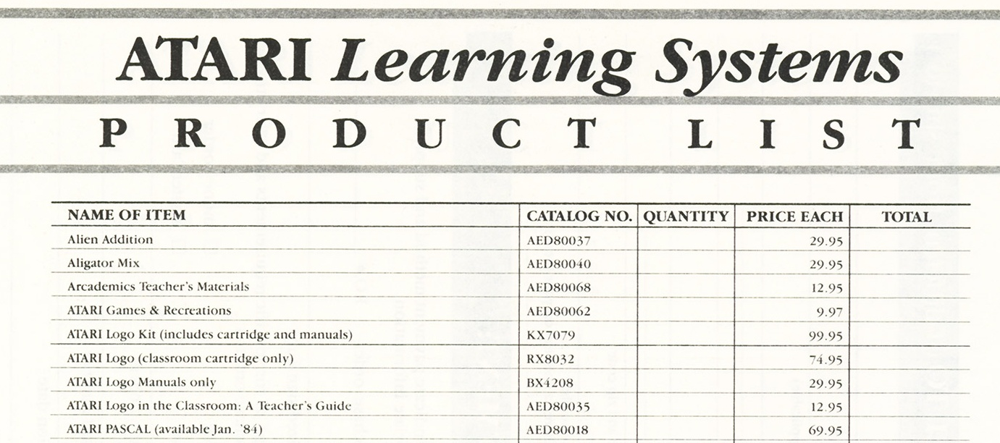
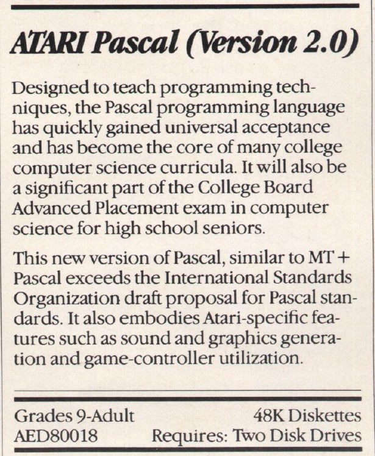

# Atari Pascal (AED80018)

The Atari Learning System product list mentions "Atari Pascal".

  
From the Atari Review Magazine, Fall 1983, page 21](https://www.atarimania.com/catalogues/hi_res/cat415019.jpg) ; many thanks to Atarimania for offering.  
  
The advertisement in the same issue mentions "Atari Pascal (2.0), Requires: 48K Diskettes, 2 disk drives".

  

From the Atari Review Magazine, Fall 1983, page 21](https://www.atarimania.com/catalogues/hi_res/cat415030.jpg) ; many thanks to Atarimania for offering.

