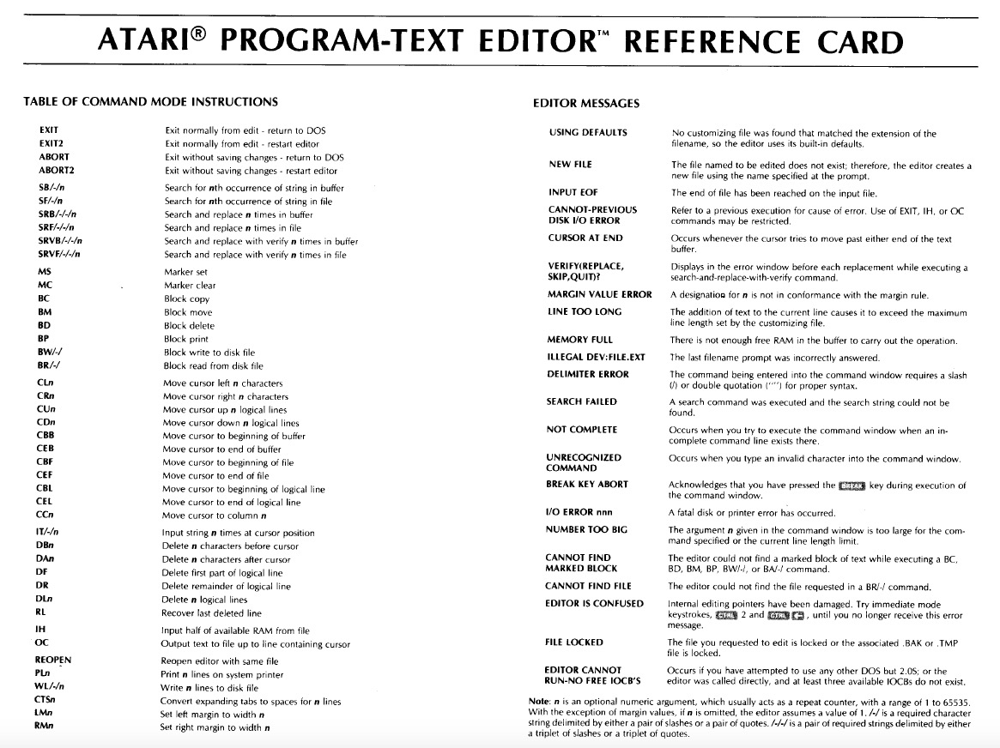

# Atari Program-Text Editor (APX-20075, CX20075, CX8105?)

Copyright (C) 1981 Atari, Inc. and Mike Lorenzen

The Atari Program Text Editor was originally released via APX and later also directly by Atari as CX20075.

The same program was included in [Atari Macro Assembler (AMAC) and Program-Text Editor (CX8121)](../Atari_Macro_Assembler_and_Program-Text_Editor/README.md).

It remains to be verified whether it was also used for PASCAL. However, given its widespread use, there is a very high probability that it is indeed the Atari "CX8105 Editor". To date, no one has seen it, nor is there any trace of it. Atari was known for occasionally renaming things, so with a bit of luck, this case could be closed. Atariwiki would be very grateful for any further information. :-)))

A German version is available as [Atari Program Text Editor (DXG20075)](../Atari_Germany/Atari_Programm-Text_Editor/README.md).

## Reference Card

- Atari Program-Text Editor - Reference Card 
