# Atari Silent Butler (DX5082)

Copyright (C) 1985 Atari Corp. and Ted A. Goldstone

Atari Silent Butler works with Atari 1050 disk drives or better (**MD disk format, NOT(!) 810 compatible**)

**The XEP80 version of this program from 1987 is still missing. Please help us. Thank you very much in advance. :-)**

Atari Silent Butler is a personal bookkeeping program for paying bills, keeping tax records and managing your checking and savings accounts with print outs. Silent Butler will maintain your income and tax records, balance up to three checking and savings accounts, remind you of birthdays, anniversaries, dates and meetings, summarize your year-end tax status, provides instant updates of your financial status. When Silent Butler needs information, for example: bank deposit figures, installments for credit card payments or check amounts, it asks you for it and keeps your books current. You provide the information. Silent Butler gives you a balanced budget and some peace of mind.

Silent Butler requires a XL or even better XE machine with at least a 1050 disk drive for the MD disk format. The more RAM, the less needs to be reloaded. The manual has 16 pages, 2 SD format disks are in the box:

- Silent Butler Program Disk
- Silent Butler Record Disk

## Review by Stephen Roquemore

SILENT BUTLER
Atari Corp.
1196 Borregas Avenue
Sunnyvale, CA 94086
(408) 745-2000
Requires 1050 disk drive

Silent Butler is a two-disk personal finance package that can track three checkbooks, three savings accounts, and includes a reminder file that holds birthdays, anniversaries and other dates. If you order the optional plastic checkholder, Silent Butler will even print on your own checks.

Silent Butler is easy to understand and use. It does what it claims to do. The program guides you to organizing your bills into fixed or variable expenses and automatically collects them into a current bills file for processing.

If you put the program disk into a 130XE, it automatically loads more of the program into memory in order to work faster than it does on the 800XL.

As the program loads, it displays a picture of a distinguished pipe-smoking gentleman-your "Silent Butler". The program is organized into two sections (mysteriously called "Bookmarks"), one with everyday procedures and the other with less often used activities.

The program leads you through each function in order, asking if there is anything you want to do here. When you become more experienced with the software, there is also a Jump feature that lets you skip around between functions. The program also saves automatically fairly often, so inexperienced users do not run the risk of losing much of their data.

At the end of each Bookmark, you are given a chance to review what you have done and make corrections. At the end of Bookmark 2, the Butler asks to "retire for the evening." You dismiss him by removing your disk and switching off. The cutesy formal language soon wears thin, and slows down the actual work.

The records disk is supposed to hold a year of data and can be backed up, but the program disk is copy-protected. As noted in the heading, you need an Atari 1050 disk drive, because Silent Butler is in an enhanced density format which runs only on the 1050. The program allows use of only one drive, even if you have more. Some of its functions require interminable disk-swapping because of this.

Silent Butler is simple to use and is functionally adequate for home needs. But I could recommend it for more users if Atari produced a single density version that would work on other drives besides the 1050.

## ATR images

- [Silent Butler A-Program Disk](attachments/Silent_Buttler_Disk_1_Program_Disk.atr) ; original Program Disk, MD-Disk format, thanks to Erhard Pütz for digitizing
- [Silent Butler B-Record Disk](attachments/Silent_Buttler_Disk_2_Record_Disk.atr) ; original Record Disk, MD-Disk format, thanks to Erhard Pütz for digitizing
- [Silent Butler A-Program Disk](attachments/Silent_Butler_A-Program_Disk-1.atr) ; Program Disk from Holmes archive, SD-Disk format
- [Silent Butler A-Program Disk](attachments/Silent_Butler_A-Program_Disk-2.atr) ; same as above, but from Vidar, MD-Disk format
- [Silent\_Butler\_B-Record\_Disk.atr](attachments/Silent_Butler_B-Record_Disk.atr) ; Record Disk from FULS from AtariAge, SD-Disk format
- [Silent\_Butler\_B-Record\_Disk-Test.atr](attachments/Silent_Butler_B-Record_Disk-Test.atr) ; same as above but with working data already, SD-Disk format
- [1985.atr](attachments/1985.atr) ; Record Disk for the year 1985, working, already formatted and ready to use, MD-Disk format
- [2015.atr](attachments/2015.atr) ; Record Disk for the year 2015, working, already formatted and ready to use, MD-Disk format

## Manual

- [Silent Butler-Owner's Manual](attachments/Silent_Butler.pdf) ; thanks to BillC from AtariAge for providing

## Box

- Atari Silent Butler - box front 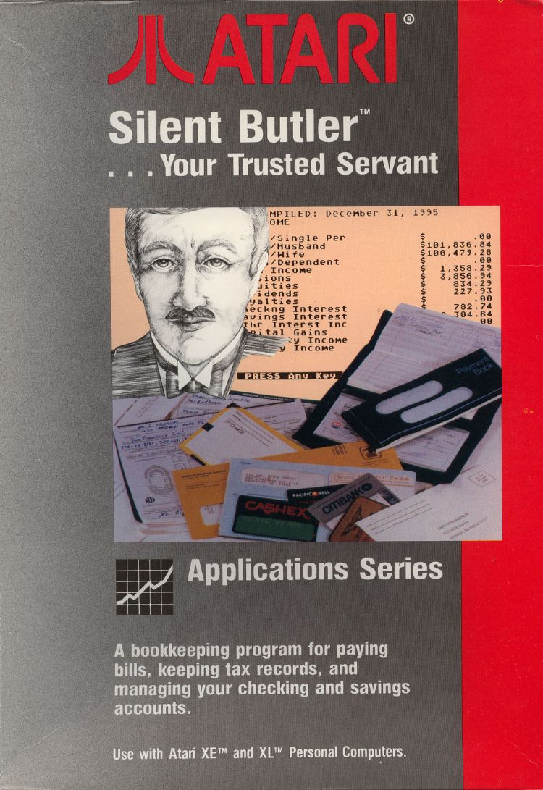

- Atari Silent Butler - box back 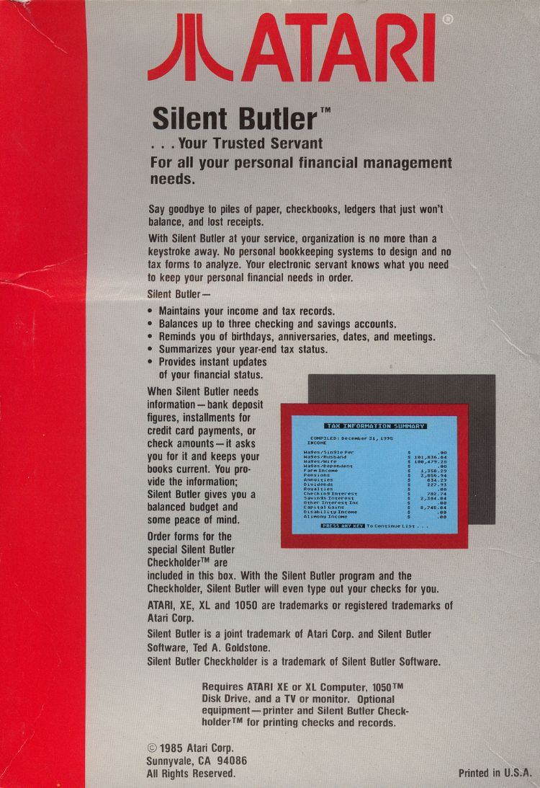

## Diskettes

- Atari Silent Butler - Program Disk 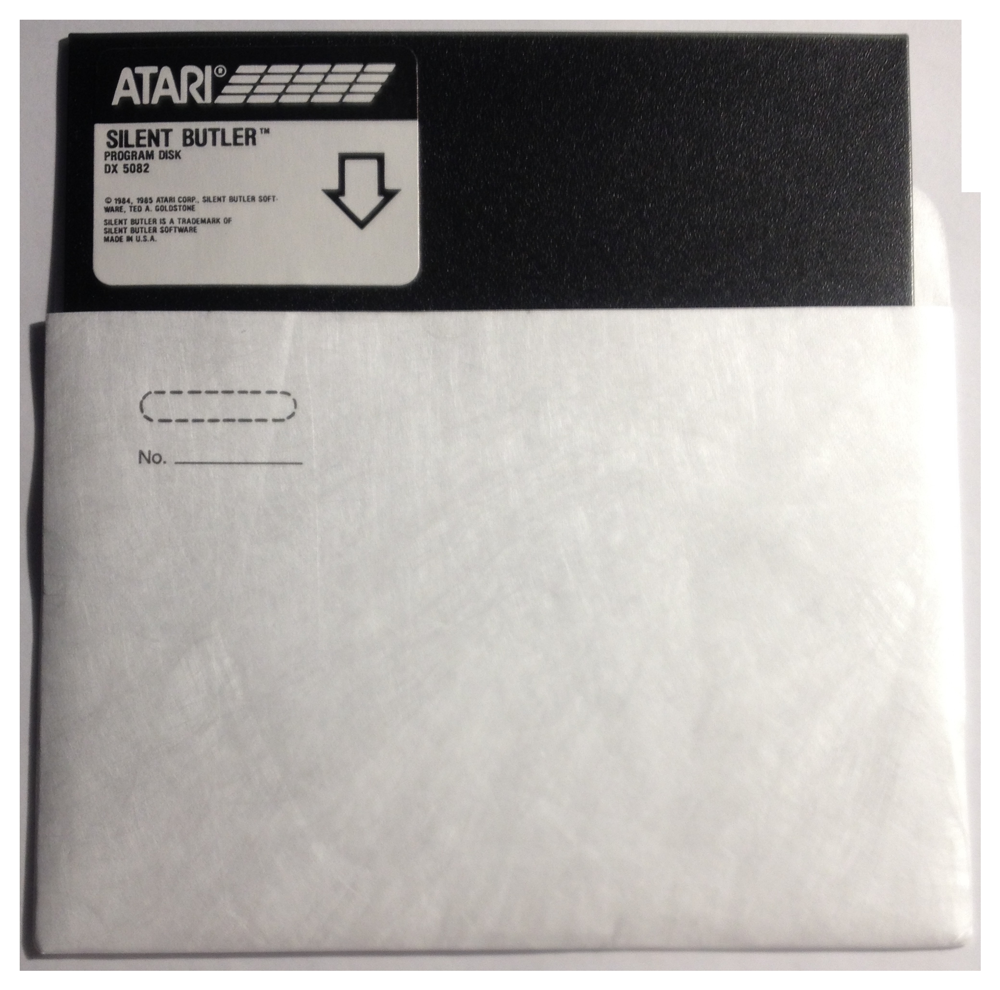

- Atari Silent Butler - Record Disk 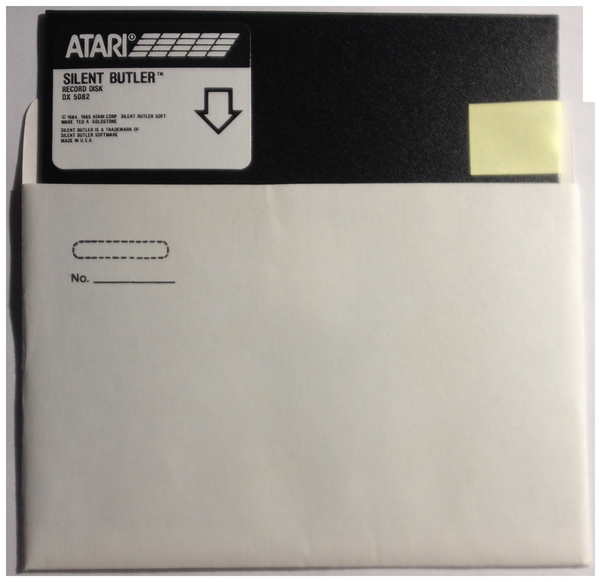

- Atari Silent Butler - Program Disk Label 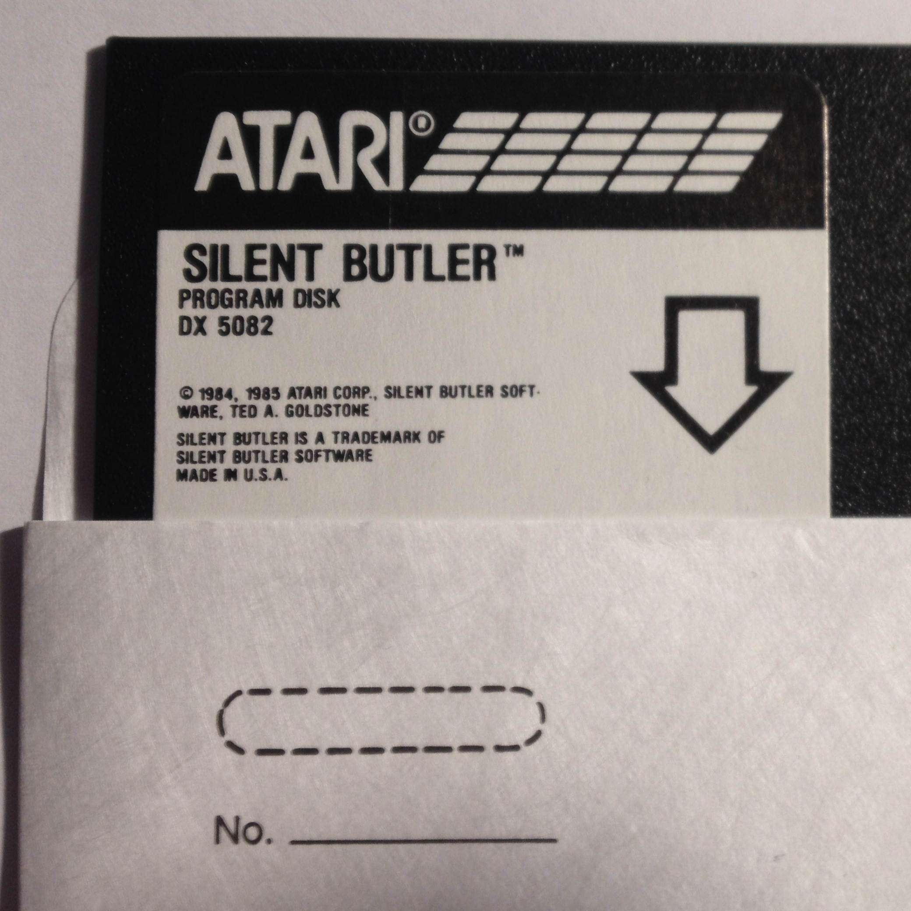

- Atari Silent Butler - Record Disk Label 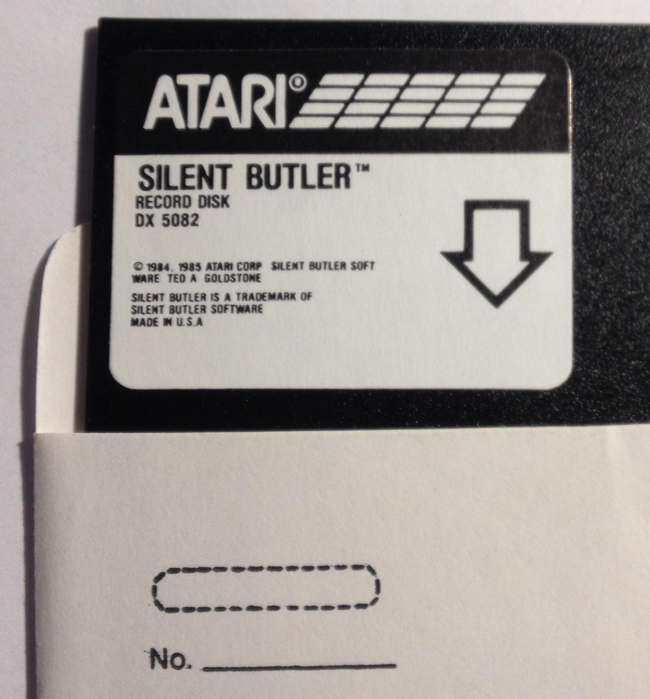

## Screenshots

- Atari Silent Butler - Screenshot 01 from SD-Program-Disk 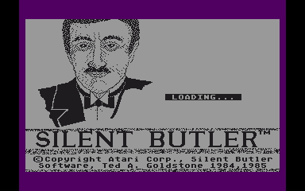

- Atari Silent Butler - Screenshot 02 from MD-Program-Disk 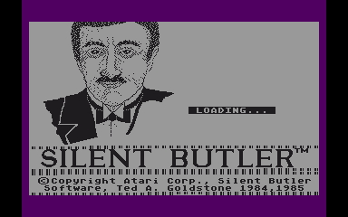

- Atari Silent Butler - Screenshot 03 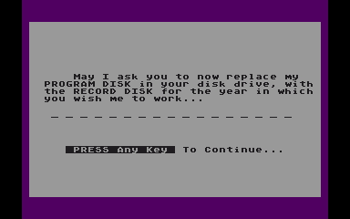

- Atari Silent Butler - Screenshot 04 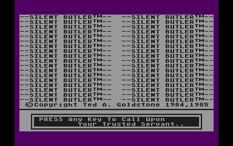

- Atari Silent Butler - Screenshot 05 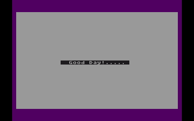

- Atari Silent Butler - Screenshot 06 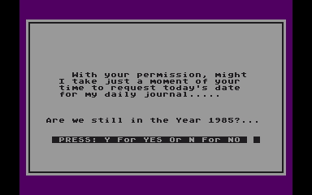

- Atari Silent Butler - Screenshot 07 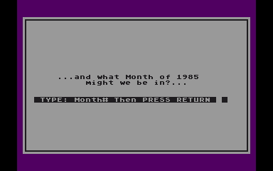

- Atari Silent Butler - Screenshot 08 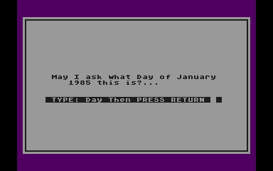

- Atari Silent Butler - Screenshot 09 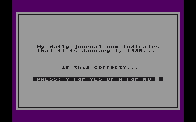

- Atari Silent Butler - Screenshot 10 

- Atari Silent Butler - Screenshot 11 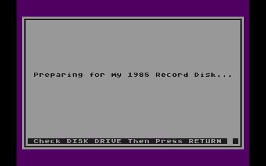

- Atari Silent Butler - Screenshot 12 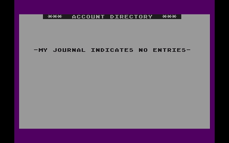

- Atari Silent Butler - Screenshot 13 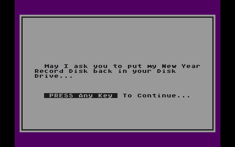

- Atari Silent Butler - Screenshot 14 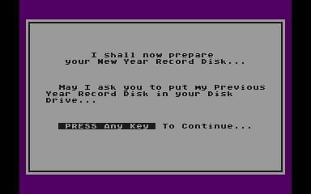

- Atari Silent Butler - Screenshot 15 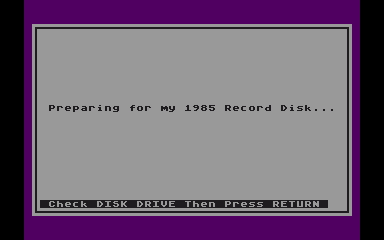

- Atari Silent Butler - Screenshot 16 

- Atari Silent Butler - Screenshot 17 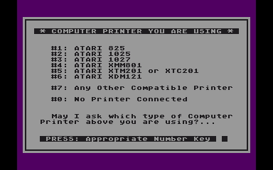

- Atari Silent Butler - Screenshot 18 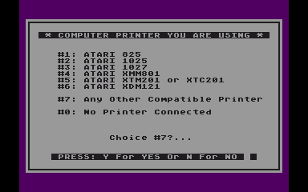

- Atari Silent Butler - Screenshot 19 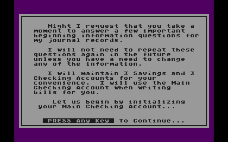

- Atari Silent Butler - Screenshot 20 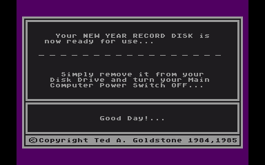

- Atari Silent Butler - Screenshot 21 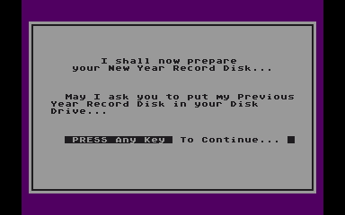

- Atari Silent Butler - Screenshot 22 

- Atari Silent Butler - Screenshot 23 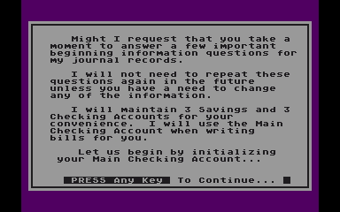

- Atari Silent Butler - Screenshot 24 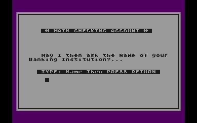

- Atari Silent Butler - Screenshot 25 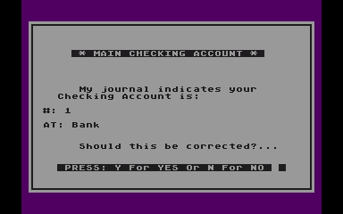

- Atari Silent Butler - Screenshot 26 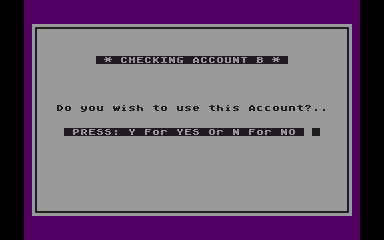

- Atari Silent Butler - Screenshot 27 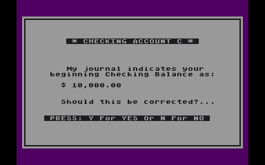

- Atari Silent Butler - Screenshot 28 

- Atari Silent Butler - Screenshot 29 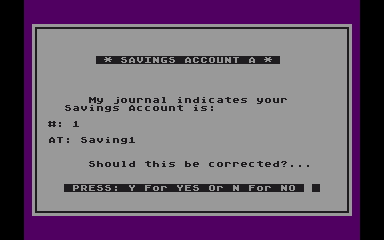

- Atari Silent Butler - Screenshot 30 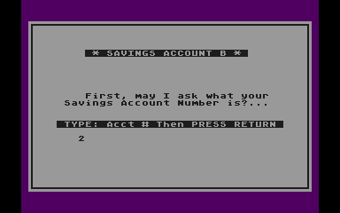

- Atari Silent Butler - Screenshot 31 

- Atari Silent Butler - Screenshot 32 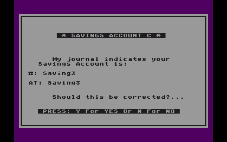

- Atari Silent Butler - Screenshot 33 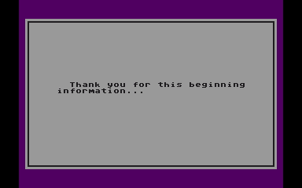

- Atari Silent Butler - Screenshot 34 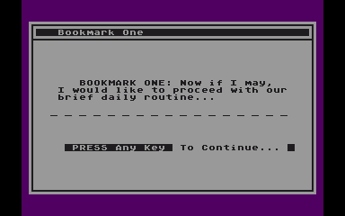

- Atari Silent Butler - Screenshot 35 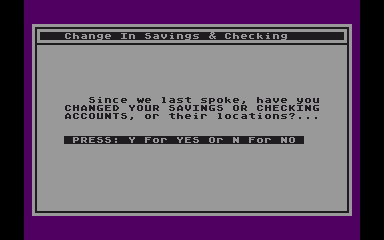

- Atari Silent Butler - Screenshot 36 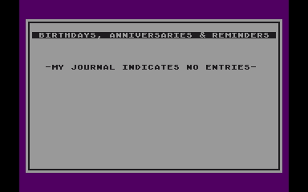

- Atari Silent Butler - Screenshot 37 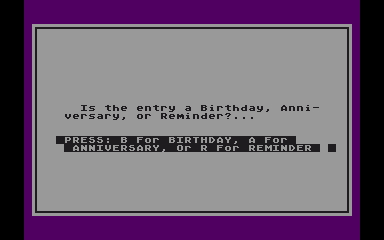

- Atari Silent Butler - Screenshot 38 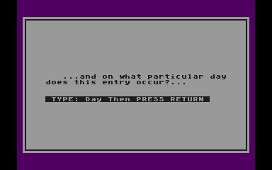

- Atari Silent Butler - Screenshot 39 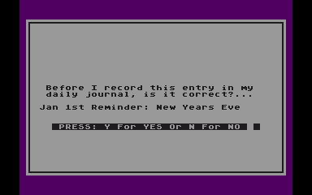

- Atari Silent Butler - Screenshot 40 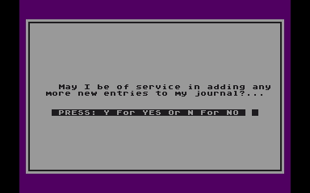

- Atari Silent Butler - Screenshot 41 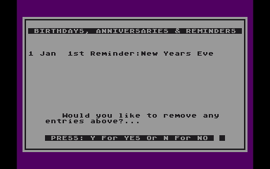

- Atari Silent Butler - Screenshot 42 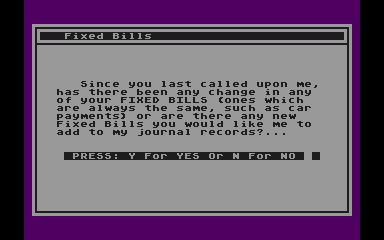

- Atari Silent Butler - Screenshot 43 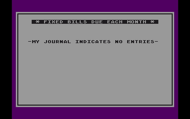

- Atari Silent Butler - Screenshot 44 

- Atari Silent Butler - Screenshot 45 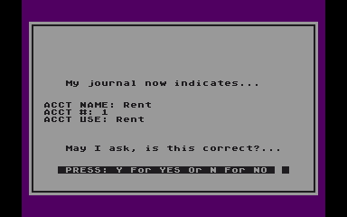

- Atari Silent Butler - Screenshot 46 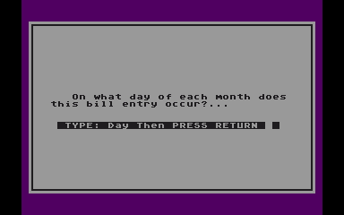

- Atari Silent Butler - Screenshot 47 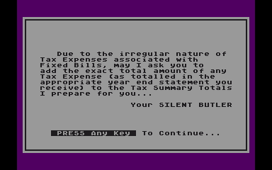

- Atari Silent Butler - Screenshot 48 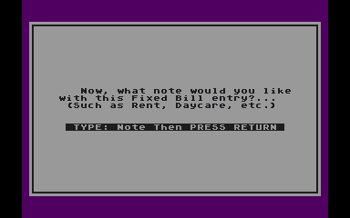

- Atari Silent Butler - Screenshot 49 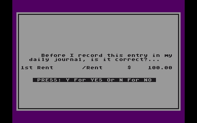

- Atari Silent Butler - Screenshot 50 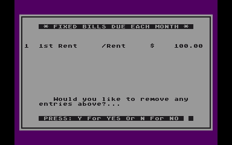

- Atari Silent Butler - Screenshot 51 

- Atari Silent Butler - Screenshot 52 

- Atari Silent Butler - Screenshot 53 

- Atari Silent Butler - Screenshot 54 

- Atari Silent Butler - Screenshot 55 

- Atari Silent Butler - Screenshot 56 

- Atari Silent Butler - Screenshot 57 

- Atari Silent Butler - Screenshot 58 

- Atari Silent Butler - Screenshot 59 

- Atari Silent Butler - Screenshot 60 

- Atari Silent Butler - Screenshot 61 

- Atari Silent Butler - Screenshot 62 

- Atari Silent Butler - Screenshot 63 

- Atari Silent Butler - Screenshot 64 

- Atari Silent Butler - Screenshot 65 

- Atari Silent Butler - Screenshot 66 

- Atari Silent Butler - Screenshot 67 

- Atari Silent Butler - Screenshot 68 

- Atari Silent Butler - Screenshot 69 

- Atari Silent Butler - Screenshot 70 

- Atari Silent Butler - Screenshot 71 

- Atari Silent Butler - Screenshot 72 

- Atari Silent Butler - Screenshot 73 

- Atari Silent Butler - Screenshot 74 

- Atari Silent Butler - Screenshot 75 

- Atari Silent Butler - Screenshot 76 

- Atari Silent Butler - Screenshot 77 

- Atari Silent Butler - Screenshot 78 

- Atari Silent Butler - Screenshot 79 

- Atari Silent Butler - Screenshot 80 

- Atari Silent Butler - Screenshot 81 

- Atari Silent Butler - Screenshot 82 

- Atari Silent Butler - Screenshot 83 

- Atari Silent Butler - Screenshot 84 

- Atari Silent Butler - Screenshot 85 

- Atari Silent Butler - Screenshot 86 

- Atari Silent Butler - Screenshot 87 

- Atari Silent Butler - Screenshot 88 

- Atari Silent Butler - Screenshot 89 

- Atari Silent Butler - Screenshot 90 

- Atari Silent Butler - Screenshot 91 

- Atari Silent Butler - Screenshot 92 

- Atari Silent Butler - Screenshot 93 

- Atari Silent Butler - Screenshot 94 
