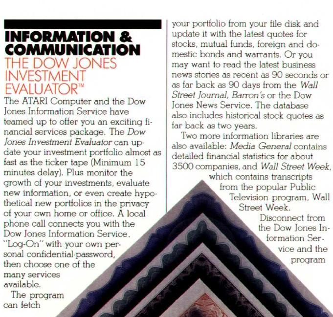
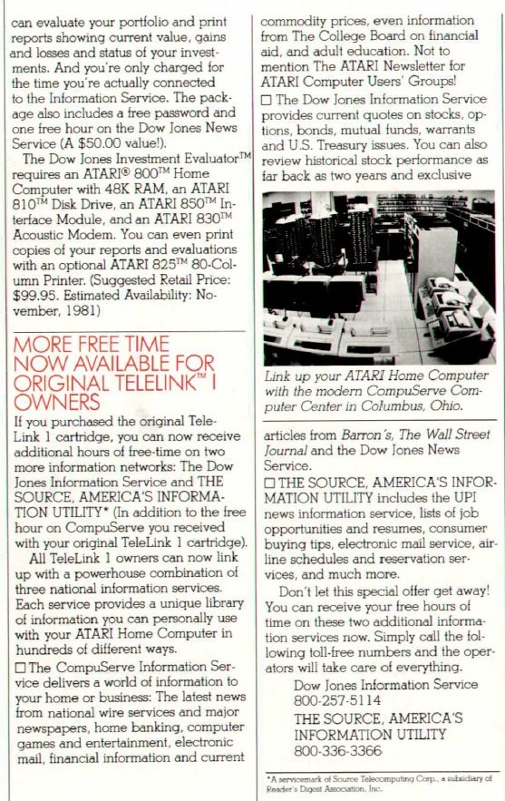
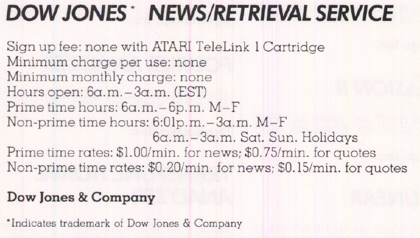
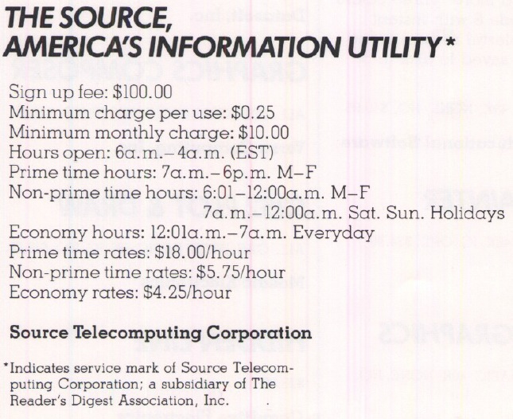
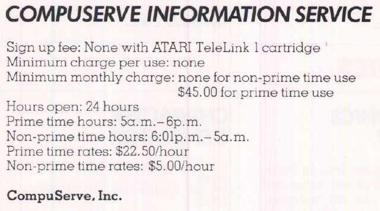

# The Dow Jones Investment Evaluator (CX412)

## Sold in the US only. Just works with a modem and a stand by-telephone-line to Wall Street

## CX8124 Dow Jones Investment Evaluator

## CX8125 Dow Jones Investment Evaluator

## CX8127 Dow Jones Investment Evaluator

## Manual

\*[Dow\_Jones\_Information\_Services-Users\_Guide.pdf](attachments/Dow_Jones_Information_Services-Users_Guide.pdf) ; size: 4 MB with OCR; A big thank you goes to Kay Savetz for giving us the manual

## Images

- Dow Jones Information Services-User's Guide - Cover 
- Dow Jones Investment Evaluator CX412 - description 1 

- Dow Jones Investment Evaluator CX412 - description 2 

## Remote Services

- Dow Jones - News-Retrieval Service. From Atari Special Additions - Volume 1 - Winter 1982 

- The Source. From Atari Special Additions - Volume 1 - Winter 1982 

- Compuserve Information Service. From Atari Special Additions - Volume 1 - Winter 1982 
