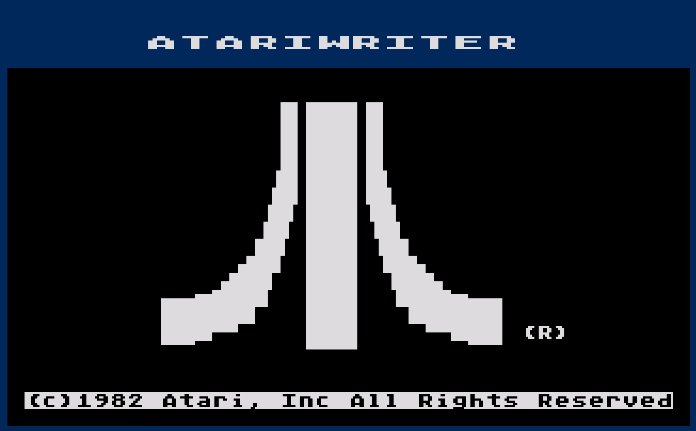
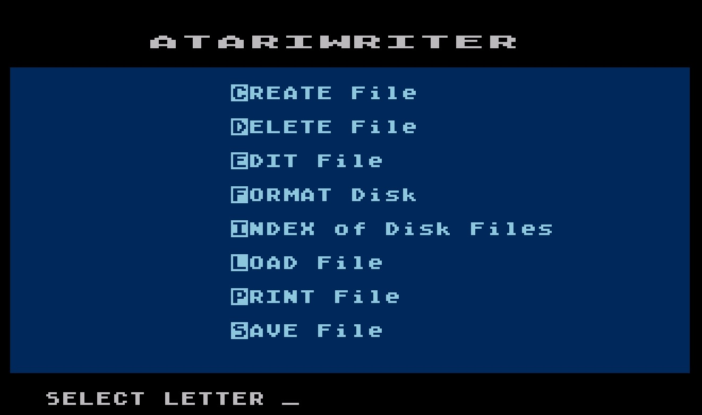
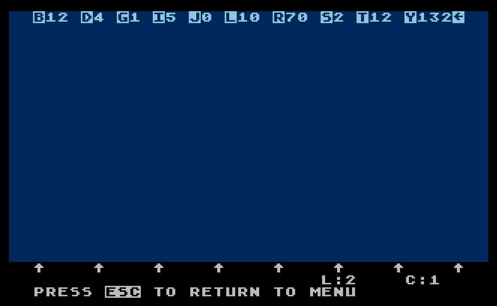
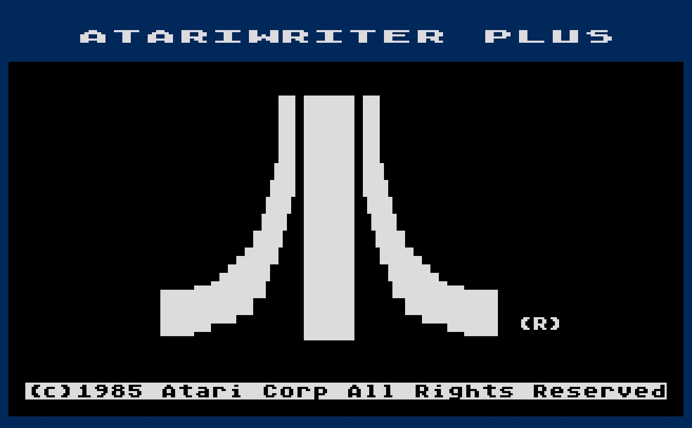
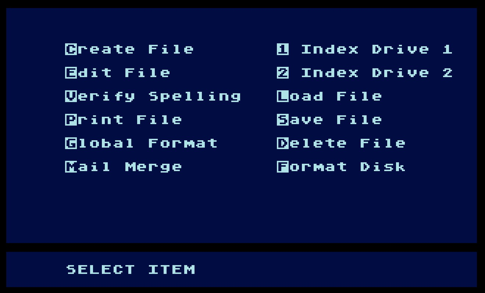
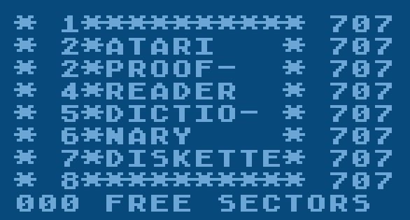

# Atari Writer 8036

; Copyright (C) 1982-1988 Atari, Inc.

AtariWriter is one of Atari's most successful products on the 8-bit platform, and certainly the most successful non-game product they released. It is estimated 800,000 copies of the original English language version were sold, not including the international versions, nor the many updated versions that followed. It is likely it sold at least 1,000,000 copies in total, which is astonishing given that only about 4 million machines were produced in total. For comparison, the much better-known WordStar sold about 650,000 copies by 1983, when better programs began to take its market.

There were three main versions of the program, the original AtariWriter released in 1982 on cartridge, the greatly expanded disk-based AtariWriter Plus in 1986, and the final AtariWriter 80 version of Plus for the XEP80 adaptor in late 1988 (or early 1989). For basic editing, the original cartridge-based version is likely the best to use, the features added in Plus will have little use given the presence of modern machines that can read and edit these files directly.

As of 2018, there is still much chaos regarding AtariWriter. We have a normal version, a plus version, an 80 columns version, a version with a proofreader dictionary, disk versions, cart versions and so on. AtariWiki will provide a structured and reliable presentations of everything regarding the Atari Writer. Of course, this will take some time. Unless told otherwise, please question all software on this site. We publish here all collections from across the world and hope with the help of the community to come down the rabbit hole all way long. Thank you for your understanding.

## CAR Images

- [AtariWriter\_Version\_A\_Brown\_Label.car](attachments/AtariWriter_Version_A_Brown_Label.car)
- [AtariWriter\_Version\_C\_Silver\_Label.car](attachments/AtariWriter_Version_C_Silver_Label.car)
- [AtariWriter\_1982.car](attachments/AtariWriter_1982.car)

## ROM Images

## BIN Images

- [AtariWriter\_Version\_A\_Brown\_Label.bin](attachments/AtariWriter_Version_A_Brown_Label.bin)
- [AtariWriter\_Version\_C\_Silver\_Label.bin](attachments/AtariWriter_Version_C_Silver_Label.bin)

## ATX Images

## PRO Images

## ATR Images

- [APX\_AtariWriter\_Printer\_Drivers\_1.0.atr](attachments/APX_AtariWriter_Printer_Drivers_1.0.atr)
- [AtariWriter\_Printer\_Drivers\_2.0.atr](attachments/AtariWriter_Printer_Drivers_2.0.atr)
- [Atari\_Proof-Reader\_Dictionary\_Diskette.atr](attachments/Atari_Proof-Reader_Dictionary_Diskette.atr)
- [Atari\_Proofreader\_Dictionary\_Diskette.atr](attachments/Atari_Proofreader_Dictionary_Diskette.atr)
- [Atari\_Writer\_80\_Column.atr](attachments/Atari_Writer_80_Column.atr)
- [Atari\_Writer\_80.atr](attachments/Atari_Writer_80.atr)
- [Atari\_Writer\_Clipart.atr](attachments/Atari_Writer_Clipart.atr)
- [Atari\_Writer\_Plus\_130\_XE.atr](attachments/Atari_Writer_Plus_130_XE.atr)
- [Atari\_Writer\_Plus\_800\_XL.atr](attachments/Atari_Writer_Plus_800_XL.atr)
- [AtariWriter\_Plus\_800XLXE.atr](attachments/AtariWriter_Plus_800XLXE.atr)
- [Atari\_Writer\_Plus\_Demo.atr](attachments/Atari_Writer_Plus_Demo.atr)
- [Atari\_Writer\_Plus\_Dictionary.atr](attachments/Atari_Writer_Plus_Dictionary.atr)
- [Atari\_Writer\_Plus\_XE.atr](attachments/Atari_Writer_Plus_XE.atr)
- [Atari\_Writer\_Plus\_XL-XE.atr](attachments/Atari_Writer_Plus_XL-XE.atr)
- [Atari\_Writer\_Plus\_XL.atr](attachments/Atari_Writer_Plus_XL.atr)
- [Atari\_Writer\_Utils.atr](attachments/Atari_Writer_Utils.atr)
- [Atari\_Writer\_Plus\_1985\_Atari\_Side\_A.atr](attachments/Atari_Writer_Plus_1985_Atari_Side_A.atr)
- [Atari\_Writer\_Plus\_1985\_Atari\_Side\_B.atr](attachments/Atari_Writer_Plus_1985_Atari_Side_B.atr)
- [Atari\_Writer\_\_A.atr](attachments/Atari_Writer_Plus_A.atr)
- [Atari\_Writer\_\_B.atr](attachments/Atari_Writer_Plus_B.atr)
- [AtariWriter\_Plus\_v1s1.atr](attachments/AtariWriter_Plus_v1s1.atr)
- [AtariWriter\_Plus\_v1s2doc.atr](attachments/AtariWriter_Plus_v1s2doc.atr)
- [AtariWriter\_Plus\_v2\_2.atr](attachments/AtariWriter_Plus_v2_2.atr)
- [AtariWriter\_Plus\_v2.atr](attachments/AtariWriter_Plus_v2.atr)
- [Atariwriter\_Plus\_A.atr](attachments/Atariwriter_Plus_A.atr)
- [Atariwriter\_Plus\_B.atr](attachments/Atariwriter_Plus_B.atr)
- [Atariwriter\_Plus.atr](attachments/Atariwriter_Plus.atr)
- [AtariWriter\_80\_800XLXE.atr](attachments/AtariWriter_80_800XLXE.atr)
- [AtariWriter\_80\_130XE.atr](attachments/AtariWriter_80_130XE.atr)
- [AtariWriter\_80\_-\_Dictionary.atr](attachments/AtariWriter_80_-_Dictionary.atr)

## XEX file

- [AtariWriter.xex](attachments/AtariWriter.xex)

## Manuals

- [Atari\_Writer\_Quick\_Reference.pdf](attachments/Atari_Writer_Quick_Reference.pdf) ; size: 2.2 MB

- [AtariWriter\_Word\_Processing.pdf](../../../../media/Companies/Atari/Atari_Writer/attachments/AtariWriter_Word_Processing.pdf) ; size: 11.9 MB

- [AtariWriter\_Plus\_-\_Quick\_Reference.pdf](attachments/AtariWriter_Plus_-_Quick_Reference.pdf) ; size: 1.3 MB

- [AtariWriter\_Plus\_Owner\_s\_Manual.pdf](../../../../media/Companies/Atari/Atari_Writer/attachments/AtariWriter_Plus_Owner_s_Manual.pdf) ; size: 6.3 MB

- [AtariWriter\_80\_-\_Quick\_Reference.pdf](attachments/AtariWriter_80_-_Quick_Reference.pdf) ; size: 157 KB

- [AtariWriter\_80\_-\_Manual.pdf](../../../../media/Companies/Atari/Atari_Writer/attachments/AtariWriter_80_-_Manual.pdf) ; size: 9.7 MB

- [Atariwriter\_Printer\_Drivers-APX-20223.pdf](attachments/Atariwriter_Printer_Drivers-APX-20223.pdf) ; size: 3.8 MB

## Pictures

- Atari Writer - Startscreen 1982 

- Atari Writer - Main Menu 1982 

- Atari Writer - empty document 

- Atari Writer Plus - Startscreen 1985 

- Atari Writer Plus with Proofreader - Main Menu 

- Atari Writer Plus - Proofreader Disk Content 
