# Basic Electricity (CX6016)

Donated by Allan Bushman: Allan, a thousand thanks from the Atari community for your outstanding help! :-)

## Boxcover

- Boxcover of Basic Electricity CX6016 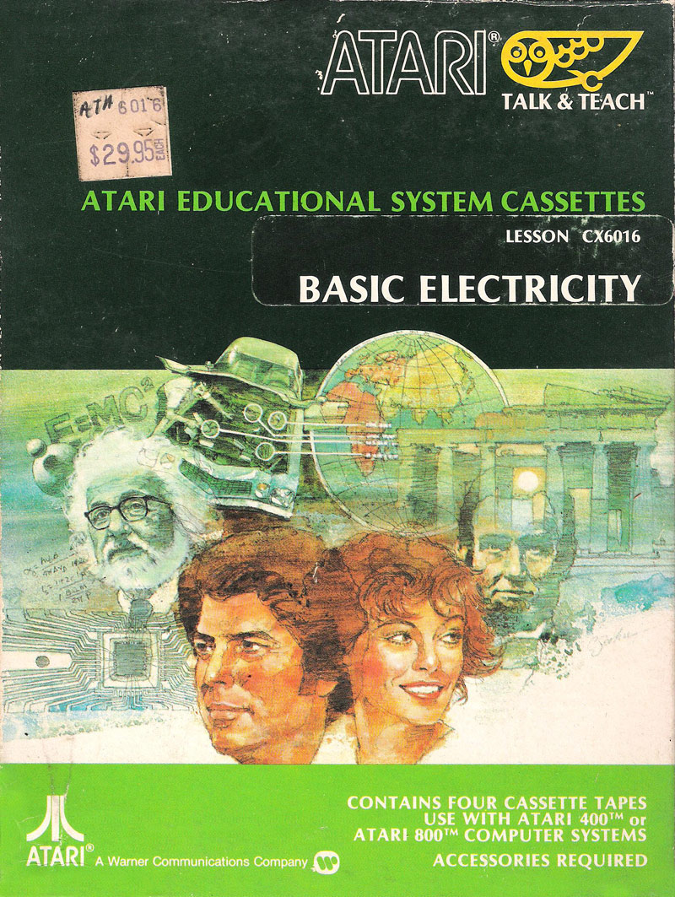

## Content

- Content of Basic Electricity CX6016 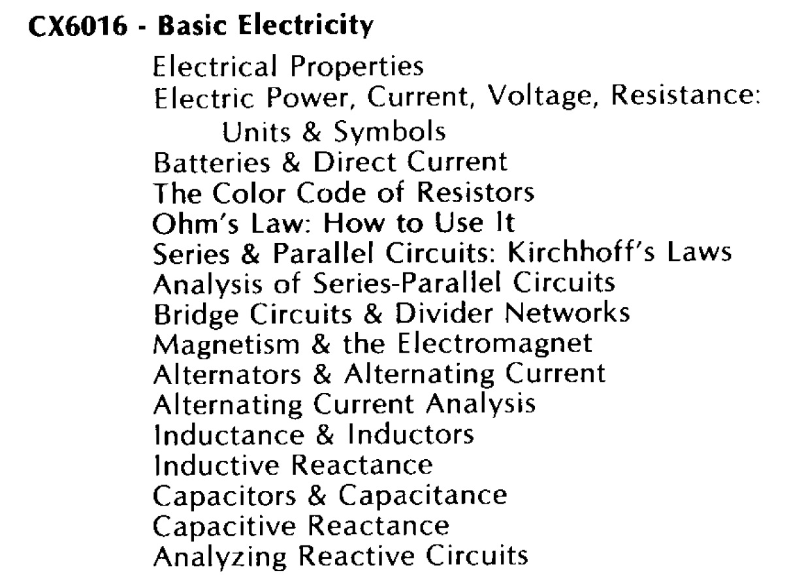

## Cassette-Images in FLAC-format

- Properties, Units \& Symbols 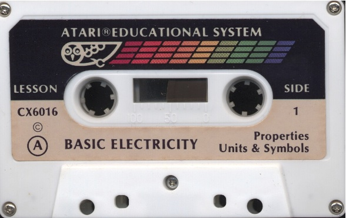

- [http://data.atariwiki.org/FLAC/BE/Lesson\_A\_Side\_1-Properties-Units\_and\_Symbols.flac](http://data.atariwiki.org/FLAC/BE/Lesson_A_Side_1-Properties-Units_and_Symbols.flac) ; size: 139.9 MB

- Batteries, Resistors 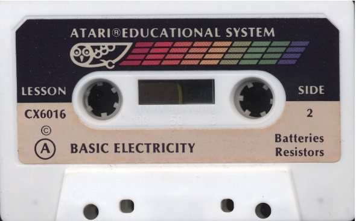

- [http://data.atariwiki.org/FLAC/BE/Lesson\_A\_Side\_2-Batteries-Resistors.flac](http://data.atariwiki.org/FLAC/BE/Lesson_A_Side_2-Batteries-Resistors.flac) ; size: 138.2 MB

- Ohm's Law, Circuits 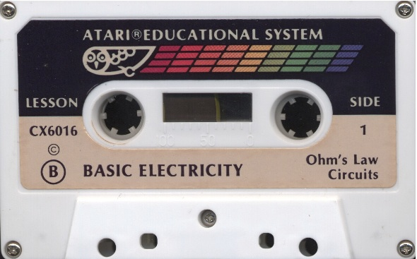

- [http://data.atariwiki.org/FLAC/BE/Lesson\_B\_Side\_1-Ohm\_s\_Law-Circuits.flac](http://data.atariwiki.org/FLAC/BE/Lesson_B_Side_1-Ohm_s_Law-Circuits.flac) ; size: 153.5 MB

- Analysis, Networks 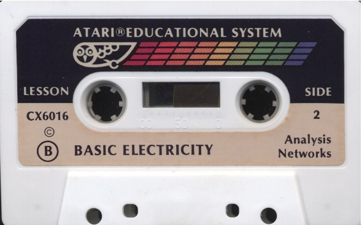

- [http://data.atariwiki.org/FLAC/BE/Lesson\_B\_Side\_2-Analysis-Networks.flac](http://data.atariwiki.org/FLAC/BE/Lesson_B_Side_2-Analysis-Networks.flac) ; size: 164.4 MB

- Magnetism, Alternators 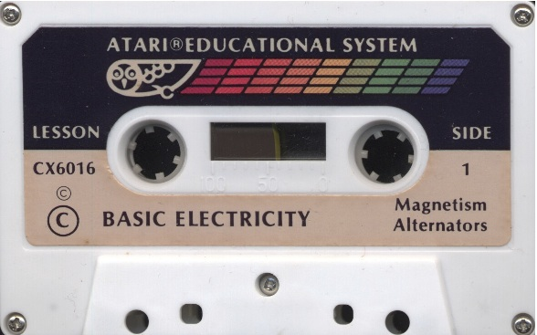

- [http://data.atariwiki.org/FLAC/BE/Lesson\_C\_Side\_1-Magnetism-Alternators.flac](http://data.atariwiki.org/FLAC/BE/Lesson_C_Side_1-Magnetism-Alternators.flac) ; size: 154.7 MB

- AC Analysis, Inductance 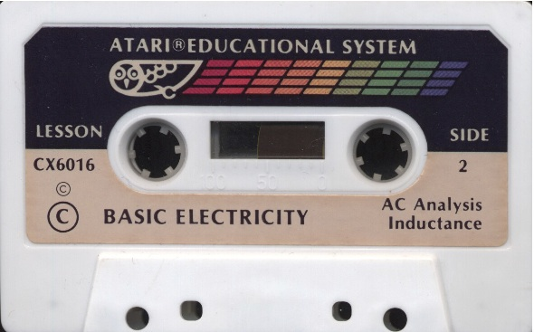

- [http://data.atariwiki.org/FLAC/BE/Lesson\_C\_Side\_2-AC\_Analysis-Inductance.flac](http://data.atariwiki.org/FLAC/BE/Lesson_C_Side_2-AC_Analysis-Inductance.flac) ; size: 154.5 MB

- Reactance, Capacitors 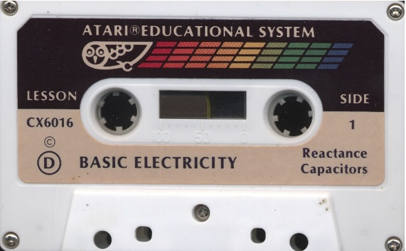

- [http://data.atariwiki.org/FLAC/BE/Lesson\_D\_Side\_1-Reactance\_Capacitors.flac](http://data.atariwiki.org/FLAC/BE/Lesson_D_Side_1-Reactance_Capacitors.flac) ; size: 152.4 MB

- Reactance, Circuits 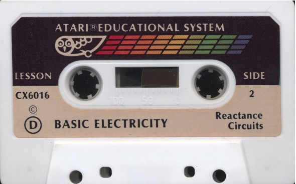

- [http://data.atariwiki.org/FLAC/BE/Lesson\_D\_Side\_2-Reactance\_Circuits.flac](http://data.atariwiki.org/FLAC/BE/Lesson_D_Side_2-Reactance_Circuits.flac) ; size: 144.3 MB

## Images

- Basic Electricity CX6016 - figure 1 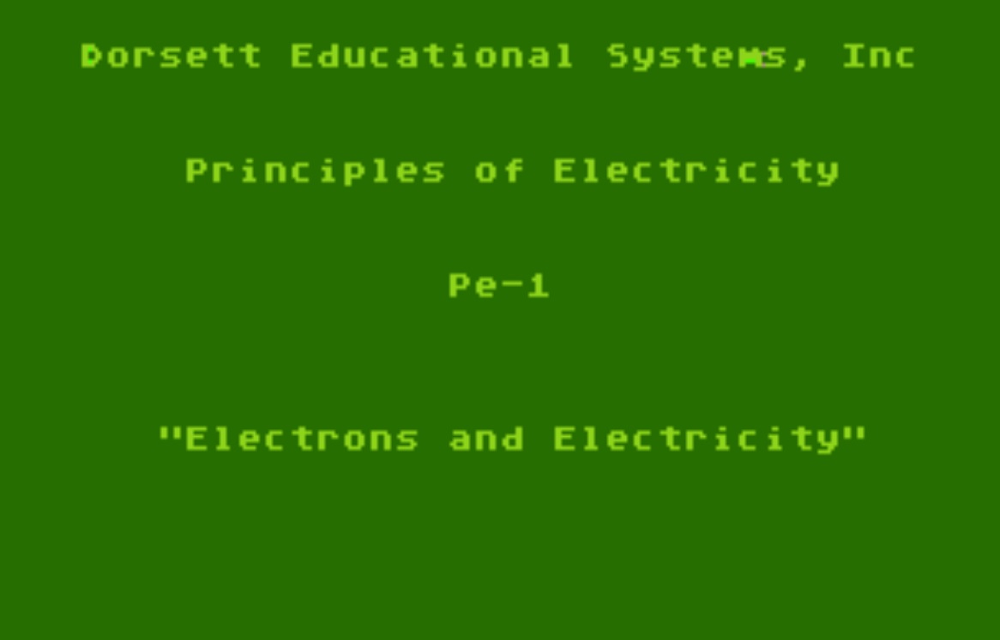

- Basic Electricity CX6016 - figure 2 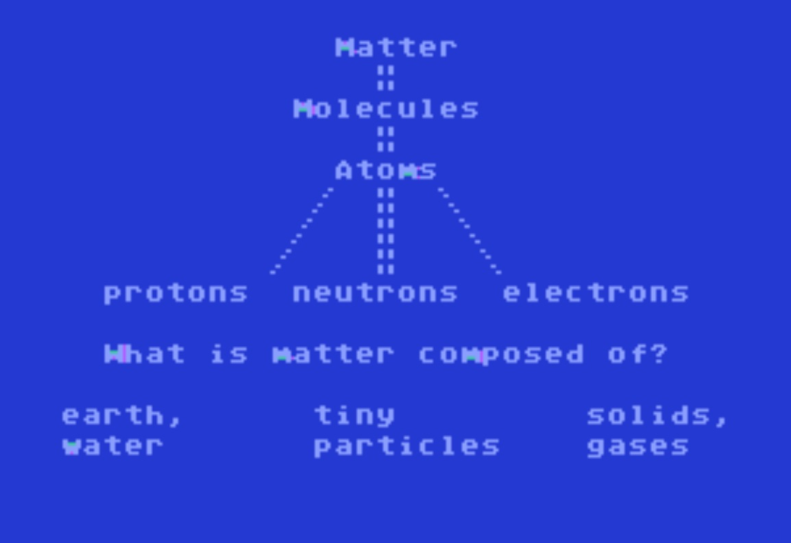

- Basic Electricity CX6016 - figure 3 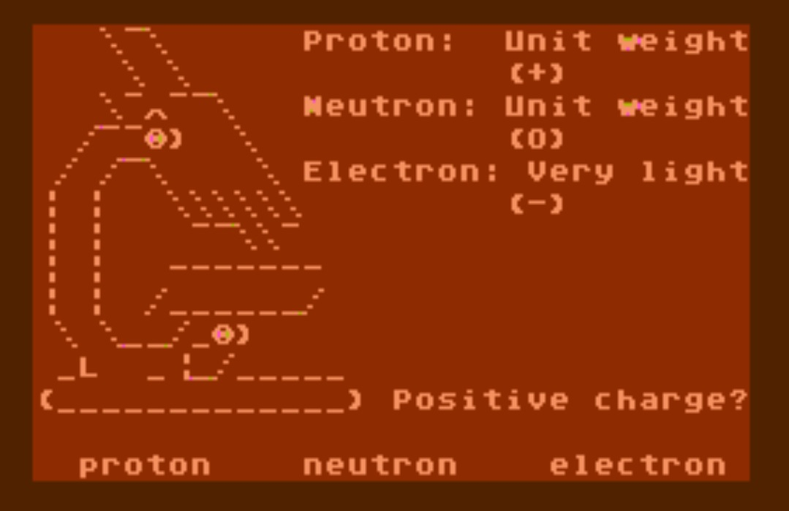

- Basic Electricity CX6016 - figure 4 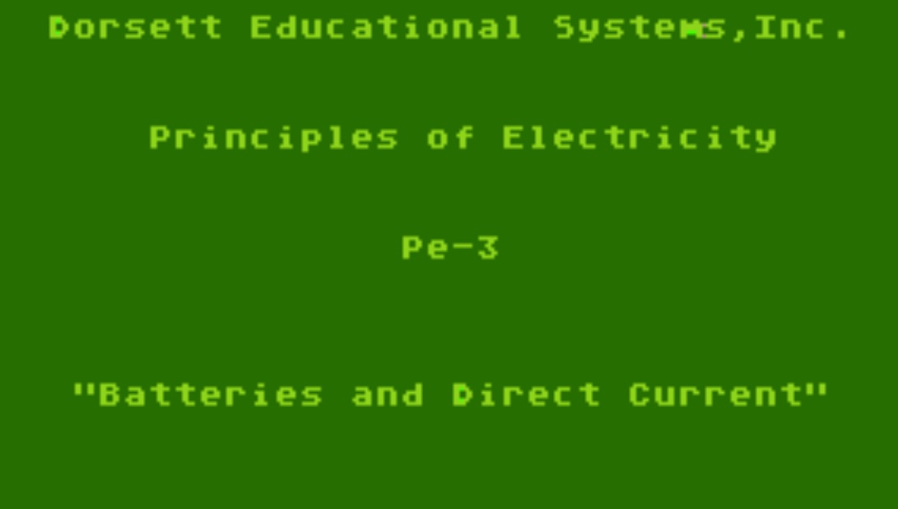

- Basic Electricity CX6016 - figure 5 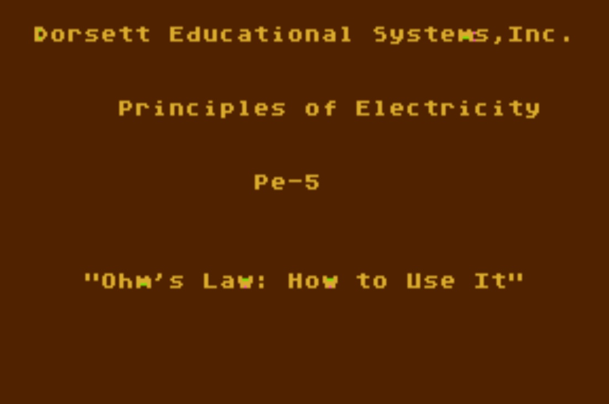

- Basic Electricity CX6016 - figure 6 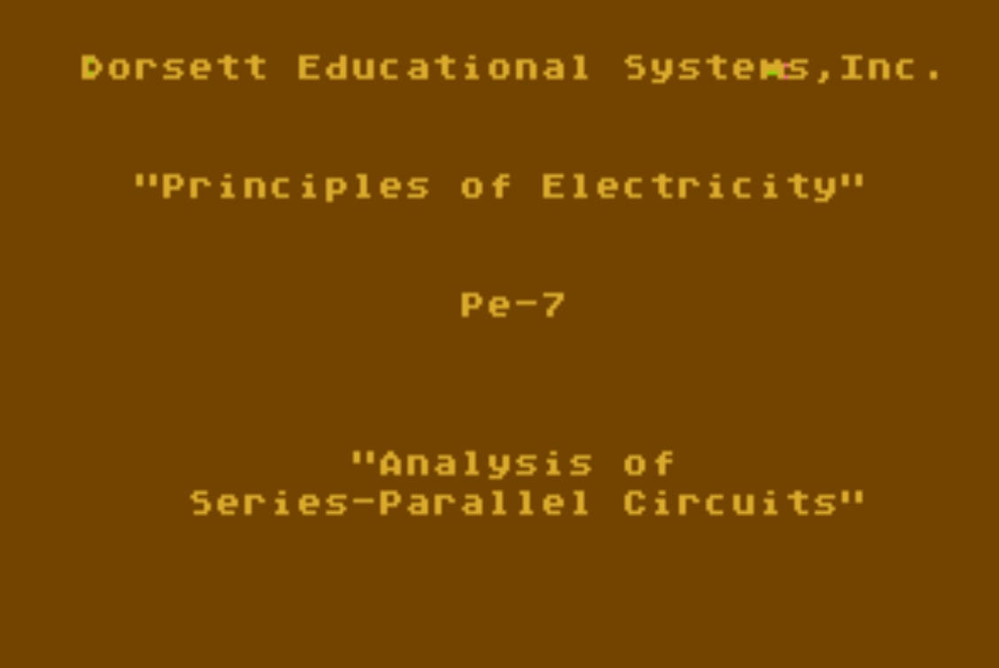

- Basic Electricity CX6016 - figure 7 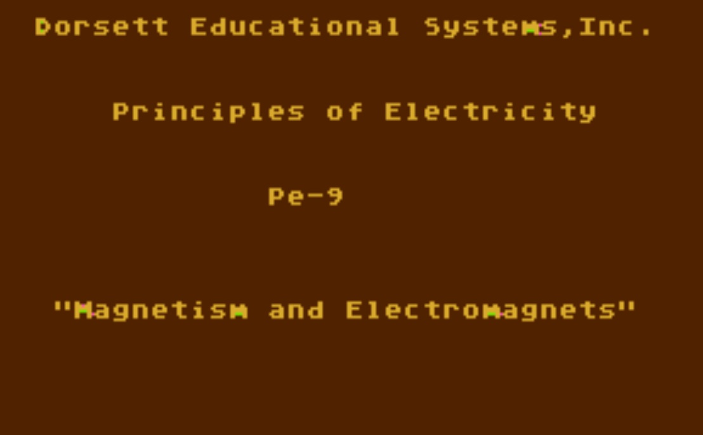

- Basic Electricity CX6016 - figure 8 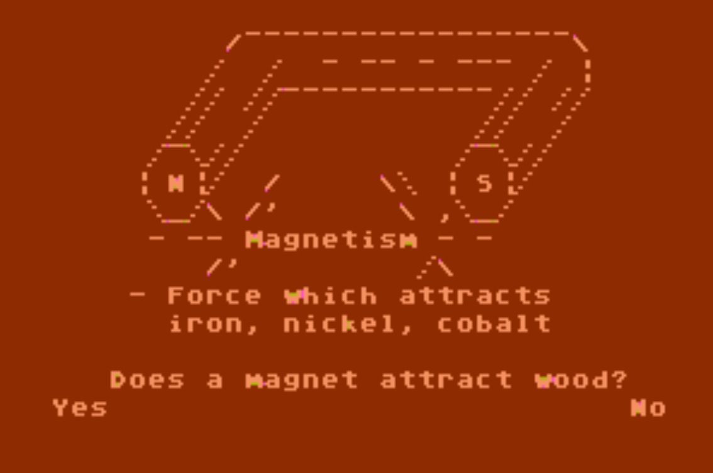

- Basic Electricity CX6016 - figure 9 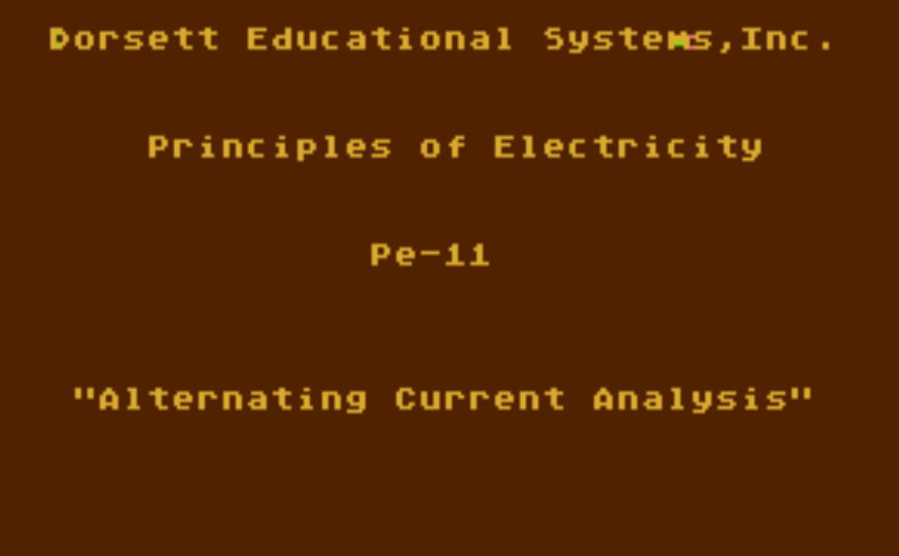

- Basic Electricity CX6016 - figure 10 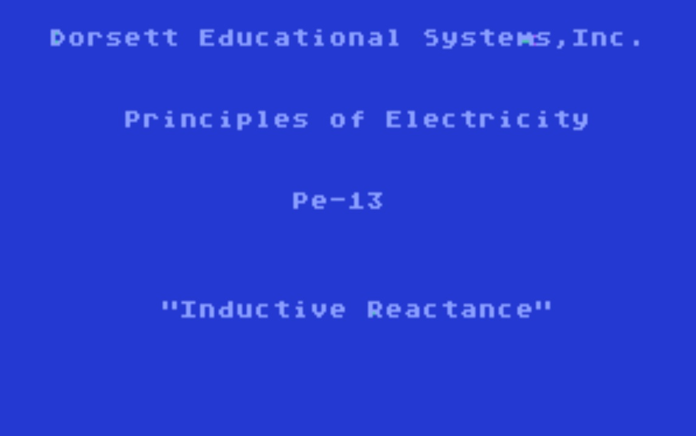

- Basic Electricity CX6016 - figure 11 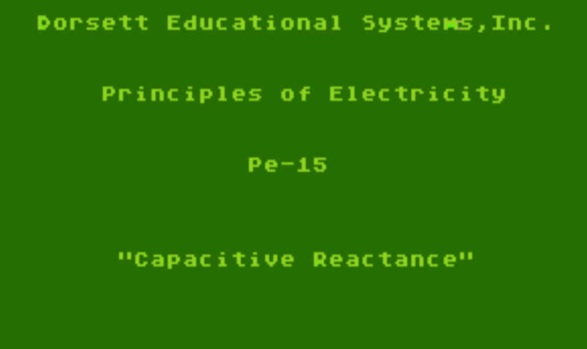
