# Basic Sociology (CX6005)

Basic Sociology CX6005 is a really hard to find artifact with a rarity above 10. Therefore, we deeply want to say thank you Bill Lange for providing this treasure to the Atari community. We really owe you very much!

## Box

- Basic Sociology CX6005 - box cover - thanks to Bill Lange for taking the picture 

- Basic Sociology CX6005 - box content - thanks to Bill Lange for taking the picture 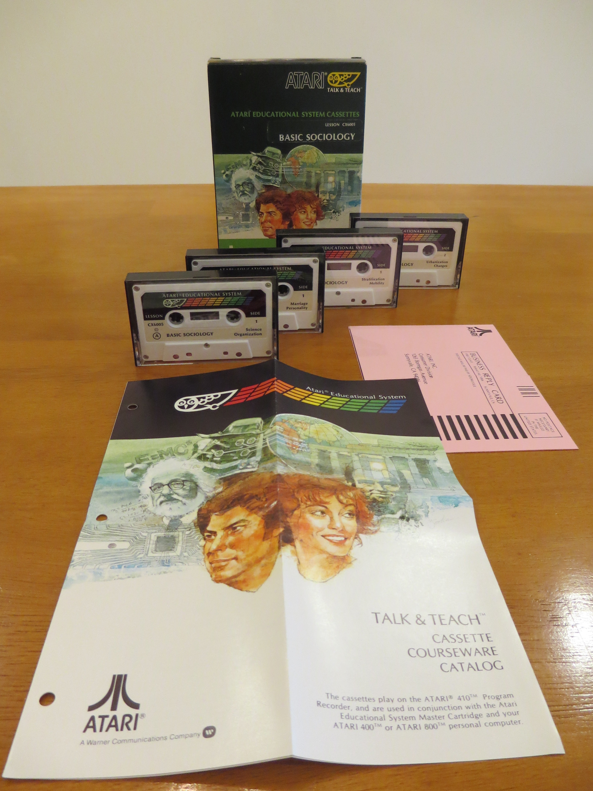

## Content

- Content of Basic Sociology CX6005 

## Cassette-Images in FLAC-format

- [http://data.atariwiki.org/FLAC/BS/Basic\_Sociology\_CX6005-Cassette\_A-Side\_1.flac](http://data.atariwiki.org/FLAC/BS/Basic_Sociology_CX6005-Cassette_A-Side_1.flac) ; size: 142.3 MB

- [http://data.atariwiki.org/FLAC/BS/Basic\_Sociology\_CX6005-Cassette\_A-Side\_2.flac](http://data.atariwiki.org/FLAC/BS/Basic_Sociology_CX6005-Cassette_A-Side_2.flac) ; size: 136.5 MB

- [http://data.atariwiki.org/FLAC/BS/Basic\_Sociology\_CX6005-Cassette\_B-Side\_1.flac](http://data.atariwiki.org/FLAC/BS/Basic_Sociology_CX6005-Cassette_B-Side_1.flac) ; size: 125.4 MB

- [http://data.atariwiki.org/FLAC/BS/Basic\_Sociology\_CX6005-Cassette\_B-Side\_2.flac](http://data.atariwiki.org/FLAC/BS/Basic_Sociology_CX6005-Cassette_B-Side_2.flac) ; size: 127.9 MB

- [http://data.atariwiki.org/FLAC/BS/Basic\_Sociology\_CX6005-Cassette\_C-Side\_1.flac](http://data.atariwiki.org/FLAC/BS/Basic_Sociology_CX6005-Cassette_C-Side_1.flac) ; size: 111.4 MB

- [http://data.atariwiki.org/FLAC/BS/Basic\_Sociology\_CX6005-Cassette\_C-Side\_2.flac](http://data.atariwiki.org/FLAC/BS/Basic_Sociology_CX6005-Cassette_C-Side_2.flac) ; size: 106.5 MB

- [http://data.atariwiki.org/FLAC/BS/Basic\_Sociology\_CX6005-Cassette\_D-Side\_1.flac](http://data.atariwiki.org/FLAC/BS/Basic_Sociology_CX6005-Cassette_D-Side_1.flac) ; size: 125.7 MB

- [http://data.atariwiki.org/FLAC/BS/Basic\_Sociology\_CX6005-Cassette\_D-Side\_2.flac](http://data.atariwiki.org/FLAC/BS/Basic_Sociology_CX6005-Cassette_D-Side_2.flac) ; size: 162.3 MB

## Images

- Basic Sociology CX6005 - figure 01 

- Basic Sociology CX6005 - figure 02 

- Basic Sociology CX6005 - figure 03 

- Basic Sociology CX6005 - figure 04 

- Basic Sociology CX6005 - figure 05 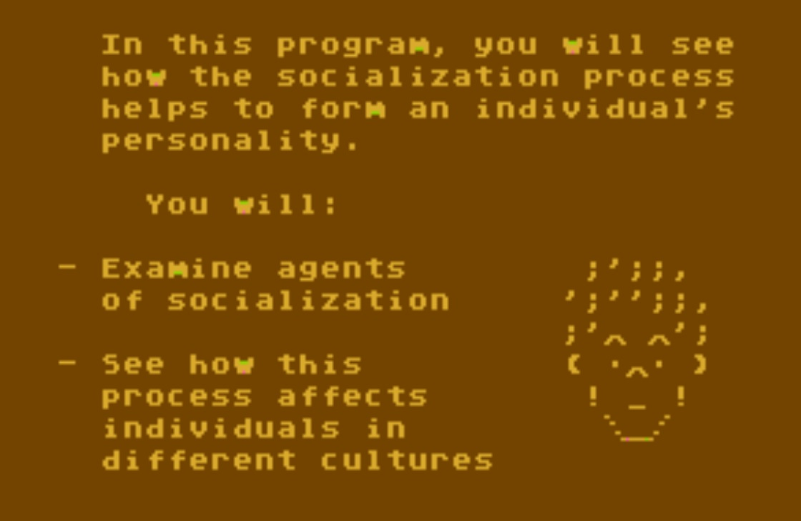

- Basic Sociology CX6005 - figure 06 

- Basic Sociology CX6005 - figure 07 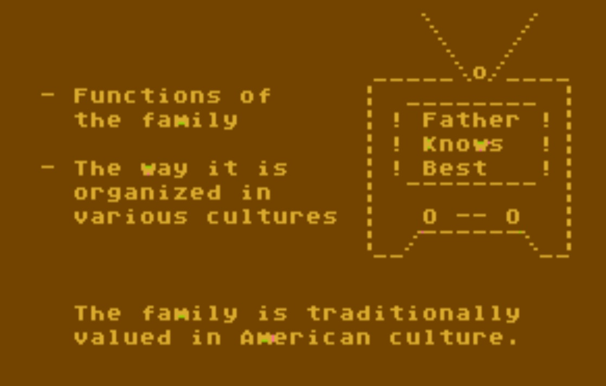

- Basic Sociology CX6005 - figure 08 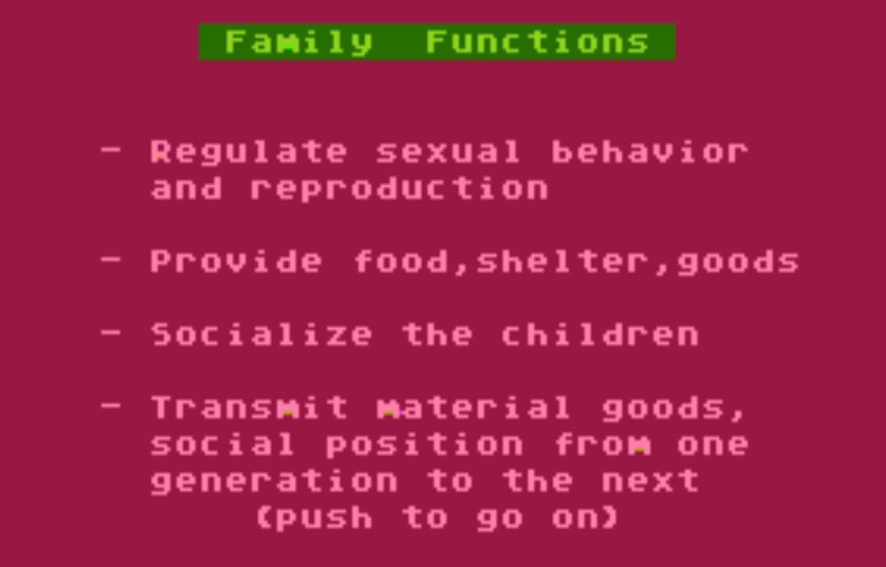

- Basic Sociology CX6005 - figure 09 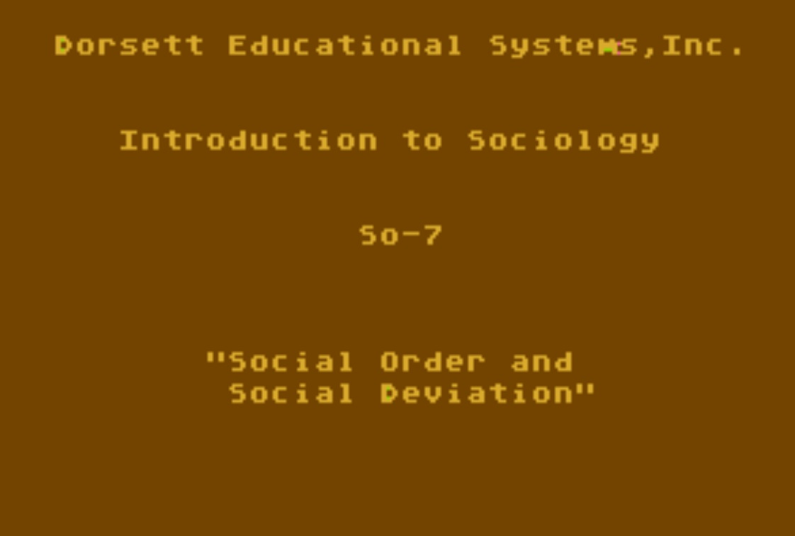

- Basic Sociology CX6005 - figure 10 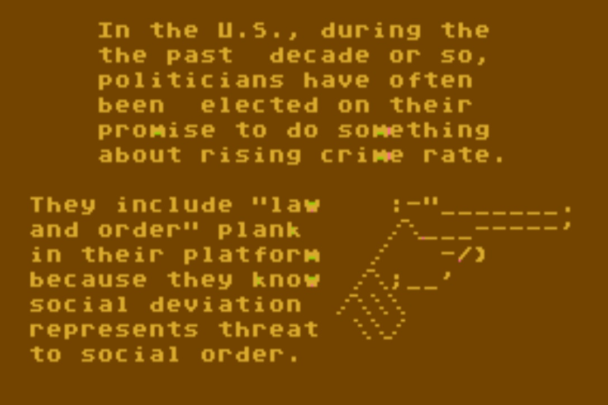

- Basic Sociology CX6005 - figure 11 

- Basic Sociology CX6005 - figure 12 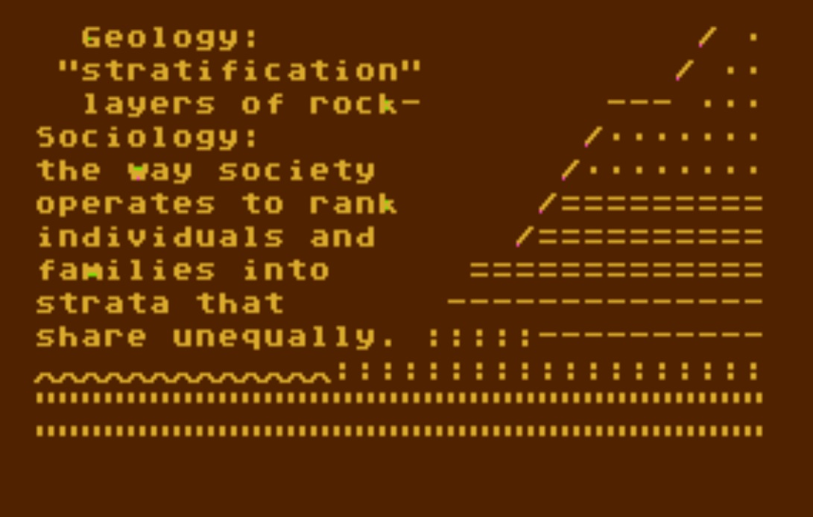

- Basic Sociology CX6005 - figure 13 

- Basic Sociology CX6005 - figure 14 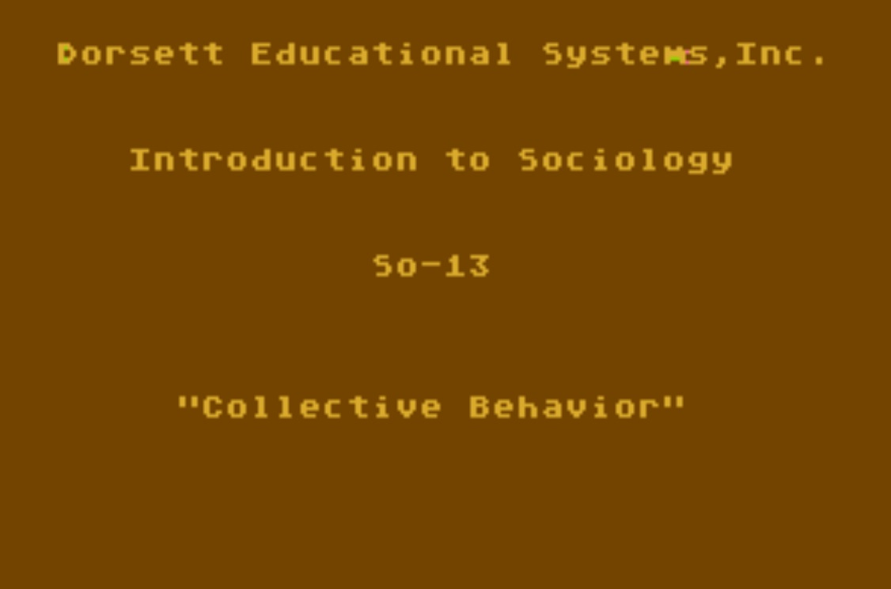

- Basic Sociology CX6005 - figure 15 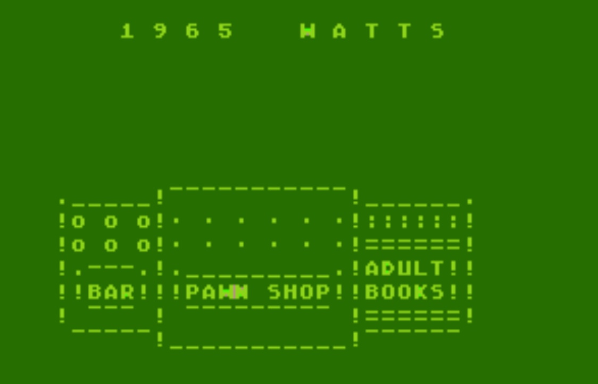

- Basic Sociology CX6005 - figure 16 

- Basic Sociology CX6005 - figure 17 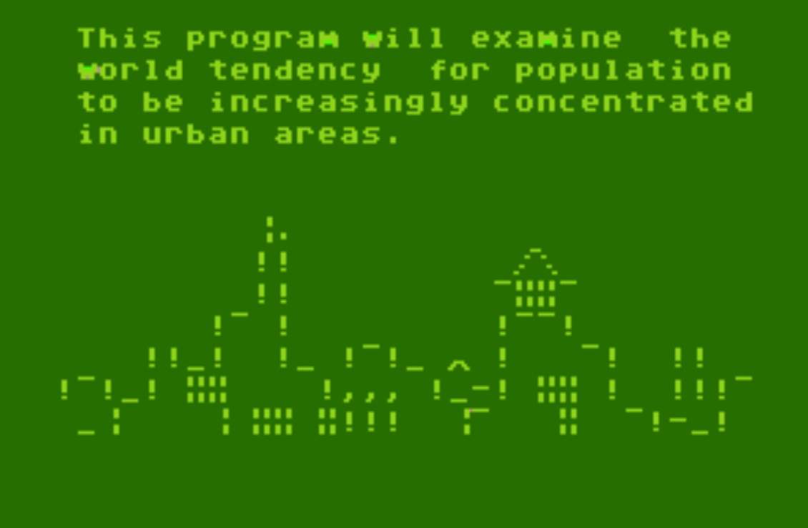

- Basic Sociology CX6005 - figure 18 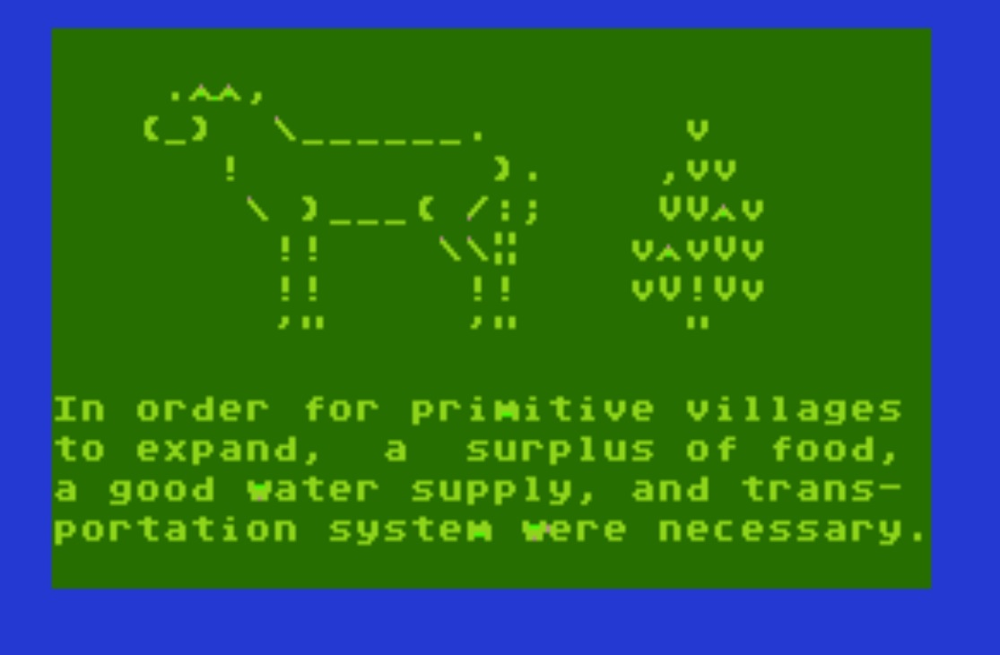
