# Business Communications (CX6010)

## Box-images

- Business Communications CX6010 - box content - thanks to bob1200xl from AtariAge for taking the picture 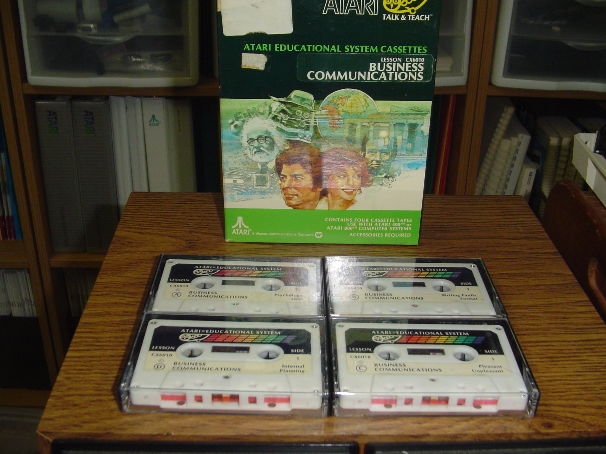

- Business Communications CX6010 - box cover - thanks to Allan Bushmann for taking the picture 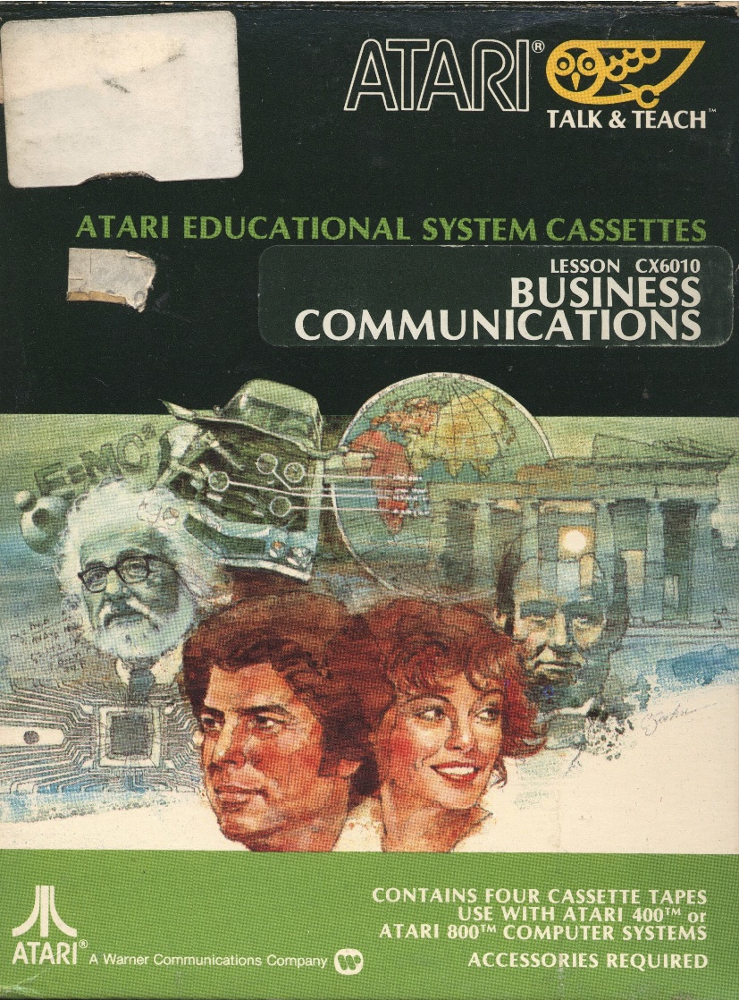

- Business Communications CX6010 - box back - thanks to Allan Bushmann for taking the picture 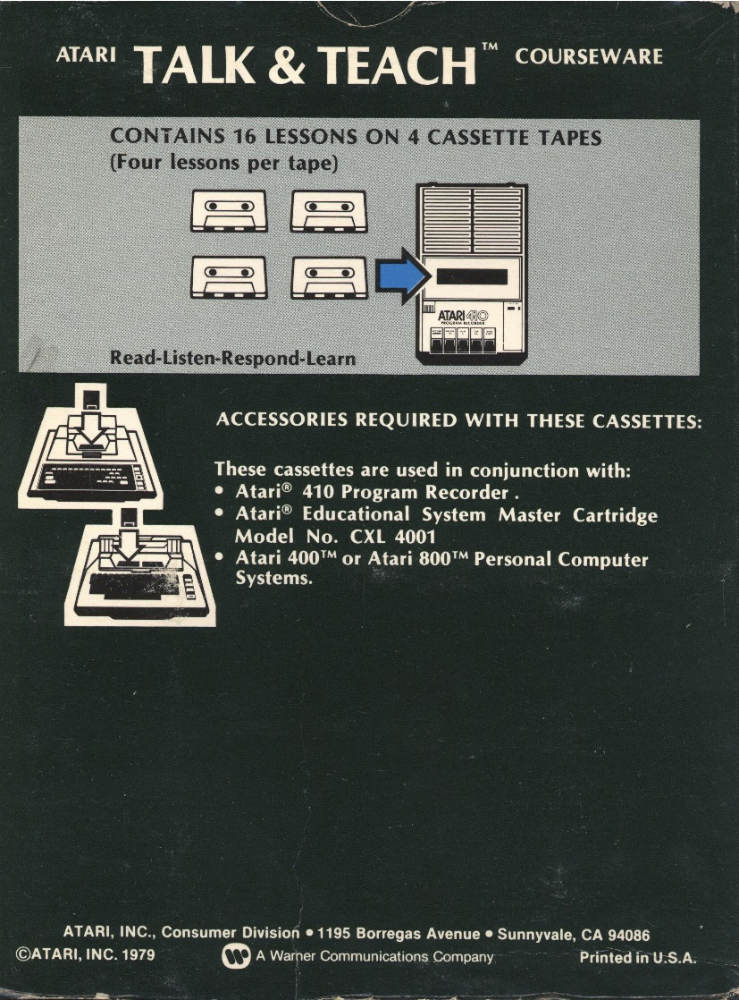

## Content

- Content of Business Communications CX6010 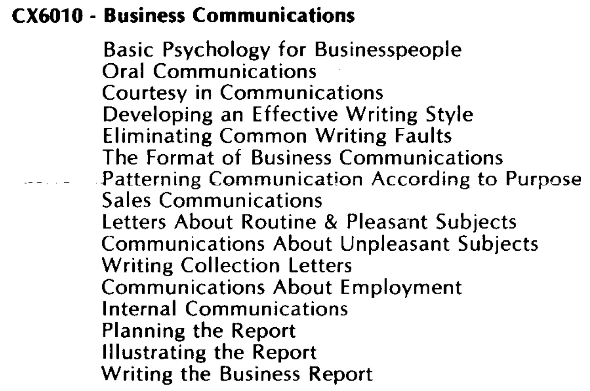

## Cassette-images in FLAC-format

- Business Communications CX6010 - Cassette A-Side 1 - thanks to Allan Bushmann for taking the picture 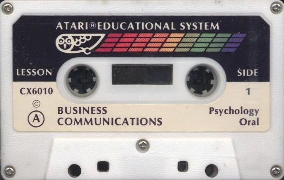

- [http://data.atariwiki.org/FLAC/BC/Business\_Communications\_CX6010-Cassette\_A-Side\_1.flac](http://data.atariwiki.org/FLAC/BC/Business_Communications_CX6010-Cassette_A-Side_1.flac) ; size: 183.4 MB

- Business Communications CX6010 - Cassette A-Side 2 - thanks to Allan Bushmann for taking the picture 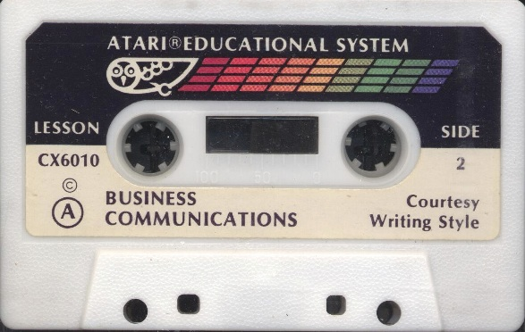

- [http://data.atariwiki.org/FLAC/BC/Business\_Communications\_CX6010-Cassette\_A-Side\_2.flac](http://data.atariwiki.org/FLAC/BC/Business_Communications_CX6010-Cassette_A-Side_2.flac) ; size: 181.1 MB

- Business Communications CX6010 - Cassette B-Side 1 - thanks to Allan Bushmann for taking the picture 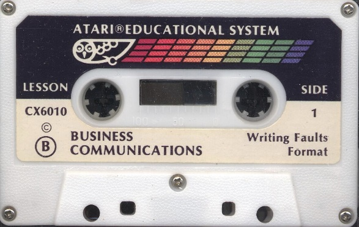

- [http://data.atariwiki.org/FLAC/BC/Business\_Communications\_CX6010-Cassette\_B-Side\_1.flac](http://data.atariwiki.org/FLAC/BC/Business_Communications_CX6010-Cassette_B-Side_1.flac) ; size: 184.4 MB

- Business Communications CX6010 - Cassette B-Side 2 - thanks to Allan Bushmann for taking the picture 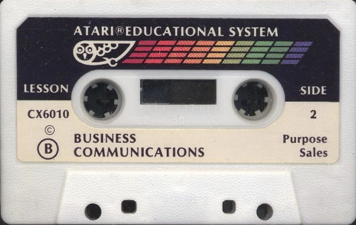

- [http://data.atariwiki.org/FLAC/BC/Business\_Communications\_CX6010-Cassette\_B-Side\_2.flac](http://data.atariwiki.org/FLAC/BC/Business_Communications_CX6010-Cassette_B-Side_2.flac) ; size: 184.2 MB

- Business Communications CX6010 - Cassette C-Side 1 - thanks to Allan Bushmann for taking the picture 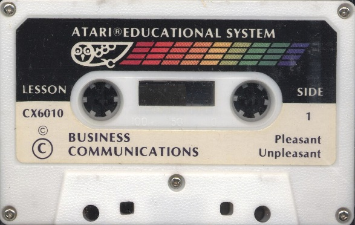

- [http://data.atariwiki.org/FLAC/BC/Business\_Communications\_CX6010-Cassette\_C-Side\_1.flac](http://data.atariwiki.org/FLAC/BC/Business_Communications_CX6010-Cassette_C-Side_1.flac) ; size: 179.6 MB

- Business Communications CX6010 - Cassette C-Side 2 - thanks to Allan Bushmann for taking the picture 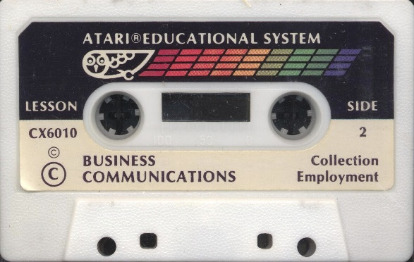

- [http://data.atariwiki.org/FLAC/BC/Business\_Communications\_CX6010-Cassette\_C-Side\_2.flac](http://data.atariwiki.org/FLAC/BC/Business_Communications_CX6010-Cassette_C-Side_2.flac) ; size: 179.7 MB

- Business Communications CX6010 - Cassette D-Side 1 - thanks to Allan Bushmann for taking the picture 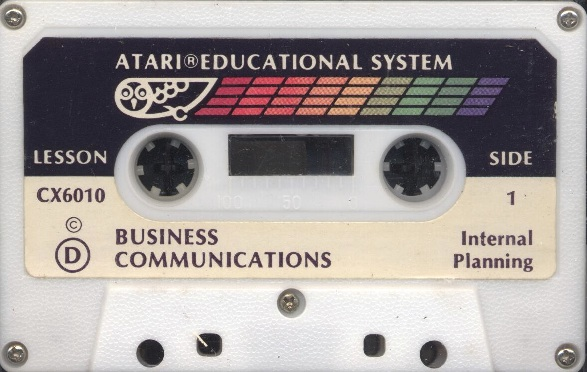

- [http://data.atariwiki.org/FLAC/BC/Business\_Communications\_CX6010-Cassette\_D-Side\_1.flac](http://data.atariwiki.org/FLAC/BC/Business_Communications_CX6010-Cassette_D-Side_1.flac) ; size: 176.3 MB

- Business Communications CX6010 - Cassette D-Side 2 - thanks to Allan Bushmann for taking the picture 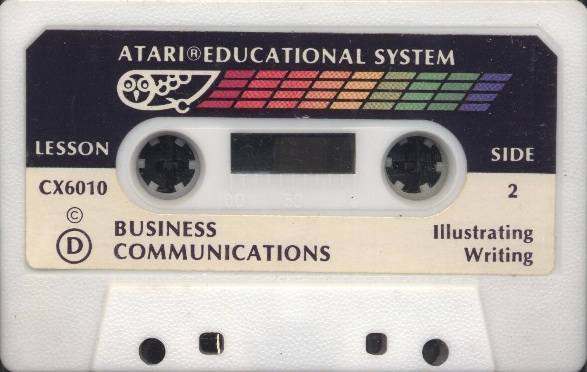

- [http://data.atariwiki.org/FLAC/BC/Business\_Communications\_CX6010-Cassette\_D-Side\_2.flac](http://data.atariwiki.org/FLAC/BC/Business_Communications_CX6010-Cassette_D-Side_2.flac) ; size: 192.0 MB
