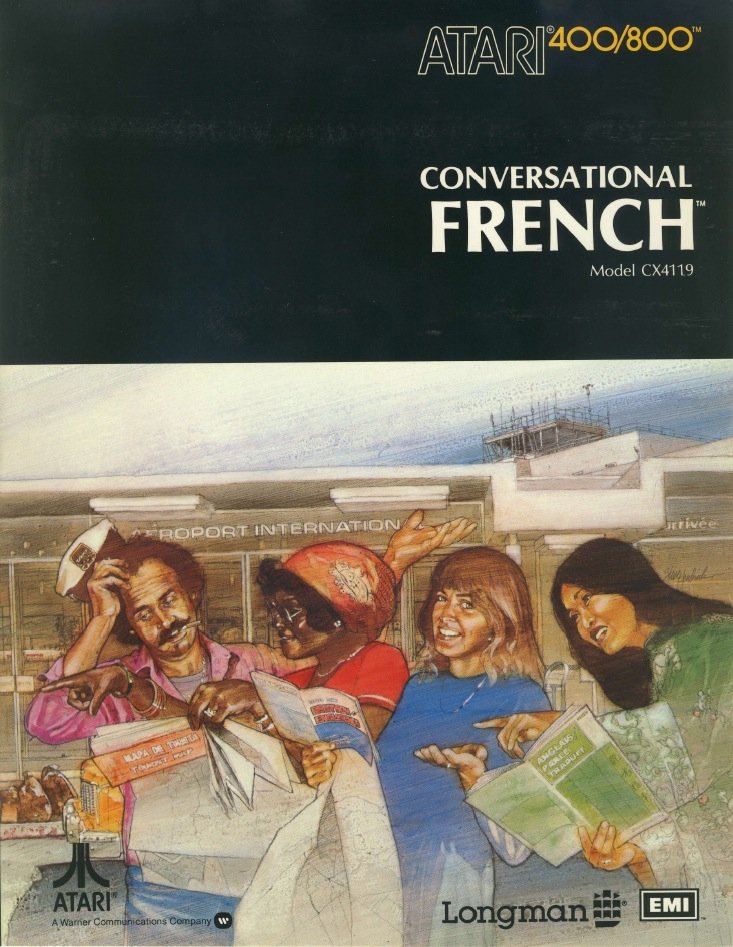
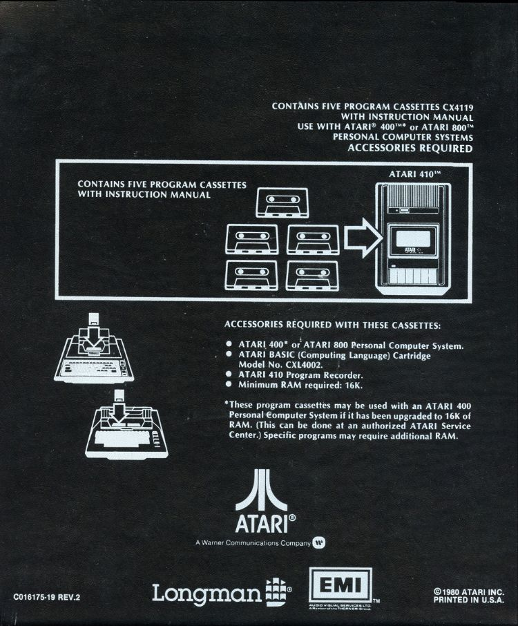
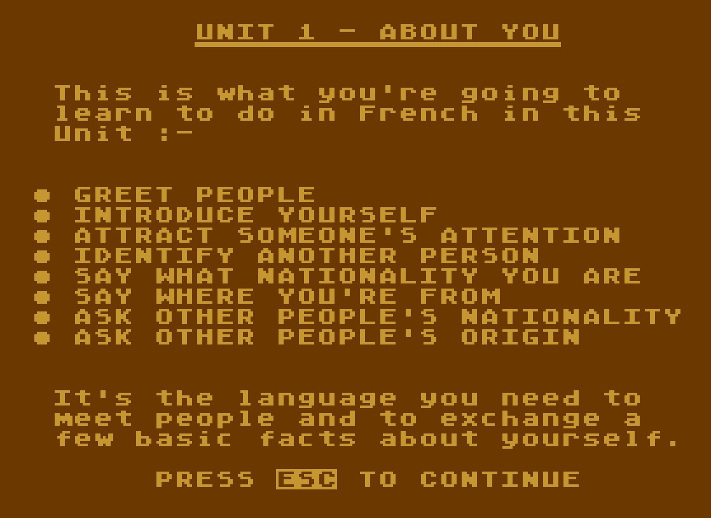
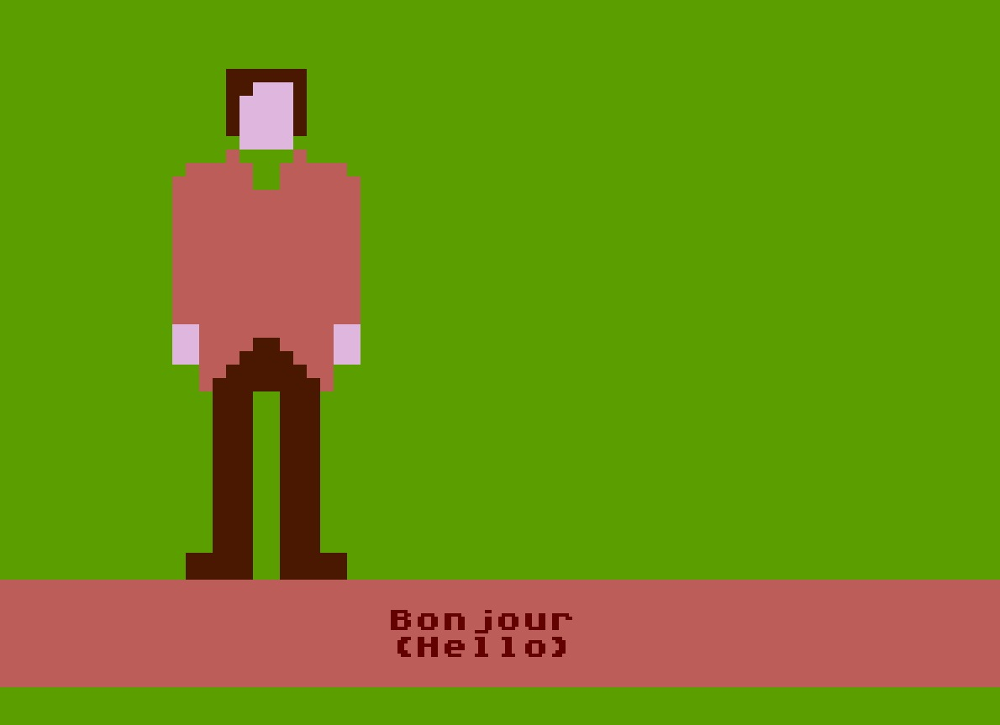

# Conversational FRENCH (CX4119)

## ATR-Images:

made out of the FLAC-Images:

- [Conversational\_FRENCH-CX4119-Unit\_1-Cassette\_A-Side\_1.atr](attachments/Conversational_FRENCH-CX4119-Unit_1-Cassette_A-Side_1.atr) Unit 1 disk

- [Conversational\_FRENCH-CX4119-Unit\_2-Cassette\_A-Side\_2.atr](attachments/Conversational_FRENCH-CX4119-Unit_2-Cassette_A-Side_2.atr) Unit 2 disk

- [Conversational\_FRENCH-CX4119-Unit\_3-Cassette\_B-Side\_1.atr](attachments/Conversational_FRENCH-CX4119-Unit_3-Cassette_B-Side_1.atr) Unit 3 disk

- [Conversational\_FRENCH-CX4119-Unit\_4-Cassette\_B-Side\_2.atr](attachments/Conversational_FRENCH-CX4119-Unit_4-Cassette_B-Side_2.atr) Unit 4 disk

- [Conversational\_FRENCH-CX4119-Unit\_5-Cassette\_C-Side\_1.atr](attachments/Conversational_FRENCH-CX4119-Unit_5-Cassette_C-Side_1.atr) Unit 5 disk

- [Conversational\_FRENCH-CX4119-Unit\_6-Cassette\_C-Side\_2.atr](attachments/Conversational_FRENCH-CX4119-Unit_6-Cassette_C-Side_2.atr) Unit 6 disk

- [Conversational\_FRENCH-CX4119-Unit\_7-Cassette\_D-Side\_1.atr](attachments/Conversational_FRENCH-CX4119-Unit_7-Cassette_D-Side_1.atr) Unit 7 disk

- [Conversational\_FRENCH-CX4119-Unit\_8-Cassette\_D-Side\_2.atr](attachments/Conversational_FRENCH-CX4119-Unit_8-Cassette_D-Side_2.atr) Unit 8 disk

- [Conversational\_FRENCH-CX4119-Unit\_9-Cassette\_E-Side\_1.atr](attachments/Conversational_FRENCH-CX4119-Unit_9-Cassette_E-Side_1.atr) Unit 9 disk

- [Conversational\_FRENCH-CX4119-Unit\_10-Cassette\_E-Side\_2.atr](attachments/Conversational_FRENCH-CX4119-Unit_10-Cassette_E-Side_2.atr) Unit 10 disk

## Manual:

[ATARI\_Conversational\_French.pdf](../../../../media/Companies/Atari/Conversational_FRENCH_CX4119/attachments/ATARI_Conversational_French.pdf) ; size: 24.2 MB; (C) 1980 Atari

## FLAC-Images:

- [http://data.atariwiki.org/FLAC/FRENCH/Conversational\_FRENCH-CX4119-Unit\_1-Cassette\_A-Side\_1.flac](http://data.atariwiki.org/FLAC/FRENCH/Conversational_FRENCH-CX4119-Unit_1-Cassette_A-Side_1.flac) ; size: 133.0 MB ; Unit 1 cassette

- [http://data.atariwiki.org/FLAC/FRENCH/Conversational\_FRENCH-CX4119-Unit\_2-Cassette\_A-Side\_2.flac](http://data.atariwiki.org/FLAC/FRENCH/Conversational_FRENCH-CX4119-Unit_2-Cassette_A-Side_2.flac) ; size: 86.8 MB ; Unit 2 cassette

- [http://data.atariwiki.org/FLAC/FRENCH/Conversational\_FRENCH-CX4119-Unit\_3-Cassette\_B-Side\_1.flac](http://data.atariwiki.org/FLAC/FRENCH/Conversational_FRENCH-CX4119-Unit_3-Cassette_B-Side_1.flac) ; size: 110.8 MB ; Unit 3 cassette

- [http://data.atariwiki.org/FLAC/FRENCH/Conversational\_FRENCH-CX4119-Unit\_4-Cassette\_B-Side\_2.flac](http://data.atariwiki.org/FLAC/FRENCH/Conversational_FRENCH-CX4119-Unit_4-Cassette_B-Side_2.flac) ; size: 125.8 MB ; Unit 4 cassette

- [http://data.atariwiki.org/FLAC/FRENCH/Conversational\_FRENCH-CX4119-Unit\_5-Cassette\_C-Side\_1.flac](http://data.atariwiki.org/FLAC/FRENCH/Conversational_FRENCH-CX4119-Unit_5-Cassette_C-Side_1.flac) ; size: 130.3 MB ; Unit 5 cassette

- [http://data.atariwiki.org/FLAC/FRENCH/Conversational\_FRENCH-CX4119-Unit\_6-Cassette\_C-Side\_2.flac](http://data.atariwiki.org/FLAC/FRENCH/Conversational_FRENCH-CX4119-Unit_6-Cassette_C-Side_2.flac) ; size: 121.8 MB ; Unit 6 cassette

- [http://data.atariwiki.org/FLAC/FRENCH/Conversational\_FRENCH-CX4119-Unit\_7-Cassette\_D-Side\_1.flac](http://data.atariwiki.org/FLAC/FRENCH/Conversational_FRENCH-CX4119-Unit_7-Cassette_D-Side_1.flac) ; size: 116.2 MB ; Unit 7 cassette

- [http://data.atariwiki.org/FLAC/FRENCH/Conversational\_FRENCH-CX4119-Unit\_8-Cassette\_D-Side\_2.flac](http://data.atariwiki.org/FLAC/FRENCH/Conversational_FRENCH-CX4119-Unit_8-Cassette_D-Side_2.flac) ; size: 115.9 MB ; Unit 8 cassette

- [http://data.atariwiki.org/FLAC/FRENCH/Conversational\_FRENCH-CX4119-Unit\_9-Cassette\_E-Side\_1.flac](http://data.atariwiki.org/FLAC/FRENCH/Conversational_FRENCH-CX4119-Unit_9-Cassette_E-Side_1.flac) ; size: 135.6 MB ; Unit 9 cassette

- [http://data.atariwiki.org/FLAC/FRENCH/Conversational\_FRENCH-CX4119-Unit\_10-Cassette\_E-Side\_2.flac](http://data.atariwiki.org/FLAC/FRENCH/Conversational_FRENCH-CX4119-Unit_10-Cassette_E-Side_2.flac) ; size: 137.7 MB ; Unit 10 cassette

## Pictures:

 Box cover (C) 1980 Atari

 Box back(C) 1980 Atari

 Unit 1 lesson

 First screen

## Autor:

up to now unknown :-(

## Credits:

Without the following persons that project would never be realized, thank you all:

- Bradley Koda
- Benjamin Daniel Smith
- Stefan Meyer
- Carsten Strotmann
- Mr. Bacardi
