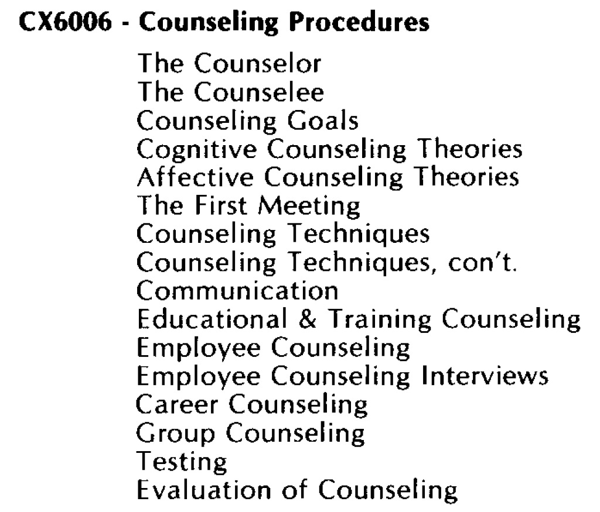
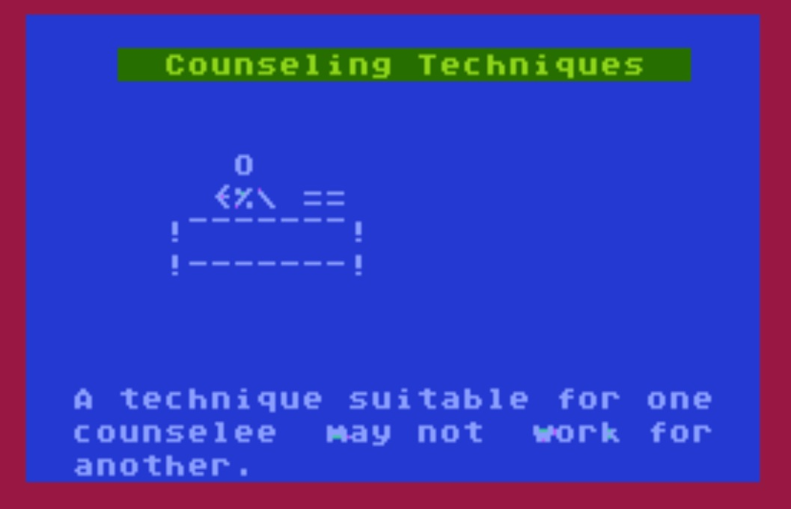

# Counseling Procedures (CX6006)

## Content

- Content of Counseling Procedures CX6006 

## Cassette-Images in FLAC-format

- [http://data.atariwiki.org/FLAC/CP/Counseling\_Procedures\_CX6006-Cassette\_A-Side\_1.flac](http://data.atariwiki.org/FLAC/CP/Counseling_Procedures_CX6006-Cassette_A-Side_1.flac) ; size: 154.9 MB

- [http://data.atariwiki.org/FLAC/CP/Counseling\_Procedures\_CX6006-Cassette\_A-Side\_2.flac](http://data.atariwiki.org/FLAC/CP/Counseling_Procedures_CX6006-Cassette_A-Side_2.flac) ; size: 161.1 MB

- [http://data.atariwiki.org/FLAC/CP/Counseling\_Procedures\_CX6006-Cassette\_B-Side\_1.flac](http://data.atariwiki.org/FLAC/CP/Counseling_Procedures_CX6006-Cassette_B-Side_1.flac) ; size: 150.0 MB

- [http://data.atariwiki.org/FLAC/CP/Counseling\_Procedures\_CX6006-Cassette\_B-Side\_2.flac](http://data.atariwiki.org/FLAC/CP/Counseling_Procedures_CX6006-Cassette_B-Side_2.flac) ; size: 164.5 MB

- [http://data.atariwiki.org/FLAC/CP/Counseling\_Procedures\_CX6006-Cassette\_C-Side\_1.flac](http://data.atariwiki.org/FLAC/CP/Counseling_Procedures_CX6006-Cassette_C-Side_1.flac) ; size: 157.8 MB

- [http://data.atariwiki.org/FLAC/CP/Counseling\_Procedures\_CX6006-Cassette\_C-Side\_2.flac](http://data.atariwiki.org/FLAC/CP/Counseling_Procedures_CX6006-Cassette_C-Side_2.flac) ; size: 158.9 MB

- [http://data.atariwiki.org/FLAC/CP/Counseling\_Procedures\_CX6006-Cassette\_D-Side\_1.flac](http://data.atariwiki.org/FLAC/CP/Counseling_Procedures_CX6006-Cassette_D-Side_1.flac) ; size: 164.2 MB

- [http://data.atariwiki.org/FLAC/CP/Counseling\_Procedures\_CX6006-Cassette\_D-Side\_2.flac](http://data.atariwiki.org/FLAC/CP/Counseling_Procedures_CX6006-Cassette_D-Side_2.flac) ; size: 163.7 MB

## Images

- Counseling Procedures CX6006 - figure 1 

- Counseling Procedures CX6006 - figure 2 

- Counseling Procedures CX6006 - figure 3 

- Counseling Procedures CX6006 - figure 4 

- Counseling Procedures CX6006 - figure 5 

- Counseling Procedures CX6006 - figure 6 

- Counseling Procedures CX6006 - figure 7 

- Counseling Procedures CX6006 - figure 8 

- Counseling Procedures CX6006 - figure 9 

- Counseling Procedures CX6006 - figure 10 

- Counseling Procedures CX6006 - figure 11 

- Counseling Procedures CX6006 - figure 12 
