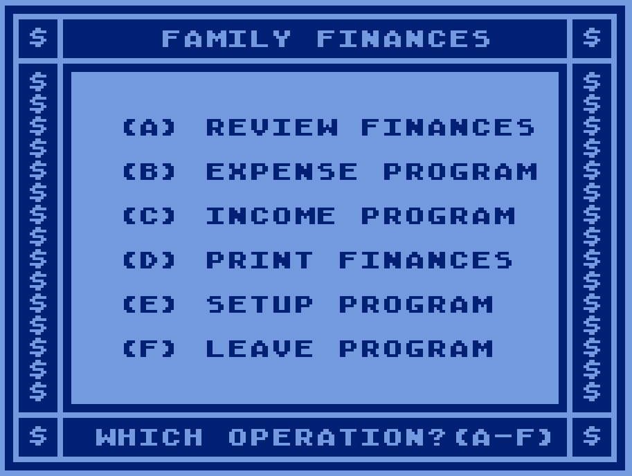
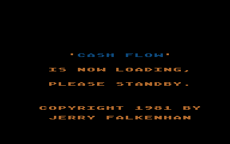
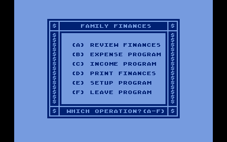
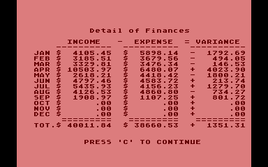
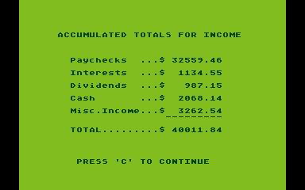

# Family Cash Flow (APX-20080)

Copyright (C) 1981 Jerry Falkenhan and Atari, Inc.

Family Cash Flow (APX-20080) was first published via APX and later distributed from Atart itself. Please see Family Finances I (Cash Flow) from [Atari Family Finances (CX421)](../Family_Finances/README.md) for further infos.

## ATR-Image

- [Family Cash Flow (APX-20080)](attachments/Family_Cash_Flow_APX-20080.atr) ; diskette image from the APX archive. Please use with the Basic cartridge and 32 KB RAM.

## Manual

The Family Cash Flow (APX-20080) manual is still missing, please help us to restore it. :-) Meanwhile please use the manual in [Atari Family Finances (CX421)](../Family_Finances/README.md) as a replacement.

## Mainmenu

- Family Cash Flow (APX-20080) - Mainmenu 

## Screenshots

- Family Cash Flow (APX-20080) - screenshot 1 

- Family Cash Flow (APX-20080) - screenshot 2 

- Family Cash Flow (APX-20080) - screenshot 3 

- Family Cash Flow (APX-20080) - screenshot 4 

## Credits

Thank you so much Allan Bushman for bringing that artifact back to the light. We owe you so much.
