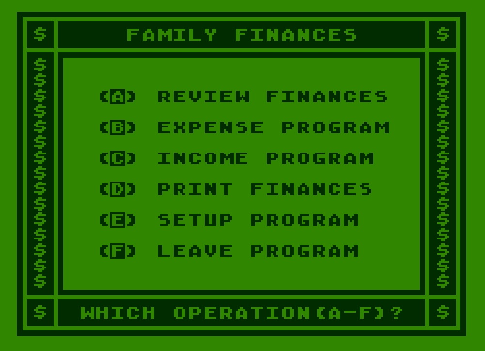
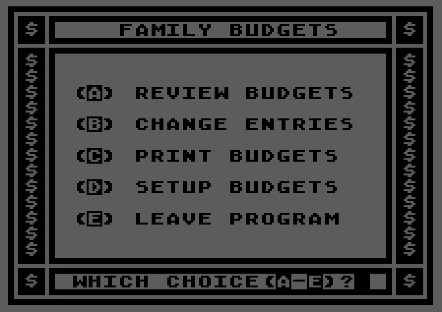
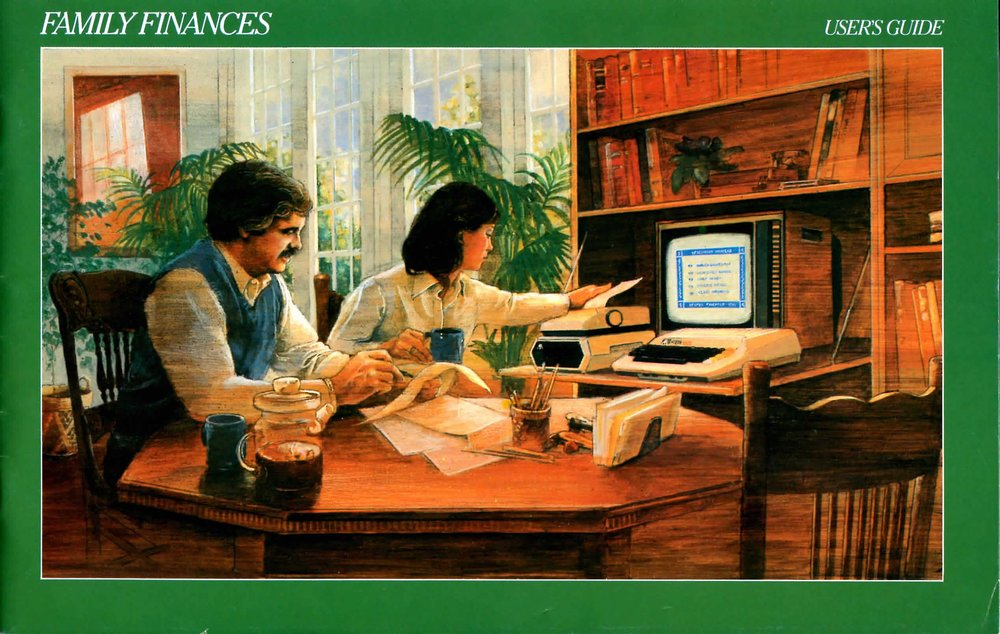
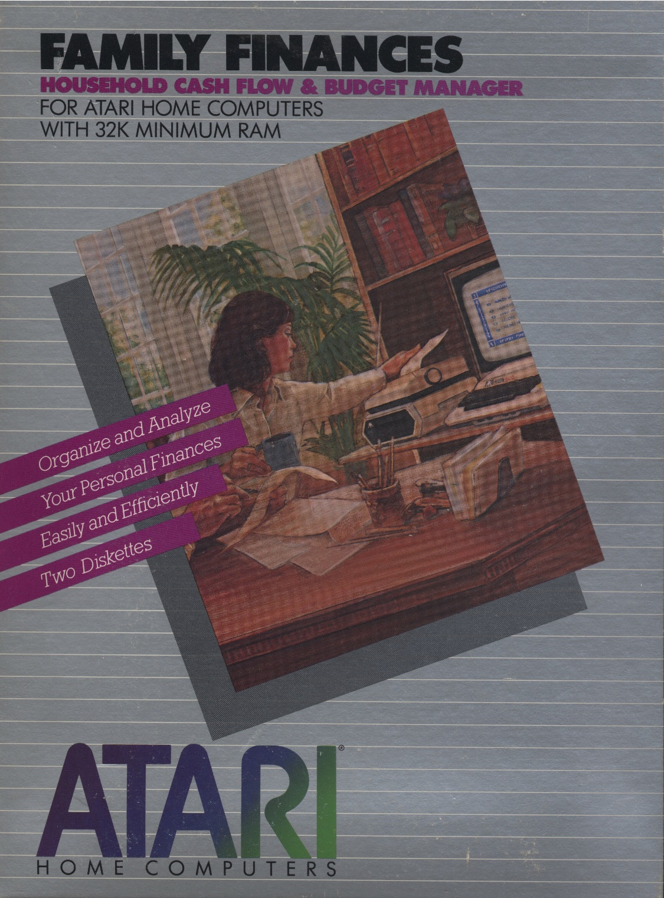
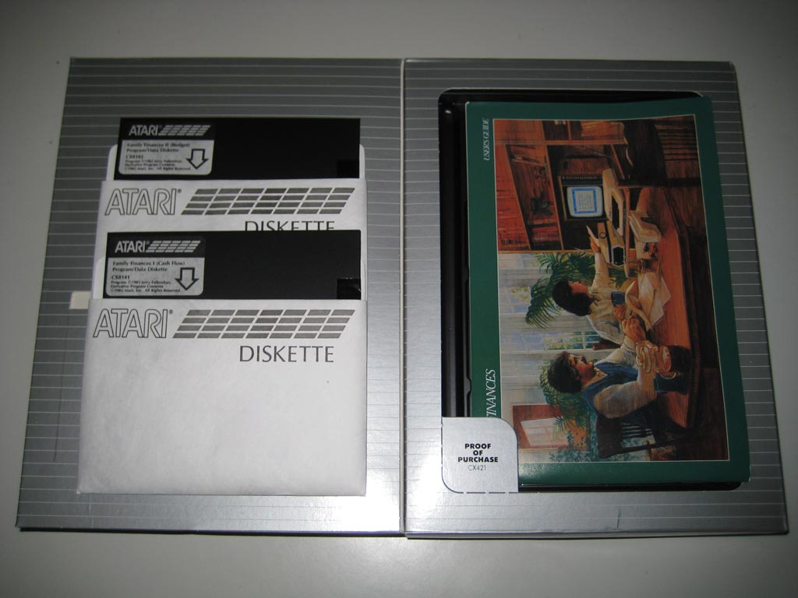
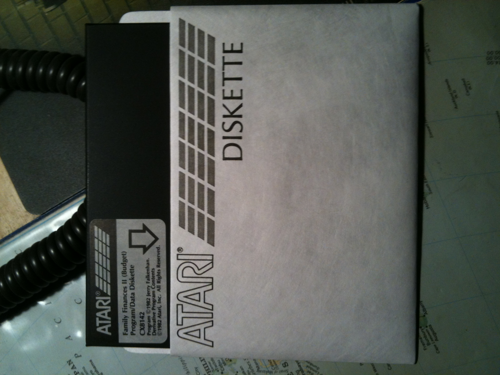
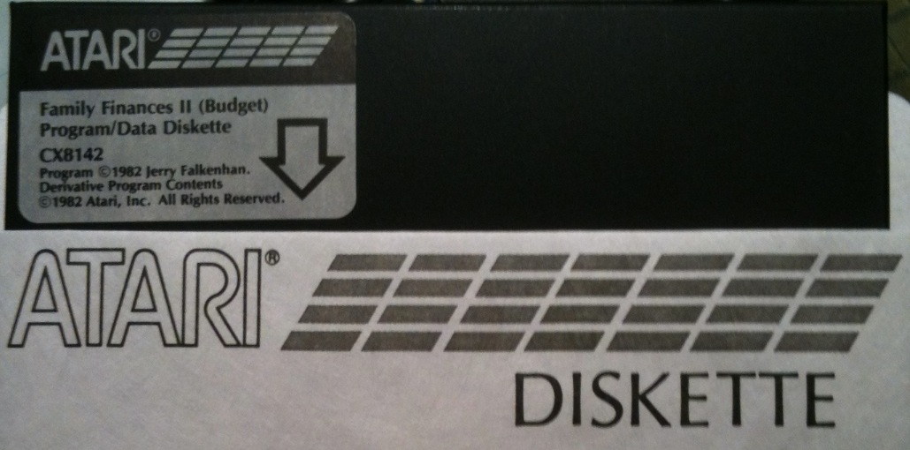
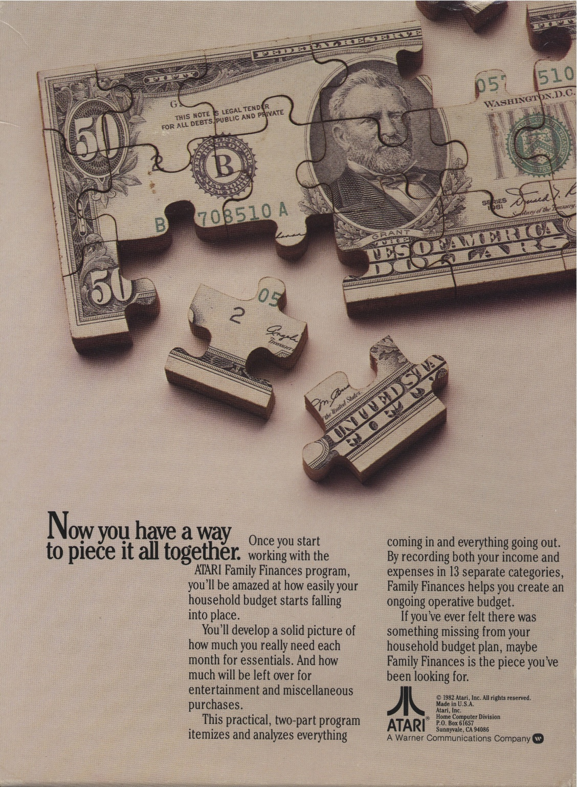
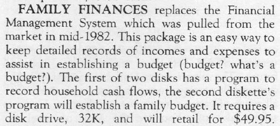

# Atari Family Finances (CX421)

Also as part in 'The Home Manager Kit' or 'The Home Manager' CX418 version 2.

This two disk program, Family Cash Flow, Family Budget, will help you itemize and analyze information on your Personal Finances.  Family cash flow tracks as many as 100 expense entries in 13 categories, 20 income entries in 13 categories for up to 12 months.  You can create and print out a Family Budget using the information from your Family Cash Flow files.  Menu driven and color coded screens. 32 KB RAM Minimum and the Atari BASIC cartridge are required.

## ATR-Images

- [Family\_Finances\_I\_Cash\_Flow\_Program-Data\_Diskette\_CX8141\_Basic\_Original.atr](attachments/Family_Finances_I_Cash_Flow_Program-Data_Diskette_CX8141_Basic_Original.atr) ; Program Diskette I for use with the Basic cartridge
- [Family\_Finances\_II\_Budget\_Program-Data\_Diskette\_CX8142\_Basic\_Original.atr](attachments/Family_Finances_II_Budget_Program-Data_Diskette_CX8142_Basic_Original.atr) ; ; Program Diskette II for use with the Basic cartridge

## Manual

- [Family Finances User's Guide](../../../../media/Companies/Atari/Family_Finances/attachments/Family_Finances_User_s_Guide.pdf) ; size: 16.9 MB

## Images

- Family Finances I (Cash Flow) Program-Data Diskette CX8141 (Basic) 

- Family Finances II (Budget) Program-Data Diskette CX8142 (Basic) 

- Family Finances manual 

- Family Finances box cover 

- Family Finances box content 

- Family Finances I (Cash Flow) Program-Data Diskette CX8141 

- Family Finances II (Budget) Program-Data Diskette CX8142 

- Family Finances advertisement 

- Family Finances should replace [Atari Personal Financial Management System (P.F.M.S.) CX406](../Atari_Personal_Financial_Management_System/README.md) ; compare for yourself 
