# Great Classics (CX6009)

Donated by Kay Savetz; Kay, thank you so much to bring this artifact from the dark to the light! We really appreciate your help! :-)))

## Content

- Content of Great Classics CX6009 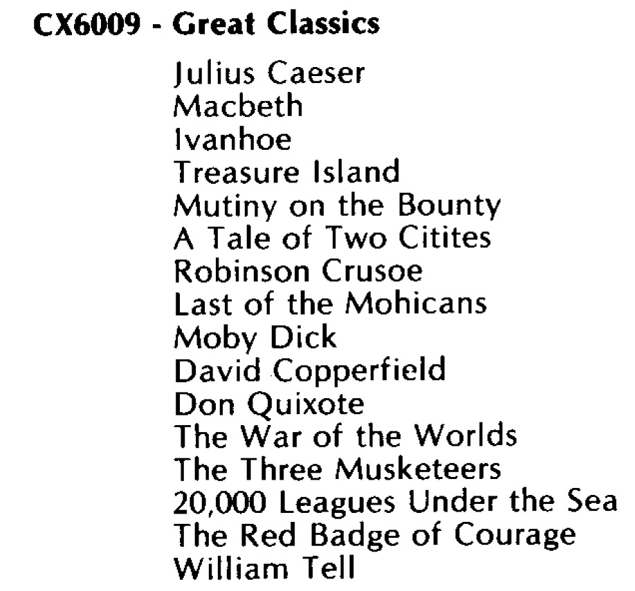

## Cassette-Images in FLAC-format

- [http://data.atariwiki.org/FLAC/GC/Great\_Classics\_CX6009-Cassette\_A-Side\_1.flac](http://data.atariwiki.org/FLAC/GC/Great_Classics_CX6009-Cassette_A-Side_1.flac) ; size: 142.6 MB

- [http://data.atariwiki.org/FLAC/GC/Great\_Classics\_CX6009-Cassette\_A-Side\_2.flac](http://data.atariwiki.org/FLAC/GC/Great_Classics_CX6009-Cassette_A-Side_2.flac) ; size: 141.5 MB

- [http://data.atariwiki.org/FLAC/GC/Great\_Classics\_CX6009-Cassette\_B-Side\_1.flac](http://data.atariwiki.org/FLAC/GC/Great_Classics_CX6009-Cassette_B-Side_1.flac) ; size: 138.4 MB

- [http://data.atariwiki.org/FLAC/GC/Great\_Classics\_CX6009-Cassette\_B-Side\_2.flac](http://data.atariwiki.org/FLAC/GC/Great_Classics_CX6009-Cassette_B-Side_2.flac) ; size: 160.7 MB

- [http://data.atariwiki.org/FLAC/GC/Great\_Classics\_CX6009-Cassette\_C-Side\_1.flac](http://data.atariwiki.org/FLAC/GC/Great_Classics_CX6009-Cassette_C-Side_1.flac) ; size: 154.6 MB

- [http://data.atariwiki.org/FLAC/GC/Great\_Classics\_CX6009-Cassette\_C-Side\_2.flac](http://data.atariwiki.org/FLAC/GC/Great_Classics_CX6009-Cassette_C-Side_2.flac) ; size: 180.3 MB

- [http://data.atariwiki.org/FLAC/GC/Great\_Classics\_CX6009-Cassette\_D-Side\_1.flac](http://data.atariwiki.org/FLAC/GC/Great_Classics_CX6009-Cassette_D-Side_1.flac) ; size: 156.9 MB

- [http://data.atariwiki.org/FLAC/GC/Great\_Classics\_CX6009-Cassette\_D-Side\_2.flac](http://data.atariwiki.org/FLAC/GC/Great_Classics_CX6009-Cassette_D-Side_2.flac) ; size: 150.9 MB

## Images

- Classics CX6009 - Startscreen 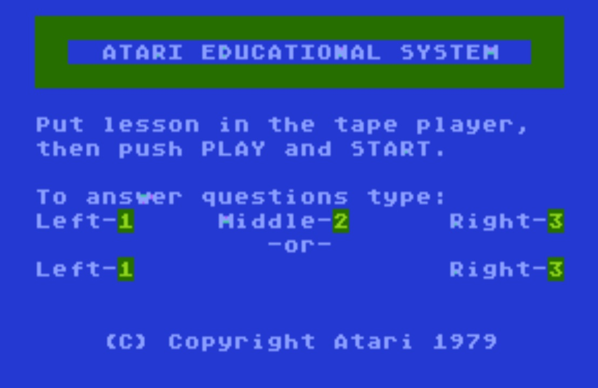

- Classics CX6009 - Example 1 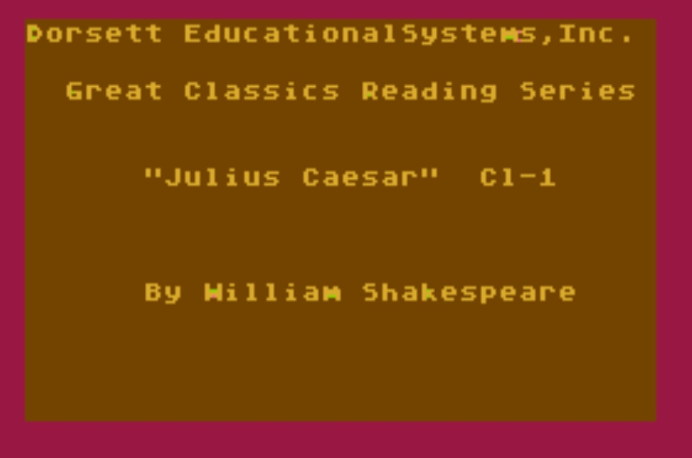

- Classics CX6009 - Example 3 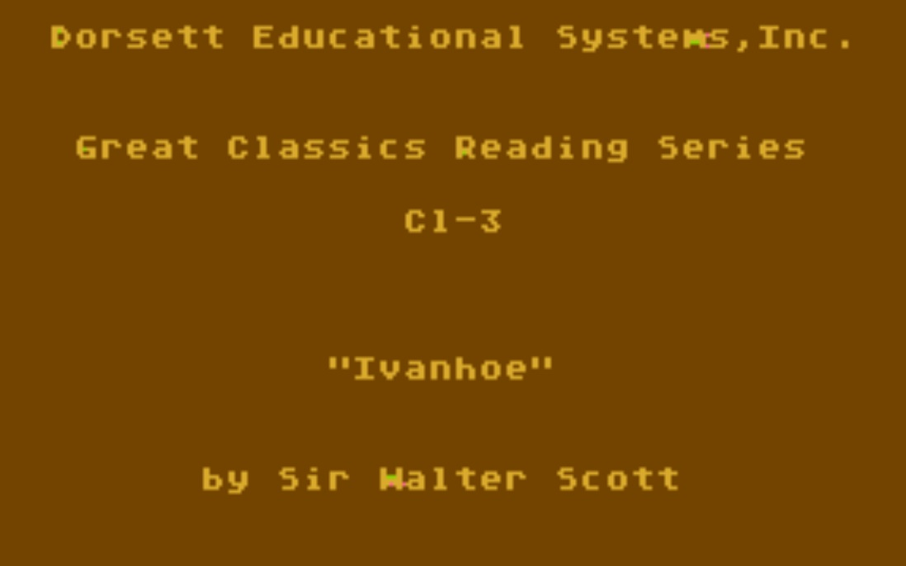

- Classics CX6009 - Example 5 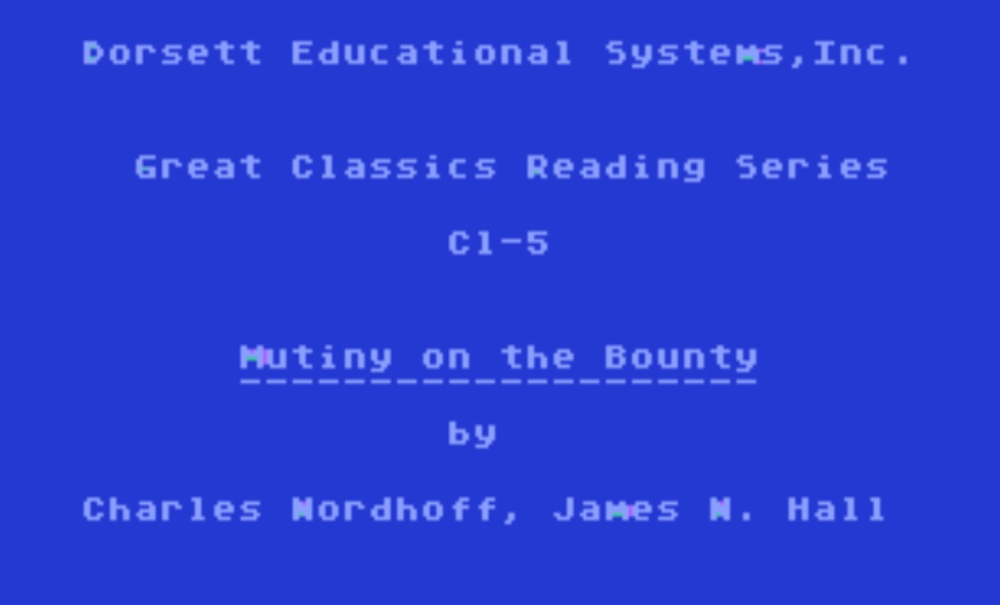

- Classics CX6009 - Example 7 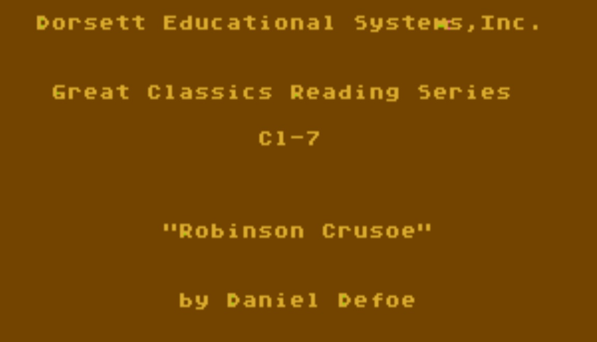

- Classics CX6009 - Example 9 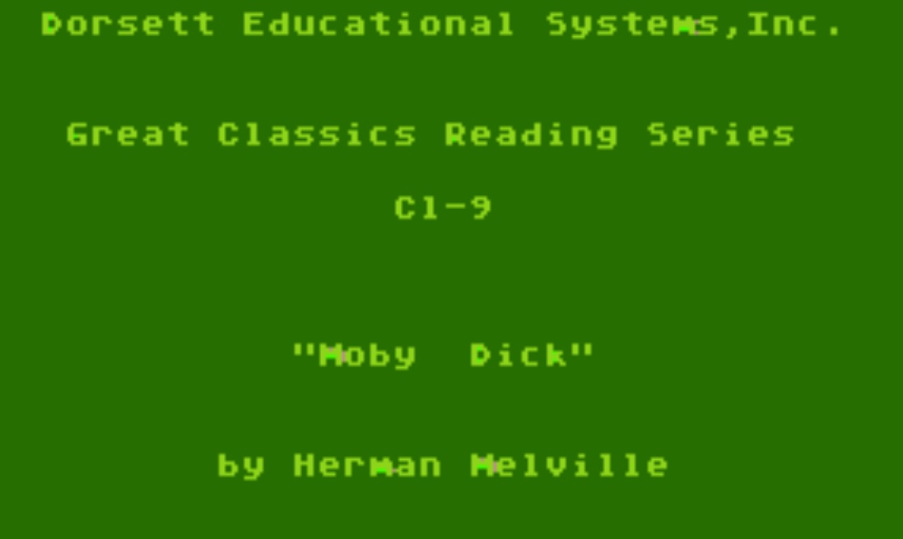

- Classics CX6009 - Example 11 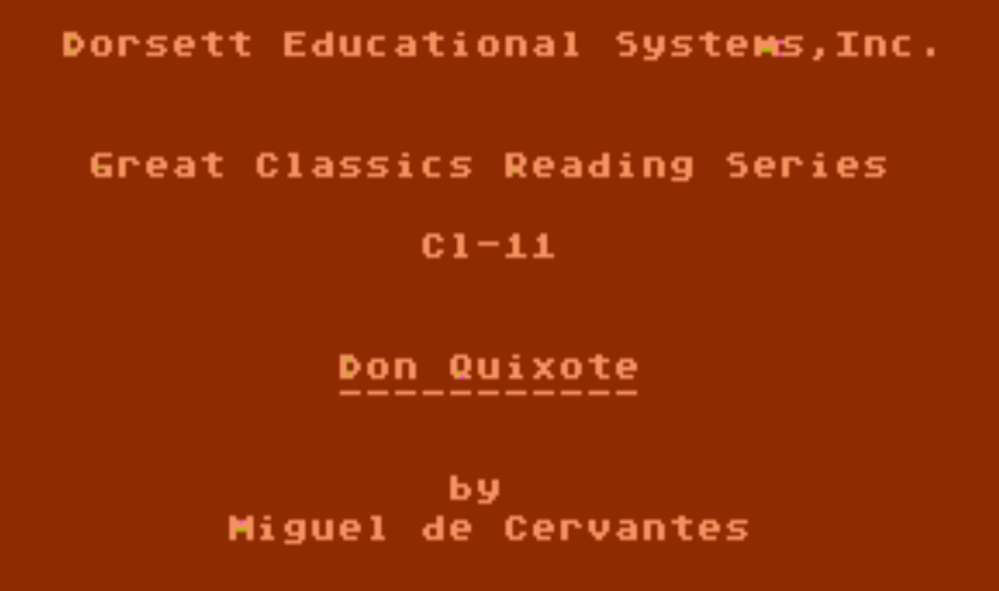

- Classics CX6009 - Example 12-1 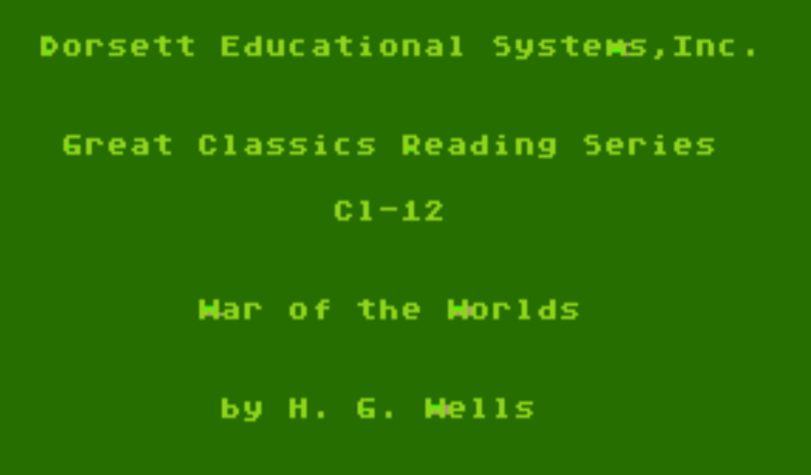

- Classics CX6009 - Example 12-2 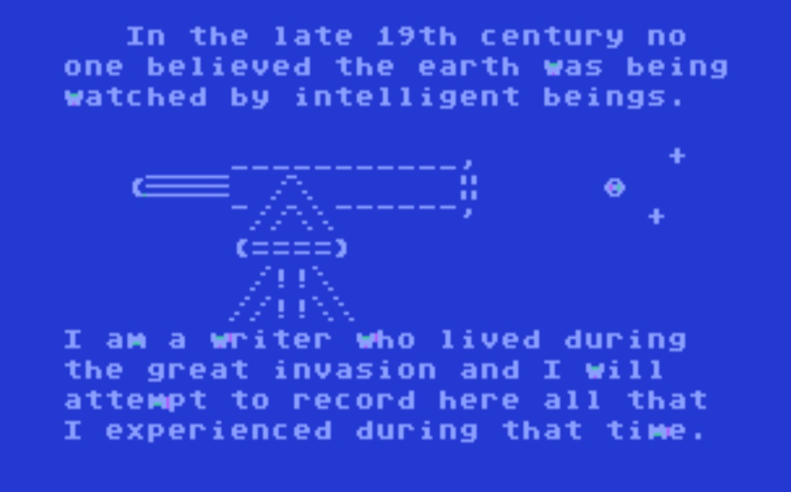

- Classics CX6009 - Example 13 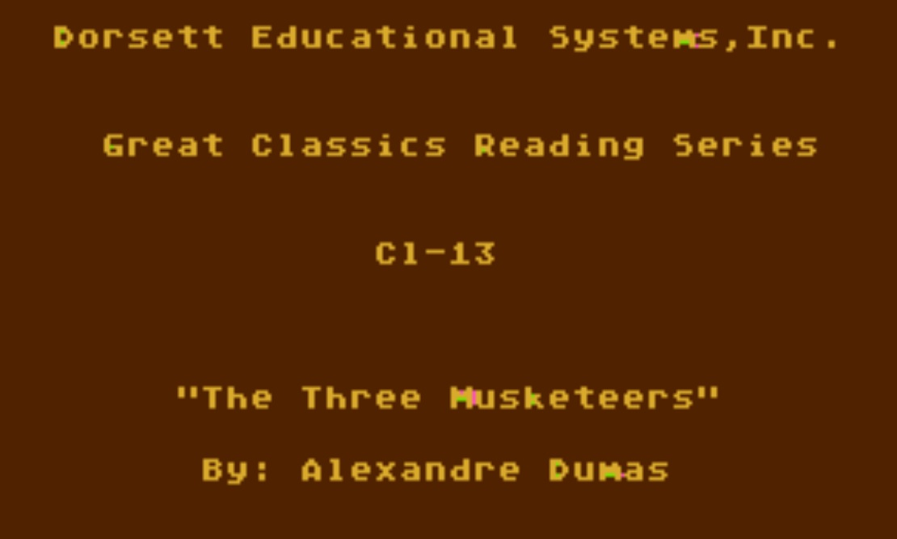

- Classics CX6009 - Example 15 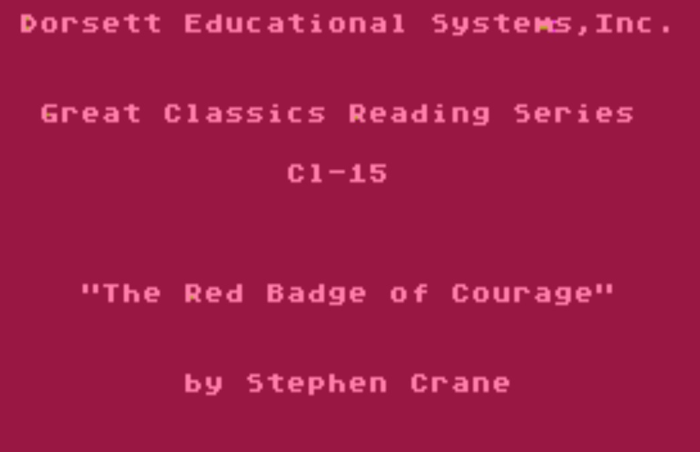

- Classics CX6009 - Endscreen 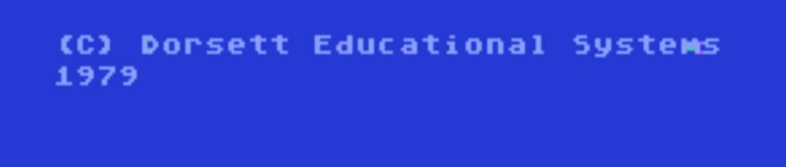
